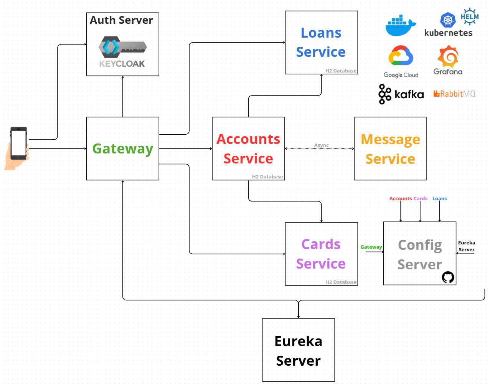

This repository contains **everything completed as part of a Udemy course**:
👉 [Course Certificate & Link](https://www.udemy.com/certificate/UC-af2973d6-3393-4be0-adaa-ebd877714a38/)

The course lasted **40.5 hours** and I completed it in its entirety.

Below is a **summary of the course sections**.
Each section includes a **very detailed `README.md` file**, describing:

* What was implemented
* Step-by-step instructions
* Associated source code

This is a **microservices project** built with **Docker and Kubernetes**, which was eventually **deployed to the Google Kubernetes Engine (GKE)** in the final stages of the course.

---

 📘 Course Sections Summary

### **Section 1: Course Overview and Microservices Fundamentals**

Introduces microservices architecture by comparing it with monolithic and SOA models. It defines core characteristics like independent deployment and scalability. Technologies covered:

* API Gateway, OpenID, OAuth2, Keycloak
* Service Discovery (Spring Cloud Eureka), Spring Boot, Spring Cloud
* Spring Security, Resilience4j, Kafka, RabbitMQ
* Prometheus, Grafana, OpenTelemetry
* Docker, Kubernetes, Helm

Architecture follows **15-Factor App** principles.

---

### **Section 2: Microservices Fundamentals (Practical)**

Focuses on hands-on development:

* REST APIs, Spring Data JPA, DTOs
* Full REST CRUD operations
* API documentation with **springdoc-openapi**
* Projects include Accounts, Loans, and Cards microservices
* Testing with Postman

---

### **Section 3: Microservice Sizing and Boundaries**

Explores how to define microservice boundaries and size them correctly using:

* **Domain-Driven Design (DDD)** and Bounded Contexts
* **Event Storming** workshops
* Banking examples and e-commerce migration case study
* Strangler Fig Pattern for gradual migration
* Technologies: API Gateway, Docker, Kubernetes

---

### **Section 4: Docker**

Covers:

* Differences between Docker and virtual machines
* Three ways to build Docker images: Dockerfile, Buildpacks, and **Jib**
* Uploading to Docker Hub
* Container orchestration with **Docker Compose**

---

### **Section 5: Cloud Native**

Introduces the **Cloud Native** approach:

* Key traits compared to traditional development
* Design principles (12-Factor and additional 3 principles)
* Tools essential for Cloud Native architecture

---

### **Section 6: Externalized Configuration**

Covers best practices for managing configurations:

* Separating config from code (dev/test/prod)
* Using @Value, environment variables, and @ConfigurationProperties
* Spring Profiles and config override hierarchy
* Centralized configuration with **Spring Cloud Config Server**
* Auto-refresh via `/actuator/refresh` or Spring Cloud Bus + RabbitMQ
* CI/CD via GitHub webhooks
* Health checks in Docker Compose

---

### **Section 7: Database Management in Microservices**

Focuses on database migration and setup:

* Move from H2 to MySQL
* Docker setup, environment variables, health checks
* Docker networking and volumes for production data persistence

---

### **Section 8: Service Discovery & Registration**

Explores scaling and service communication:

* Service Discovery, Registration, Load Balancing
* Comparison of traditional and cloud-native approaches
* Client-Side Discovery with **Spring Cloud Eureka**
* Topics: Eureka Server setup, heartbeats, self-preservation
* Load Balancing with **OpenFeign**
* Testing with Docker-based replicas

---

### **Section 9: API Gateway & Cross-Cutting Concerns**

Explains the role of API Gateway as a central entry point:

* Functions: Logging, security, distributed tracing, routing
* Implemented using **Spring Cloud Gateway**
* Routing with Eureka and custom filters
* Docker image creation with **Jib**
* Service startup order and health checks

---

### **Section 10: Resilience in Microservices**

Discusses fault tolerance patterns:

* **Circuit Breaker**, Retry, Rate Limiter, Timeouts, Bulkhead
* Implemented via **Resilience4j**, Redis
* Integrated with Feign Clients
* Best practices for distributed systems

---

### **Section 11: Observability in Microservices**

Highlights monitoring and tracing:

* Difference between Monitoring and Observability
* Tools:

    * **Grafana + Loki** for logs
    * **Micrometer + Prometheus** for metrics
    * **OpenTelemetry + Grafana Tempo** for tracing
* Integrated observability stack for troubleshooting and alerting

---

### **Section 12: Microservice Security**

Covers authentication and authorization:

* Centralized IAM with **Keycloak**
* OAuth2, OpenID Connect, Spring Security
* Grant types:

    * Client Credentials for server-to-server
    * Authorization Code + PKCE for UI clients
* Docker deployment of Keycloak
* API Gateway for network-level security
* Concepts: JWT, Role-Based Access Control (RBAC)

---

### **Section 13: Event-Driven Microservices (RabbitMQ)**

Promotes asynchronous communication:

* Event-Driven Architecture (EDA) and **RabbitMQ**
* Publisher/Subscriber model
* Use of **Spring Cloud Function** and **Spring Cloud Stream**
* Real-world notification example
* Docker setup for RabbitMQ

---

### **Section 14: Event-Driven Microservices (Kafka)**

Focus on high-throughput messaging:

* Comparison of **Kafka vs. RabbitMQ**
* Kafka terms: Producers, Consumers, Topics, Partitions, Offsets
* Kafka + Spring Cloud Stream integration
* Docker Compose deployment with Kafka
* Health checks and connectivity

---

### **Section 15: Container Orchestration (Kubernetes)**

Explains orchestration for scaling:

* Concepts: Deployments, rollouts, rollbacks, self-healing, scaling
* Introduction to **Kubernetes (K8s)**: origin, open-source, CNCF
* Architecture:

    * **Control Plane**: API Server, Scheduler, Controller Manager, etcd
    * **Worker Nodes**: Pods, Kubelet, Kube-proxy
* Local setup with Docker Desktop
* Tools: kubectl, Service Accounts, Kubernetes Dashboard

---

### **Section 16: Application Management with Helm**

Helm as the Kubernetes package manager:

* Simplifies YAML file management
* Uses **Helm Charts** with reusable templates (`values.yaml`)
* Centralized install, upgrade, and rollback
* Community charts available (e.g., Prometheus, Grafana)

---

### **Section 17: Service Discovery with Spring Cloud Kubernetes**

Focuses on server-side discovery:

* Comparison of Client-Side (Eureka) vs. Server-Side (Kubernetes)
* Use **Spring Cloud Kubernetes** to eliminate Eureka
* Configuration for Feign Clients and Gateway
* Load balancing handled by Kubernetes

---

### **Section 18: Cloud Microservices Deployment (GKE)**

Deployment in the cloud:

* Platforms: **GKE (Google)**, **EKS (AWS)**, **AKS (Azure)**
* Use **Google Cloud SDK** to manage GKE clusters
* Autopilot vs. Standard clusters
* Deploy apps with manifests and Helm
* Verify services like Gateway, Grafana
* Troubleshoot with `kubectl`, logs, GKE console

---

### **Section 19: Advanced DevOps Concepts**

Advanced Kubernetes topics:

* **Kubernetes Services**: ClusterIP, NodePort, LoadBalancer, ExternalName
* **Kubernetes Ingress** for HTTP routing (NGINX, Traefik)
* Comparison with **Spring Cloud Gateway**
* **Service Mesh**: Istio, Linkerd for internal traffic management
* Features: Service discovery, load balancing, security, metrics
* **TLS vs. mTLS** for Zero Trust environments

---

### **Section 20: Dependency & Shared Code Management (Maven BOMs)**

Centralized version management:

* The challenge of hardcoded dependency versions
* **Maven BOM** (`<dependencyManagement>`, `<packaging>pom</packaging>`)
* Simplifies upgrades and version control
* Move to **Multi-Module Maven Projects**:

    * Share code via a common module
    * Avoid duplication
    * Supports modularity and clean architecture

---
