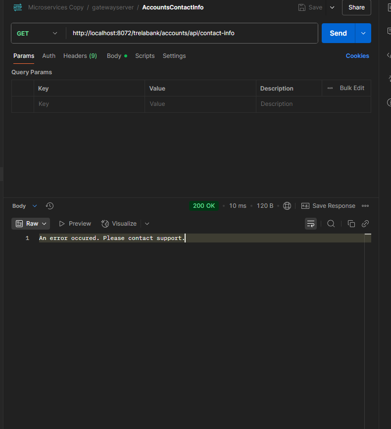

---

# Section 10: Making microservices Resilient

---

### In this section, we will focus on making our microservices resilient.

**Resilience4j** – this is what we’ll be using.

Let’s imagine that the **loans service** stops working. In that case, the **accounts service** will wait for a response, but eventually it will also get overloaded due to the waiting and stop responding. This will continue to propagate to the **gateway** as well.
*(diagram below)*


If we implement a **circuit breaker**, every request will receive a response saying that the **loans service** is unavailable. Thanks to this, even if the loan service is not responding, other services will keep functioning, preventing the entire system from going down.
*(diagram below)*


---

### How does the circuit breaker switch from **closed** to **open**?

By monitoring the **failure rate**.

If we set the threshold to, for example, **70%**, it means the circuit breaker will transition to the **open** state only after **7 out of 10** requests fail (i.e., exceed the threshold). In the **open** state, it will start **blocking further requests**.

It won’t stay in the open state forever — after some time, it will enter the **half-open** state (a sort of test mode), where it allows a few requests through to check if everything is fine.

* If in this **half-open** state, for example, **7 out of 10** requests still fail, the circuit breaker returns to the **open** state.
* But if only, say, **1 out of 10** requests fails, it will go back to the **closed** state.

---

We will implement a circuit breaker in **both the gateway and the service**. Therefore, we will look at different methods of implementing it.

---

### Adding Resilience4j to our gateway:

```xml
<dependency>
    <groupId>org.springframework.cloud</groupId>
    <artifactId>spring-cloud-starter-circuitbreaker-reactor-resilience4j</artifactId>
</dependency>
```

Now we can add a circuit breaker to our **route**:

```java
.route("accounts-route", p -> p
    .path("/trelabank/accounts/**")
    .filters(f -> f.rewritePath("/trelabank/accounts/(?<segment>.*)", "/${segment}")
        .addResponseHeader("X-Response-Time", LocalDateTime.now().toString())
        .circuitBreaker(config -> config.setName("accounts-circuitbreaker")))
    .uri("lb://ACCOUNTS"))
```

We can then configure it further in `application.yml`:

```yaml
resilience4j.circuitbreaker:
  configs:
    default:
      slidingWindowSize: 10
      permittedNumberOfCallsInHalfOpenState: 2
      failureRateThreshold: 50
      waitDurationInOpenState: 10000
```

Explanation:

* **Sliding window** means it will evaluate failures over the last 10 requests.
* The circuit breaker collects 10 requests at a time, then evaluates the next 10, and so on.
* **Threshold**: If 50% or more fail within the window, it moves to the open state.
* **waitDurationInOpenState**: How long to stay open before transitioning to half-open.
* **permittedNumberOfCallsInHalfOpenState**: How many requests are allowed in half-open mode.

---

### Testing the circuit breaker

Start the gateway and other services, and test this endpoint:

```
http://localhost:8072/trelabank/accounts/api/contact-info
```

Then check the status of the circuit breaker:

```
http://localhost:8072/actuator/circuitbreakers
```

Example response:

```json
{
  "circuitBreakers": {
    "accounts-circuitbreaker": {
      "failureRate": "-1.0%",
      "slowCallRate": "-1.0%",
      "failureRateThreshold": "50.0%",
      "slowCallRateThreshold": "100.0%",
      "bufferedCalls": 5,
      "failedCalls": 0,
      "slowCalls": 0,
      "slowFailedCalls": 0,
      "notPermittedCalls": 0,
      "state": "CLOSED"
    }
  }
}
```

Explanation:

* **failureRate** is -1%: not enough data collected yet.
* **slowCallRate** is also -1%: no long requests yet.
* **bufferedCalls**: number of requests that have passed through the circuit breaker.
* **failedCalls**, **slowCalls**, etc.: self-explanatory.
* **notPermittedCalls**: how many calls were blocked because the circuit was open.

---

You can see more endpoints at:

```
http://localhost:8072/actuator
```

For example, to view all circuit breaker events:

```
http://localhost:8072/actuator/circuitbreakerevents/accounts-circuitbreaker
```

Example:

```json
{
  "circuitBreakerEvents": [
    {
      "circuitBreakerName": "accounts-circuitbreaker",
      "type": "SUCCESS",
      "creationTime": "2025-07-15T20:37:22.657327900+02:00[Europe/Warsaw]",
      "errorMessage": null,
      "durationInMs": 1023,
      "stateTransition": null
    },
    ...
  ]
}
```

---

### Testing a **slow call**

Add a **breakpoint** in the `/contact-info` controller method in the **accounts** service.
*(screenshot below)*


Now start the application in **debug mode** and hit this endpoint through the gateway:

```
http://localhost:8072/trelabank/accounts/api/contact-info
```

Response:

```json
{
  "timestamp": "2025-07-16T04:08:57.320+00:00",
  "path": "/trelabank/accounts/api/contact-info",
  "status": 504,
  "error": "Gateway Timeout",
  "requestId": "8da359f5-1",
  "message": "Did not observe any item or terminal signal within 1000ms in 'circuitBreaker' (and no fallback has been configured)"
}
```

Circuit breaker is still **closed**, because this is only the **first failed call**:

```json
{
  "circuitBreakers": {
    "accounts-circuitbreaker": {
      "failureRate": "-1.0%",
      "bufferedCalls": 1,
      "failedCalls": 1,
      ...
      "state": "CLOSED"
    }
  }
}
```

Now we can **intentionally trigger multiple failures** by repeatedly calling the same endpoint while the breakpoint is active:

```
http://localhost:8072/trelabank/accounts/api/contact-info
```

Once we reach **10 calls with at least 50% failures** (in our case, 100%), the circuit breaker goes into the **OPEN** state:

```json
{
  "circuitBreakers": {
    "accounts-circuitbreaker": {
      "failureRate": "100.0%",
      "bufferedCalls": 10,
      "failedCalls": 10,
      "state": "OPEN"
    }
  }
}
```

Now, **each new request** to the circuit breaker will get:

```json
{
  "timestamp": "2025-07-16T04:14:37.668+00:00",
  "path": "/trelabank/accounts/api/contact-info",
  "status": 503,
  "error": "Service Unavailable",
  "requestId": "ba59887f-22",
  "message": "Upstream service is temporarily unavailable"
}
```

---

### Recovery

After **10 seconds** in the **OPEN** state, a new request will cause the circuit breaker to enter **HALF-OPEN** state.

In **HALF-OPEN**, 2 test requests are allowed:

* If even **one fails**, the breaker returns to **OPEN**.
* If both succeed, it transitions to **CLOSED**.

Now remove the **breakpoint** from the controller and see how the circuit breaker returns to **CLOSED** after successful calls:

```json
{
  "circuitBreakers": {
    "accounts-circuitbreaker": {
      "failureRate": "-1.0%",
      "bufferedCalls": 0,
      "failedCalls": 0,
      "state": "CLOSED"
    }
  }
}
```

---

We have implemented a **circuit breaker**, but we **don't have any fallback mechanism** yet.

In the **gateway application**, we need to create a **controller class** and place a **fallback endpoint** there:

```java
@RestController
public class FallbackController {

    @RequestMapping("/contactSupport")
    public Mono<String> contactSupport() {
        return Mono.just("An error occurred. Please contact support.");
    }
}
```

Now we want to integrate this into our **circuit breaker** configuration.

All we need to do is add the fallback information:

```java
.route("accounts-route", p -> p
    .path("/trelabank/accounts/**")
    .filters(f -> f
        .rewritePath("/trelabank/accounts/(?<segment>.*)", "/${segment}")
        .addResponseHeader("X-Response-Time", LocalDateTime.now().toString())
        .circuitBreaker(config -> config
            .setName("accounts-circuitbreaker")
            .setFallbackUri("forward:/contactSupport"))
    )
    .uri("lb://ACCOUNTS"))
```

Now we place a **breakpoint** in the `AccountsController`, and when we use the URL:

```
http://localhost:8072/trelabank/accounts/api/contact-info
```

We now receive the fallback message:

```
An error occurred. Please contact support.
```

(Screenshot below)



---

### Now let's try to implement a circuit breaker inside the **Accounts Service**.

We use **Feign Clients** from within the Accounts Service to call the **Loans Service** and **Cards Service**,
so we need to check if there’s an integration between the **circuit breaker and Feign clients**.

In the documentation, we see that all we need to do is configure it in `application.yml`:

> If Spring Cloud CircuitBreaker is on the classpath and
> `spring.cloud.openfeign.circuitbreaker.enabled=true`,
> Feign will wrap all methods with a circuit breaker.

To disable Spring Cloud CircuitBreaker support per client, you can create a vanilla Feign builder like this:

```java
@Configuration
public class FooConfiguration {
    @Bean
    @Scope("prototype")
    public Feign.Builder feignBuilder() {
        return Feign.builder();
    }
}
```

The circuit breaker name follows the pattern described in the docs.

---

We add the following to our `application.yml` in the **Accounts Service**:

```yaml
spring:
  cloud:
    openfeign:
      circuitbreaker:
        enabled: true

resilience4j:
  circuitbreaker:
    configs:
      default:
        slidingWindowSize: 10
        permittedNumberOfCallsInHalfOpenState: 2
        failureRateThreshold: 50
        waitDurationInOpenState: 10000
```

And from the docs, we learn about **fallbacks** for Feign clients.

In the `@FeignClient` annotation, we need to mention the **fallback class**.
We create a new class that implements the **Feign Client interface** (e.g., previously we had `CardsFeignClient` and `LoansFeignClient`).
In this class, we implement the required method and write our **fallback logic**.

Example:

```java
@Component
public class LoansFallback implements LoansFeignClient {

    @Override
    public ResponseEntity<LoanDto> fetchLoanDetails(String correlationId, String mobileNumber) {
        return null;
    }
}
```

Once we write that class, we go to our Feign client and add the fallback:

```java
@FeignClient(name = "cards", fallback = CardsFallback.class)
public interface CardsFeignClient {
    @GetMapping("/api/fetch")
    ResponseEntity<CardsDto> fetchCardDetails(
        @RequestHeader("trelaBank-correlation-id") String correlationId,
        @RequestParam String mobileNumber);
}
```

In the **service** (e.g., `CustomerServiceImpl`), where we use `CardsFeignClient` and `LoansFeignClient`,
we need to add **null checks**, since our fallback methods return null:

```java
if (loanDtoResponseEntity != null) {
    loanDto = loanDtoResponseEntity.getBody();
}

if (cardDtoResponseEntity != null) {
    cardDto = cardDtoResponseEntity.getBody();
}
```

---

### Now we can try testing our circuit breaker

At first, we won’t see any circuit breaker data, but after making a call like `fetchCustomerDetails`,
we can go to this endpoint:

```
http://localhost:8080/actuator/circuitbreakers
```

And we get:

```json
{
  "circuitBreakers": {
    "CardsFeignClientfetchCardDetailsStringString": {
      "failureRate": "-1.0%",
      "slowCallRate": "-1.0%",
      "failureRateThreshold": "50.0%",
      "slowCallRateThreshold": "100.0%",
      "bufferedCalls": 1,
      "failedCalls": 0,
      "slowCalls": 0,
      "slowFailedCalls": 0,
      "notPermittedCalls": 0,
      "state": "CLOSED"
    },
    "LoansFeignClientfetchLoanDetailsStringString": {
      "failureRate": "-1.0%",
      "slowCallRate": "-1.0%",
      "failureRateThreshold": "50.0%",
      "slowCallRateThreshold": "100.0%",
      "bufferedCalls": 1,
      "failedCalls": 0,
      "slowCalls": 0,
      "slowFailedCalls": 0,
      "notPermittedCalls": 0,
      "state": "CLOSED"
    }
  }
}
```

Let’s now **shut down the Loans Microservice** and make the following request again:

```
http://localhost:8072/trelabank/accounts/api/fetchCustomerDetails?mobileNumber=4354437687
```

In the response, we’ll get `null` for `loansDto`, as expected based on our fallback:

```json
{
  "name": "Marcin Trela",
  "email": "marcin.trela.dev@gmail.com",
  "mobileNumber": "4354437687",
  "accountsDto": {
    "accountNumber": 1242393599,
    "accountType": "Savings",
    "branchAddress": "123 Main Street, New York"
  },
  "loansDto": null,
  "cardsDto": {
    "mobileNumber": "4354437687",
    "cardNumber": "100029640295",
    "cardType": "Credit Card",
    "totalLimit": 100000,
    "amountUsed": 0,
    "availableAmount": 100000
  }
}
```

So even though one service went down, we are **still returning partial information** instead of failing completely.

---

### Real-world example: Amazon

Let’s imagine we open a product page on Amazon. Many microservices work in the background to display everything:

* product details,
* price,
* categories,
* recommendations, etc.

What if the **recommendation service goes down**?
We don’t want the **entire page to crash**, which would be financially damaging if many users tried to buy something.

We prefer to still show product and price info — just without the recommendations.

---

After about 10 total requests, and 5 failed ones, the **circuit breaker opens**:

```json
{
  "circuitBreakers": {
    "CardsFeignClientfetchCardDetailsStringString": {
      "failureRate": "0.0%",
      "slowCallRate": "0.0%",
      "failureRateThreshold": "50.0%",
      "slowCallRateThreshold": "100.0%",
      "bufferedCalls": 10,
      "failedCalls": 0,
      "slowCalls": 0,
      "slowFailedCalls": 0,
      "notPermittedCalls": 0,
      "state": "CLOSED"
    },
    "LoansFeignClientfetchLoanDetailsStringString": {
      "failureRate": "100.0%",
      "slowCallRate": "0.0%",
      "failureRateThreshold": "50.0%",
      "slowCallRateThreshold": "100.0%",
      "bufferedCalls": 10,
      "failedCalls": 10,
      "slowCalls": 0,
      "slowFailedCalls": 0,
      "notPermittedCalls": 0,
      "state": "OPEN"
    }
  }
}
```

And if we now also shut down the **Cards Service**, we’ll receive:

```json
{
  "name": "Marcin Trela",
  "email": "marcin.trela.dev@gmail.com",
  "mobileNumber": "4354437687",
  "accountsDto": {
    "accountNumber": 1605527422,
    "accountType": "Savings",
    "branchAddress": "123 Main Street, New York"
  },
  "loansDto": null,
  "cardsDto": null
}
```

In short: we **gracefully accept** that some fields may be `null`, rather than taking down the whole system.

---

Now let’s talk about a new scenario that we might encounter quite often.

When we call an endpoint in Postman right now, it responds very quickly. However, sometimes we might end up waiting a long time for a response.

Let’s do a quick test again—let’s put a breakpoint in the **LoansController**.

(see image below)


Now, let’s try to call the following endpoint:

```
http://localhost:8072/trelabank/loans/api/contact-info
```

In this case, we could end up waiting **indefinitely**. (Quick reminder: we did **not** provide a circuit breaker for the **loans** path in the Gateway, so no automatic timeout or fallback from the circuit breaker is triggered.)

(see image below)


To solve this, we need to configure a **timeout**.

By default, the timeout is set to 1 second.

But maybe we don’t want to use a circuit breaker for paths like `loans` or `cards`.

```java
@Bean
public RouteLocator trelaBankRouteConfig(RouteLocatorBuilder routeLocatorBuilder) {
    return routeLocatorBuilder.routes()

        .route("accounts-route", p -> p
            .path("/trelabank/accounts/**")
            .filters(f -> f.rewritePath("/trelabank/accounts/(?<segment>.*)", "/${segment}")
                .addResponseHeader("X-Response-Time", LocalDateTime.now().toString()))
            .uri("lb://ACCOUNTS"))

        .route("loans-route", p -> p
            .path("/trelabank/loans/**")
            .filters(f -> f.rewritePath("/trelabank/loans/(?<segment>.*)", "/${segment}")
                .addResponseHeader("X-Response-Time", LocalDateTime.now().toString()))
            .uri("lb://LOANS"))

        .route("cards-route", p -> p
            .path("/trelabank/cards/**")
            .filters(f -> f.rewritePath("/trelabank/cards/(?<segment>.*)", "/${segment}")
                .addResponseHeader("X-Response-Time", LocalDateTime.now().toString()))
            .uri("lb://CARDS"))

        .build();
}
```

We go to the Spring documentation and find the section on **HTTP timeouts configuration**:

(screen below)


If we apply these configurations, they will be **global** in our gateway:

```yaml
spring:
  cloud:
    gateway:
      httpclient:
        connect-timeout: 1000
        response-timeout: 5s
```

* `connect-timeout` is the time to establish a **TCP connection** with the server (e.g., another microservice).
* `response-timeout` is the time to **receive a response** from the server after a successful connection.

> `connect-timeout` applies at the stage where the client tries to establish a TCP connection.
> If the connection cannot be established within this time (e.g., server offline, port closed, address unreachable), the client **immediately stops the attempt** and doesn’t wait further.

Let’s now copy this configuration into our Gateway setup, but change the `response-timeout` to 2 seconds:

```yaml
httpclient:
  connect-timeout: 1000
  response-timeout: 2s
```

Now, let’s **pause the Loans controller** again using a breakpoint and call:

```
http://localhost:8072/trelabank/loans/api/contact-info
```

This time, we get the following response:

```json
{
  "timestamp": "2025-07-16T12:21:53.005+00:00",
  "path": "/trelabank/loans/api/contact-info",
  "status": 504,
  "error": "Gateway Timeout",
  "requestId": "ce74f767-471",
  "message": "Response took longer than timeout: PT2S",
  "trace": "org.springframework.cloud.gateway.support.TimeoutException: Response took longer than timeout: PT2S\r\n"
}
```

So, the timeout mechanism **is working**.

As we can see, it waited exactly 2 seconds—everything is working as expected.

(see image below)


However, this **global timeout configuration** won’t work for our circuit breaker that we configured for the `accounts` path, because it gets **overridden by the circuit breaker logic**:

```java
.route("accounts-route", p -> p
    .path("/trelabank/accounts/**")
    .filters(f -> f.rewritePath("/trelabank/accounts/(?<segment>.*)", "/${segment}")
        .addResponseHeader("X-Response-Time", LocalDateTime.now().toString())
        .circuitBreaker(config -> config.setName("accounts-circuitbreaker")
            .setFallbackUri("forward:/contactSupport")))
    .uri("lb://ACCOUNTS"))
```

Sometimes we may want to configure different timeout parameters for each microservice.
You can find how to do this in the documentation under **Per-route timeouts**.

> Per-route timeouts can be used **independently** of the circuit breaker.
> They work on their own and are **not tied** to the circuit breaker functionality.

For more details, refer to the official Spring documentation.

---
**What is the Retry Pattern and why do we need it?**

The Retry Pattern is a pattern that allows retrying a request/connection.

1. You need to decide how many times to retry and when to do it.

2. **Backoff Strategy**
   Introduce a delay between retries — ideally, this delay should increase over time.

Example:

* retry → 1 second delay
* retry → 2 seconds delay
* retry → 4 seconds delay

3. 🛑 **Circuit Breaker Integration**
   Why combine them?
   If nothing works after several retries, it might be better to give up for a while and avoid wasting resources.

4. 🔁 **Idempotent Operations**
   It’s important to retry only idempotent operations safely to avoid side effects.

---

**Let's implement the Retry Pattern with Spring Cloud Gateway**
Let’s implement it in the loans service:

```java
.route("loans-route", p -> p
    .path("/trelabank/loans/**")
    .filters(f -> f
        .rewritePath("/trelabank/loans/(?<segment>.*)", "/${segment}")
        .addResponseHeader("X-Response-Time", LocalDateTime.now().toString())
        .retry(config -> config
            .setRetries(3)
            .setMethods(HttpMethod.GET)
            .setBackoff(Duration.ofMillis(100), Duration.ofMillis(1000), 2, true)))
    .uri("lb://LOANS"))
```

As you can see, we added retry with 3 attempts only for the GET method, because it’s the safest in terms of idempotency.
We also set the backoff:

* `Duration.ofMillis(100)`
  This is the initial delay — after the first failed attempt, the Gateway waits 100 milliseconds before retrying.

* `Duration.ofMillis(1000)`
  This is the maximum delay — the delay will not increase beyond 1000 ms (1 second), even if the backoff strategy would otherwise increase it.

This means the delay will have **jitter** — small random fluctuations in delay time.

---

**Why jitter?**
To avoid the "thundering herd problem," where many services retry exactly at the same time, overloading the system.

* `2` is the multiplier that defines how much the delay increases with each retry — this is **exponential backoff**:

  1st retry → 100 ms
  2nd retry → 100 × 2 = 200 ms
  3rd retry → 200 × 2 = 400 ms
  (and so on, up to the max 1000 ms)

In this case, retries stop at 3, so it won’t grow beyond the third retry.

---

**Imagine this scenario:**
You have 100 microservices that get an error at the same time and try to retry the request.
Without jitter, all would retry at exactly the same time (e.g., after 1 second), which causes overload. Jitter helps spread out those retries randomly.

---

**Adding logging to the contact-info controller in loans service:**

```java
@Override
@GetMapping("/contact-info")
public ResponseEntity<LoansContactInfoDto> getLoansContactInfo() {
    log.debug("Invoked Loans contact-info API");
    return ResponseEntity
            .status(HttpStatus.OK)
            .body(loansContactInfoDto);
}
```

Add a breakpoint at `log.debug("Invoked Loans contact-info API");`.

In Postman, send:
`http://localhost:8072/trelabank/loans/api/contact-info`

After about 9 seconds (while the program is stopped at the breakpoint), we get a timeout error:

```json
{
  "timestamp": "2025-07-16T13:01:44.913+00:00",
  "path": "/trelabank/loans/api/contact-info",
  "status": 504,
  "error": "Gateway Timeout",
  "requestId": "c2330128-472",
  "message": "Response took longer than timeout: PT2S",
  "trace": "org.springframework.cloud.gateway.support.TimeoutException: Response took longer than timeout: PT2S\r\n"
}
```

(Screenshot below)


Before adding retry, we got timeout after 2 seconds without retry. Now we see retry is working.

After resuming the endpoint, we see from logs that the request was called 3 times — so 3 retry attempts:

```
2025-07-16T15:11:56.692+02:00 DEBUG 10576 --- [loans] [nio-8090-exec-1] d.t.loans.controller.LoansController     : Invoked Loans contact-info API
2025-07-16T15:11:57.750+02:00 DEBUG 10576 --- [loans] [nio-8090-exec-2] d.t.loans.controller.LoansController     : Invoked Loans contact-info API
2025-07-16T15:11:58.575+02:00 DEBUG 10576 --- [loans] [nio-8090-exec-3] d.t.loans.controller.LoansController     : Invoked Loans contact-info API
```

---

### 🔁 Implementing Retry Pattern in Separate Microservices

Now we’ll see how to implement the **Retry pattern** inside **individual microservices**.

We’ve already implemented it in the **API Gateway**, but sometimes we also need to implement it in the **underlying services**.

---

### 🧩 Controller Setup

In the `AccountsController`, we select a method to apply Retry.
It’s best to use a **GET method**, since Retry guarantees **idempotency** (safe to repeat).

```java
@Override
@Retry(name = "geldBuildInfo", fallbackMethod = "getBuildInfoFallback")
@GetMapping("/build-info")
public ResponseEntity<String> getBuildInfo() {
    return ResponseEntity.status(HttpStatus.OK).body(buildVersion);
}

public ResponseEntity<String> getBuildInfoFallback(Throwable t) {
    return ResponseEntity.status(HttpStatus.OK).body("0.9");
}
```

We add the `@Retry` annotation and specify the `fallbackMethod`,
which must have the same name and accept a `Throwable` parameter.

In our case, the fallback simply returns a **different version** of the build info (`0.9`).

---

### ⚙️ Retry Configuration in `application.yaml`

```yaml
resilience4j.retry:
  configs:
    default:
      maxRetryAttempts: 3
      waitDuration: 100
      enableExponentialBackoff: true
      exponentialBackoffBase: 2
```

These configurations come directly from the official Resilience4j documentation:
📖 [https://resilience4j.readme.io/docs/getting-started-3](https://resilience4j.readme.io/docs/getting-started-3)

---

### 📋 Logging Retry Attempts

Now let’s add some logging to see how many times Retry attempts the method.

```java
@Override
@Retry(name = "geldBuildInfo", fallbackMethod = "getBuildInfoFallback")
@GetMapping("/build-info")
public ResponseEntity<String> getBuildInfo() {
    log.debug("Invoked Accounts build-info API");
    return ResponseEntity.status(HttpStatus.OK).body(buildVersion);
}

public ResponseEntity<String> getBuildInfoFallback(Throwable t) {
    log.debug("Invoked Accounts fallback method");
    return ResponseEntity.status(HttpStatus.OK).body("0.9");
}
```

---

### ❌ Forcing the Retry to Fail

Let’s intentionally throw a `NullPointerException` so that Retry is triggered:

```java
@Override
@Retry(name = "geldBuildInfo", fallbackMethod = "getBuildInfoFallback")
@GetMapping("/build-info")
public ResponseEntity<String> getBuildInfo() {
    log.debug("Invoked Accounts build-info API");
    throw new NullPointerException();
    // return ResponseEntity.status(HttpStatus.OK).body(buildVersion);
}
```

Now call:

📡 `http://localhost:8072/trelabank/accounts/api/build-info`

➡️ You’ll get the value `"0.9"` from the fallback, meaning it works.

---

### 🧪 Console Output

In the logs, you’ll see that the method was attempted **3 times** before falling back:

```
DEBUG ... Invoked Accounts build-info API
DEBUG ... Invoked Accounts build-info API
DEBUG ... Invoked Accounts build-info API
DEBUG ... Invoked Accounts fallback method
```

---

### ⏱️ Circuit Breaker Timeout Interaction

Now let’s change `waitDuration` from **100 ms to 500 ms**:

```yaml
resilience4j.retry:
  configs:
    default:
      maxAttempts: 3
      waitDuration: 500
      enableExponentialBackoff: true
      exponentialBackoffBase: 2
```

Now call again:

📡 `http://localhost:8072/trelabank/accounts/api/build-info`


---

### 💡 What Happened?

This time, we get the fallback response **from the Circuit Breaker**, which means:

* Internally, the **Circuit Breaker uses a TimeLimiter**.
* That TimeLimiter waits only up to the default timeout configured.
* Since this timeout is **shorter than the total retry time**, Retry **doesn’t finish**, and the Circuit Breaker **activates its fallback**.

---

### 📌 Summary

> If the **TimeLimiter of the Circuit Breaker** is **too short**
> (i.e., shorter than the total retry time),
> **Retry won’t complete**, and the **Circuit Breaker fallback** kicks in instead.

---

### 🛠 Fixing the Issue

You can either:

* Go back to shorter `waitDuration` values
* **Or increase the timeout** of the **Circuit Breaker's TimeLimiter**

In the Gateway, you can configure the timeout like this:

```java
@Bean
Customizer<ReactiveResilience4JCircuitBreakerFactory> circuitBreakerCustomizer() {
    return factory -> factory.configureDefault(id ->
        new Resilience4JConfigBuilder(id)
            .circuitBreakerConfig(CircuitBreakerConfig.ofDefaults())
            .timeLimiterConfig(
                TimeLimiterConfig.custom()
                    .timeoutDuration(Duration.ofSeconds(4))
                    .build())
            .build());
}
```

We increased the TimeLimiter to **4 seconds**, so Retry now has enough time to run fully and trigger **its own fallback**.

---

📡 Final test:
`http://localhost:8072/trelabank/accounts/api/build-info`

✅ We now receive `"0.9"` again — from **Retry's fallback**, so everything works as intended.


---

### What if we want retry not to happen, for example, when a `NullPointerException` or some other exception occurs?

We can achieve this (in the **Accounts Service**) by adding `ignoreExceptions`:

```yaml
resilience4j.retry:
  configs:
    default:
      maxAttempts: 3
      waitDuration: 500
      enableExponentialBackoff: true
      exponentialBackoffBase: 2
      ignoreExceptions:
        - java.lang.NullPointerException
```

This tells Spring: **do not perform retries if a `NullPointerException` is thrown**.

We receive the response `"0.9"` (see screenshot below):


That means the **fallback for retry was triggered**, but **the retry mechanism itself did not execute**—it went straight to the fallback. This is clearly visible in the logs:

```
2025-07-16T16:14:19.491+02:00 DEBUG 3212 --- [accounts] [nio-8080-exec-4] d.t.a.controller.AccountController       : Invoked Accounts build-info API
2025-07-16T16:14:19.492+02:00 DEBUG 3212 --- [accounts] [nio-8080-exec-4] d.t.a.controller.AccountController       : Invoked Accounts fallback method
```

---

We can also use `retryExceptions` – this means **retry will be executed *only* for the specified exception(s)**:

```yaml
resilience4j.retry:
  configs:
    default:
      maxAttempts: 3
      waitDuration: 500
      enableExponentialBackoff: true
      exponentialBackoffBase: 2
      ignoreExceptions:
        - java.lang.NullPointerException
      retryExceptions:
        - java.util.concurrent.TimeoutException
```

Now let’s change the exception thrown in the controller to `TimeoutException` and see what happens.

Then call:
**[http://localhost:8072/trelabank/accounts/api/build-info](http://localhost:8072/trelabank/accounts/api/build-info)**

Now we see that the retry mechanism runs 3 times:

```
2025-07-16T16:21:05.959+02:00 DEBUG 3212 --- [accounts] [nio-8080-exec-1] d.t.a.controller.AccountController       : Invoked Accounts build-info API
2025-07-16T16:21:06.461+02:00 DEBUG 3212 --- [accounts] [nio-8080-exec-1] d.t.a.controller.AccountController       : Invoked Accounts build-info API
2025-07-16T16:21:07.212+02:00 DEBUG 3212 --- [accounts] [nio-8080-exec-1] d.t.a.controller.AccountController       : Invoked Accounts build-info API
2025-07-16T16:21:07.212+02:00 DEBUG 3212 --- [accounts] [nio-8080-exec-1] d.t.a.controller.AccountController       : Invoked Accounts fallback method
```

---

We can also ask: **how do we configure this in the Gateway?**

It’s just as easy to configure there too (screenshot below):


---

Rate Limitter czym jest?  
jest to po to żeby ograniczyć żądania 

miedzy innymi zebyn ie doszło do dos attacks (denial of service)
to znaczy atak ktory polega na wysyłaniu żądań i i blokowaniu systemu
Jezeli oczekujesz 10000 żądań na sekunde to jest git
 ale jezeli nagle dostajesz 1 milion to moze znaczyc ze cos jest nie tak

W  koncu poza limitem są declinowane HTTP 429 Too many Requests status

mozemy tez z rate limitem zrobic np ze uzytkownicy premium moga wiecej zadan wysylac a zwykli mniej 


💬 1. ChatGPT / AI tools (np. ChatGPT, Gemini, Claude)
Gdzie? → ograniczenie liczby zapytań do modelu

Użytkownik darmowy: może wykonać 10 zapytań na godzinę.

Użytkownik premium: brak limitu lub 1000 zapytań na godzinę.

📍 RateLimiter pilnuje tego na backendzie (np. przy każdym wywołaniu modelu AI).
---

Alright, so how do we implement a **TimeLimiter**?
We can find it in the Spring documentation:
[https://docs.spring.io/spring-cloud-gateway/reference/spring-cloud-gateway-server-webflux/gatewayfilter-factories/requestratelimiter-factory.html](https://docs.spring.io/spring-cloud-gateway/reference/spring-cloud-gateway-server-webflux/gatewayfilter-factories/requestratelimiter-factory.html)

🔑 **What does KeyResolver do?**
KeyResolver is responsible for generating a key (e.g., user123, 192.168.0.1, admin) based on which the request rate limiting (limit) will be applied.

Spring Cloud Gateway uses this key to know for whom or what the requests are counted and to check whether the limit has been exceeded (e.g., 10 requests per second).

We will be using **Redis**, which is a NoSQL key-value store, good for caching.

The Spring documentation also references an article by Stripe explaining how they help with rate limiting:
[https://stripe.com/blog/rate-limiters](https://stripe.com/blog/rate-limiters)

🧩 **Key parameters:**

1. `redis-rate-limiter.replenishRate`
   🔁 How many tokens per second replenish the bucket

2. `redis-rate-limiter.burstCapacity`
   📦 The maximum number of tokens that can be stored in the bucket
   🛑 Note: If you set `burstCapacity` to 0 → you block all requests.

3. `redis-rate-limiter.requestedTokens`
   💰 How many tokens a single request costs

Example:
replenishRate: 1
requestedTokens: 60
burstCapacity: 60

Means 1 request per second.

---

Okay, so let’s start with the Gateway.

First, add the dependency:

```xml
<dependency>
    <groupId>org.springframework.boot</groupId>
    <artifactId>spring-boot-starter-data-redis-reactive</artifactId>
</dependency>
```

In the gateway, add these two beans:

```java
@Bean
public RedisRateLimiter redisRateLimiter(){
    return new RedisRateLimiter(1,1,1);
}

@Bean
KeyResolver userKeyResolver(){
    return exchange -> Mono.justOrEmpty(exchange.getRequest().getHeaders().getFirst("user"))
            .defaultIfEmpty("anonymous");
}
```

Setting the Redis Rate Limiter means the user receives 1 token per second, can accumulate a maximum of 1 token, and one request costs 1 token — so basically, they can perform 1 request per second.

The second bean means the user must have a `user` header, otherwise they are treated as `anonymous`.

This allows applying rate limiting separately for each user, e.g., user jan123 or user ewa456.

In the KeyResolver, you can actually write any logic to assign tokens to specific users.

---

So, for the **cards** route, let's implement rate limiting:

```java
.route("cards-route", p -> p
        .path("/trelabank/cards/**")
        .filters(f -> f.rewritePath("/trelabank/cards/(?<segment>.*)", "/${segment}")
                .addResponseHeader("X-Response-Time", LocalDateTime.now().toString())
                .requestRateLimiter(config -> config.setRateLimiter(redisRateLimiter())
                        .setKeyResolver(userKeyResolver())))
        .uri("lb://CARDS"))
```

We set the rate limiter previously defined in the bean, as well as the userKeyResolver.

---

Now, we need to create a Redis container that will hold the users and tokens. We’ll do this using Docker (just creating a container from the console for now):

```bash
docker run -p 6379:6379 --name trelabankredis -d redis
```

We now need to configure connection to Redis in the Gateway’s `application.properties`:

```yaml
data:
  redis:
    connect-timeout: 2s
    host: localhost
    port: 6379
    timeout: 1s
```

Connection timeout is 2 seconds, otherwise timeout; operation timeout is 1 second, otherwise timeout.

---

Start the application.

To test the rate limiter, we need to send many requests within one second. To perform load testing, we can use **ApacheBenchmark**:

[https://httpd.apache.org/](https://httpd.apache.org/)

I didn’t want to get too deep into the installation, so I watched a tutorial on YouTube:
[https://www.youtube.com/watch?v=oJnCEqeAsUk\&ab\_channel=FlavorOfTheMonth](https://www.youtube.com/watch?v=oJnCEqeAsUk&ab_channel=FlavorOfTheMonth)

After installing, we can run the load test:

```bash
ab -n 10 -c 2 -v 3 http://localhost:8072/trelabank/cards/api/contact-info
```

* `ab` means Apache Benchmark
* `10` means 10 requests
* `2` means sending the 10 requests with 2 concurrent threads
* `3` means show a detailed report in the output

---


We get results like:
In 1.559 seconds, 10 requests were sent, 8 of which failed.
So the rate limiter works because during 1.5 seconds it was only able to process 2 requests.

You can see each request in the logs:

```
LOG: Response code = 200
LOG: header received:
HTTP/1.0 429 Too Many Requests
X-RateLimit-Remaining: 0
X-RateLimit-Requested-Tokens: 1
X-RateLimit-Burst-Capacity: 1
X-RateLimit-Replenish-Rate: 1
content-length: 0

WARNING: Response code not 2xx (429)
```
---

Here is the full English translation of your text:

---

Now let’s implement a **time limiter** in individual microservices.

We’ll use the method in the **`accounts`** service in the controller called `getJavaVersion`.

We annotate the controller method:

```java
@Override
@RateLimiter(name = "getJavaVersion")
@GetMapping("/java-version")
public ResponseEntity<String> getJavaVersion() {
    return ResponseEntity
        .status(HttpStatus.OK)
        .body(environment.getProperty("JAVA_HOME"));
}
```

Then, we can define the time limiter settings in the `application.yml`:

```yaml
resilience4j.ratelimiter:
  configs:
    default:
      timeoutDuration: 1000
      limitRefreshPeriod: 5000
      limitForPeriod: 1
```

This means that within each 5-second window (`limitRefreshPeriod: 5000`), only 1 request is allowed (`limitForPeriod: 1`).
If another request comes in before that, it will wait up to 1 second (`timeoutDuration: 1000`) for a free slot.
If it doesn’t get a slot in time — it will be rejected.

> 🧭 This is a different approach from Redis-based rate limiting.

---

### 🔁 Comparison of Two Approaches:

#### ✅ 1. `resilience4j.ratelimiter` (In-memory Rate Limiter)

* Works **locally** in a single application instance.
* No external dependencies (no Redis).
* Useful for limiting requests **within one instance**.
* **Not distributed** — if you have multiple instances (e.g., in Kubernetes), each instance maintains its own limits.
* Configured in `application.yml` under `resilience4j.ratelimiter`.

📌 **Example use case**: You want to limit internal method calls or access to a resource-intensive function.

---

#### 🔗 2. `RedisRateLimiter` (Spring Cloud Gateway + Redis)

* **Distributed** — works independently of the number of application instances.
* Redis stores the counters (how many requests were made, how many remain in the “bucket”).
* Ideal for API Gateway or scenarios with multiple server instances.
* Requires Redis to be configured (e.g., running in Docker).
* Defined as a Spring Bean:

```java
@Bean
public RedisRateLimiter redisRateLimiter(){
    return new RedisRateLimiter(1, 1, 1);
}
```

📌 **Example use case**: You want to limit an API user to 1 request per second, regardless of which application instance handles the request.

---

In our case, the rate limiter should allow **one request every 5 seconds**.

When we execute:

```
http://localhost:8072/trelabank/accounts/api/java-version
```

We get a proper response:

```
C:\Program Files (x86)\Java JDK\jdk-21.0.2
```

Then we quickly send another request and receive:

```json
{
  "apiPath": "uri=/api/java-version",
  "errorCode": "INTERNAL_SERVER_ERROR",
  "errorMessage": "RateLimiter 'getJavaVersion' does not permit further calls",
  "errorTime": "2025-07-17T07:12:59.2778529"
}
```

---

### 🧩 Now let’s add a **fallback method**:

```java
@Override
@RateLimiter(name = "getJavaVersion", fallbackMethod = "getJavaVersionFallback")
@GetMapping("/java-version")
public ResponseEntity<String> getJavaVersion() {
    return ResponseEntity
        .status(HttpStatus.OK)
        .body(environment.getProperty("JAVA_HOME"));
}

public ResponseEntity<String> getJavaVersionFallback(Throwable throwable){
    return ResponseEntity.status(HttpStatus.OK).body("Java 17");
}
```

Now, if there are **too many requests within 5 seconds**, we should get `"Java 17"` as the fallback response.

---

ulkhead Pattern

Bulkhead means a partition, like on a ship where bulkheads prevent the entire ship from flooding.

Carousel as a Service

The carousel only has 5 seats.

If you let in more than 5 people — there might be an accident (e.g., engine overload, structural break).

So you apply a safety rule:
👉 Only 5 people can ride at the same time.

Rate Limiter checks whether a single person (request) even has the right to try — meaning whether they are allowed to enter (within a given time window, e.g., 1 second or 5 seconds).

Bulkhead determines how many people can do something at the same time — i.e., how many concurrent actions are allowed at the same moment.

🎟️ Rate Limiter = Gives you a ticket to get on the carousel
It checks if you are even allowed to try.

If you come too often (e.g., every 1 second), it denies you a ticket and you don’t even approach the carousel.

It protects the carousel from too much external traffic.

🎠 Bulkhead = Manages how many people can ride at the same time
Even if you have a ticket (i.e., the rate limiter allowed you through), you may have to wait in line if the carousel is already full.

If there are no seats (e.g., max 3 people at once), you must wait until someone finishes the ride.

It protects the carousel from internal overload.

💥 What happens if there are no tickets or no seats?
No ticket (rate limiter): ❌ "You are coming too often, try again later."

No seat (bulkhead): ⏳ "Wait until someone gets off the carousel… or timeout."

The Bulkhead pattern can only be implemented via Resilience4j because Spring Framework does not provide it.

You can find everything about it in the Resilience4j documentation.

We won’t implement it in this project or show a demo of the bulkhead pattern because to see a demo, we need paid tools like LoadRunner or JMeter.

---

czasem w projekcie bedziemy uzywac roznych patternow resilienc4j

https://resilience4j.readme.io/docs/getting-started-3#aspect-order

rada jest taka że lepiej nie używać wszystkich patternów na raz to będzie jak overengineerings
i mozesz dostac wiele niespodzianek bez wlasciwego przetestowania uzywaj tylko tych potrzebnych\

---

Okay, now let’s do `docker images` to list all images.
(Screenshot from Docker below)


Now we need to create a `docker-compose`.

We apply Redis like this below:

```yaml
redis:
  image: redis
  ports:
    - "6379:6379"
  healthcheck:
    test: ["CMD-SHELL", "redis-cli ping | grep PONG"]
    timeout: 10s
    retries: 10
  extends:
    file: common-config.yml
    service: microservice-base-config
```

And we also need to add Redis as a dependency to the gateway:

```yaml
  redis:
    condition: service_healthy
```
And we need to add the Redis-related environment variables to the gateway.

    environment:
      SPRING_DATA_REDIS_CONNECT-TIMEOUT: 2s
      SPRING_DATA_REDIS_HOST: redis
      SPRING_DATA_REDIS_PORT: 6379
      SPRING_DATA_REDIS_TIMEOUT: 1S