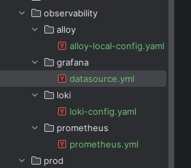
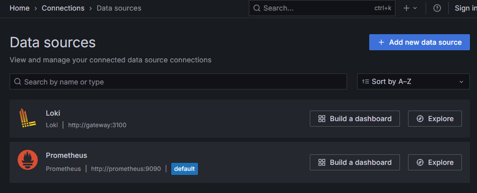

---

# Section 11: Observability and monitoring of microservices

---

Here’s your translated explanation into **English** (well-structured and suitable for documentation or a presentation):

---

### **Observability vs Monitoring**

**Observability** is primarily about understanding what is happening inside your systems and processes.
**Monitoring**, on the other hand, is about watching for known problems — such as increased traffic, failed requests, or CPU spikes.

* **Monitoring** answers the question: *“Is something wrong?”*
* **Observability** answers the question: *“Why is it wrong?”*

You can think of it like this:

* **Monitoring** is about detecting known symptoms.
* **Observability** provides tools to investigate and understand *any* state of the system — even unknown or unexpected ones.

#### Analogy:

* **Monitoring** is like the dashboard warning lights in a car: they alert you when something is off.
* **Observability** is like opening the hood, plugging in a diagnostic computer, and analyzing logs, temperatures, and pressures to pinpoint the root cause.

**Monitoring is reactive** — you respond *after* the problem appears.
Example:

> The oil light turns on → you check the oil → you top it up.

**Observability enables proactive action** — you act *before* the problem escalates.
Example:

> You notice engine temperature slowly rising over time → investigate why → replace the fan before the car overheats.

---

### **Grafana and Loki**

**Grafana** is a popular tool for visualizing metrics, logs, and traces from various sources.
It’s easy to install via Docker.

**Loki** is the storage backend for log aggregation.
Grafana connects to Loki to display and analyze logs.

Here’s an official architecture diagram from Grafana:
🔗 [https://grafana.com/docs/loki/latest/get-started/quick-start/quick-start/](https://grafana.com/docs/loki/latest/get-started/quick-start/quick-start/)

The **orange box** in the diagram represents **Loki**, and you can run it in **two ways**:

#### Option 1: Single Container

You can run Loki in a single container with basic configuration:

```yaml
loki:
  image: grafana/loki:main
  container_name: loki
  command: [ "-config.file=/etc/loki/local-config.yaml" ]
  ports:
    - "3100:3100"
```

This encapsulates the whole Loki stack in one service.

#### Option 2: Split Microservices (Advanced Mode)

For more control and scalability, you can split the services like this:

* `read` service (for reading logs)
* `write` service (for writing logs)
* `backend`
* `gateway` (acts as an HTTP proxy)
* `minio` (for object storage)
* `grafana`
* `flog` (a log generator — acts as a fake service)
* `alloy` (collects logs from Docker)

**Alloy** connects to the Docker daemon via `/var/run/docker.sock` and scrapes logs directly from running containers.

This setup gives you more flexibility — for example, you can scale `write` or `read` services independently.

> ⚠️ **Why separate services?**
> Because you gain more control over the architecture, and it enables horizontal scaling (e.g., more `write` instances for high log volume).

---

### **Directory Setup**

You create an `observability` folder inside your `docker-compose` folder in your project:

```
/docker-compose/
└── observability/
    ├── docker-compose.yaml
    ├── alloy-local-config.yaml
    ├── loki-config.yaml
```

Use the official example `docker-compose.yaml` from Grafana and modifiy it for your app lectures 163-164 (remove `flog` if you don’t need it):
🔗 [https://raw.githubusercontent.com/grafana/loki/main/examples/getting-started/docker-compose.yaml](https://raw.githubusercontent.com/grafana/loki/main/examples/getting-started/docker-compose.yaml)

Make some adjustments — e.g., set up your networks properly. Note that:

* `read` and `write` should be on the same network
* The rest (like `grafana`, `gateway`, etc.) might be in a broader project network (e.g., `trelabank`)
---

### **Building and Running the Stack**

Once you’ve added the files and made your adjustments:

* Build your images (e.g., using Google Jib if needed)
* Run everything with:

  ```bash
  docker-compose up -d
  ```

You’ll see several containers spin up — including Grafana, Loki components, Minio, etc.

---

### **In Grafana**
(localhost:3000)
1. **Go to Data Sources**
   You should see **Loki** connected.

2. **Go to Explore → Select “containers” label**

   

This label (`container`) comes from **Alloy**, based on the container name:

```alloy
rule {
  source_labels = ["__meta_docker_container_name"]
  regex         = "/(.*)"
  target_label  = "container"
}
```

* `source_labels`: pulls the container names
* `target_label`: maps them to the `container` label in logs

---

### **Notes**

* **Alloy pulls logs directly from Docker** using the Docker socket.
* This stack is not for local dev (e.g., IntelliJ-based logging), but rather for **dev/prod/QA environments**.
* The actual logs are saved to the volume directory created by Loki:
  


---

## Metrics – Let's move on to metrics

Event logs are essential for monitoring applications, but they don't provide enough data to answer all the necessary questions. To answer questions like CPU usage, memory consumption, number of threads, failed requests, etc. — and to effectively monitor, manage, and diagnose an application in a production environment — we need more data.

**Metrics** are numerical measurements of application performance, collected and aggregated at regular intervals. They can be used to monitor the health and performance of an application and to set alerts or notifications when specific thresholds are exceeded.

### 1️⃣ Micrometer

Micrometer automatically exposes data from `/actuator/metrics` in a format that is understandable by monitoring systems. You just need to include the proper Micrometer dependency for a specific monitoring provider. You can think of it as **SLF4J for metrics**.

### 2️⃣ Actuator

The Actuator is mainly used to expose operational information about a running application — such as system health, metrics, info, thread dumps, environment variables, etc. It uses HTTP endpoints or JMX beans to enable interaction with the application.

### 3️⃣ Prometheus

The most commonly used format for exporting metrics is the one used by **Prometheus** — an open-source system monitoring and alerting toolkit. Just like **Loki** aggregates and stores event logs, Prometheus does the same but for metrics.

### 4️⃣ Grafana

**Grafana** is a visualization tool that allows you to create dashboards and charts based on data from Prometheus.

Exactly! ✅

Micrometer acts like a **"translator"** for metrics — it’s an abstraction layer that:

🔁 Collects metrics from your application (Spring Boot, JVM, etc.)
📤 Converts them into a format understandable by monitoring systems (e.g., Prometheus, Datadog, New Relic)

You can learn more about Micrometer at:
👉 [https://micrometer.io/](https://micrometer.io/)

And more about Prometheus here:
👉 [https://prometheus.io/](https://prometheus.io/)

> Note: Prometheus has its limitations — it’s not ideal for building complex dashboards, alerts, or notifications. That’s where tools like Grafana come in.

---

Let’s implement it now in our microservices.

In reality, we just need to add the necessary dependencies, and our job as developers ends there.

We add the dependency:

```xml
<dependency>
    <groupId>io.micrometer</groupId>
    <artifactId>micrometer-registry-prometheus</artifactId>
</dependency>
```

After adding it to each microservice, we also need to add the following property in `application.yml`:

```yaml
# prometheus
metrics:
  tags:
    application: ${spring.application.name}
```

This simply provides Prometheus with the information it needs to name our applications and the metrics they come from.

Okay, now we can start our applications.

Let’s open an actuator endpoint, for example, the accounts service:

```
http://localhost:8080/actuator/metrics
```

And we’ll see the metrics:

```json
{
  "names": [
    "application.ready.time",
    "application.started.time",
    "disk.free",
    "disk.total",
    "executor.active",
    ...
    "tomcat.sessions.rejected"
  ]
}
```

As we can see, there are lots of metrics. We can select one of them by modifying the URL, for example:

```
http://localhost:8080/actuator/metrics/system.cpu.count
```

```json
{
  "name": "system.cpu.count",
  "description": "The number of processors available to the Java virtual machine",
  "measurements": [
    {
      "statistic": "VALUE",
      "value": 24
    }
  ],
  "availableTags": [
    {
      "tag": "application",
      "values": [
        "accounts"
      ]
    }
  ]
}
```

As we can see, it works. However, it would be inconvenient to go to each of these endpoints manually to check every piece of information.

That’s why Prometheus will collect all of this automatically.

Micrometer provides a special endpoint just for Prometheus:

```
http://localhost:8080/actuator/prometheus
```

The data returned here is formatted specifically for Prometheus, and Prometheus will scrape this endpoint every 3, 5, or 10 seconds depending on the configuration.

Now let’s add Prometheus to our `docker-compose`, since the endpoint is ready—we just need to hook it up.

Create a new folder:
`docker-compose/observability/prometheus`

Then, from this link:
[https://grafana.com/docs/grafana-cloud/send-data/metrics/metrics-prometheus/prometheus-config-examples/docker-compose-linux/](https://grafana.com/docs/grafana-cloud/send-data/metrics/metrics-prometheus/prometheus-config-examples/docker-compose-linux/)
—copy the configuration into `prometheus.yml` and modify it to suit your needs.

Then in `docker-compose.yaml`, add the Prometheus service:

```yaml
prometheus:
  image: prom/prometheus:latest
  container_name: prometheus
  ports:
    - "9090:9090"
  volumes:
    - ../observability/prometheus/prometheus.yml:/etc/prometheus/prometheus.yml
  extends:
    file: common-config.yml
    service: network-deploy-service
```

So, we include the Prometheus configuration, give it the path to the config folder, and use the same network as the other microservices from `network-deploy-service`.

Now we need to connect Prometheus to Grafana.

Earlier, in Grafana, we set up a datasource for Loki. Now we need to do the same for Prometheus.

Here’s the updated `grafana` service configuration in `docker-compose.yaml`:

```yaml
grafana:
  image: grafana/grafana:latest
  environment:
    - GF_PATHS_PROVISIONING=/etc/grafana/provisioning
    - GF_AUTH_ANONYMOUS_ENABLED=true
    - GF_AUTH_ANONYMOUS_ORG_ROLE=Admin
  depends_on:
    - gateway
  entrypoint:
    - sh
    - -euc
    - |
      mkdir -p /etc/grafana/provisioning/datasources
      cat <<EOF > /etc/grafana/provisioning/datasources/ds.yaml
      apiVersion: 1
      datasources:
        - name: Loki
          type: loki
          access: proxy
          url: http://gateway:3100
          jsonData:
            httpHeaderName1: "X-Scope-OrgID"
          secureJsonData:
            httpHeaderValue1: "tenant1"
      EOF
      /run.sh
  ports:
    - "3000:3000"
  healthcheck:
    test: ["CMD-SHELL", "wget --no-verbose --tries=1 --spider http://localhost:3000/api/health || exit 1"]
    interval: 10s
    timeout: 5s
    retries: 5
  extends:
    file: common-config.yml
    service: network-deploy-service
```

To avoid making this block longer, we’ll create a separate folder for Grafana configuration:

`docker-compose/observability/grafana`

Inside that folder, we place a new file for datasource configuration (see screenshot below):



First, we can optionally delete the previously defined datasources:

```yaml
apiVersion: 1

deleteDataSources:
  - name: Prometheus
  - name: Loki
```

Then we define our new datasources:

```yaml
apiVersion: 1

datasources:
  - name: Prometheus
    type: prometheus
    uid: prometheus
    url: http://prometheus:9090
    access: proxy
    orgId: 1
    basicAuth: false
    isDefault: false
    version: 1
    editable: true
    jsonData:
      httpMethod: GET

  - name: Loki
    type: loki
    uid: loki
    access: proxy
    orgId: 1
    editable: true
    url: http://gateway:3100
    jsonData:
      httpHeaderName1: "X-Scope-OrgID"
      derivedFields:
        - datasourceUid: tempo
          matcherRegex: "\\[.+,(.+),.+\\]"
          name: TraceID
          url: '$${__value.raw}'
    secureJsonData:
      httpHeaderValue1: "tenant1"
```

As you can see, earlier in Grafana we manually created the datasource folder and wrote the config using `mkdir` and `cat`. Now we don't need to do that anymore because we’ve created a proper `datasource.yml` and mounted it directly.

So we can now remove the `entrypoint` section and instead use `volumes` with the proper config path.

Next, we rebuild the Docker images for all the services, because we’ve modified their code.

Then we can start the entire stack with `docker-compose`.

Now our containers are running (see screenshot):


We can again test the endpoint:

```
http://localhost:8080/actuator/prometheus
```

We can also go to Prometheus and see all the microservices:

```
http://localhost:9090/targets
```


If we go to the "Graph" tab, we can explore all available metrics and see them visualized:


It’s already very useful—but Grafana takes it a step further by offering beautiful dashboards and more features.

Now let’s open Grafana.

If we go to *Connections* (see screenshot), we’ll see all our data sources. These are all the ones we defined in the `docker-compose/observability/grafana/datasource.yml` file:



We can choose a specific application, or not—then the chart will show metrics for the whole system:


So we can view a lot of useful stats—but that’s not all.

Let’s now move on to **dashboards**.

---


You can find dashboards at the following link:
👉 [https://grafana.com/grafana/dashboards/](https://grafana.com/grafana/dashboards/)

There are many dashboards available — for example, we can search for one related to **JVM** and look for the one with the highest number of downloads.

Let’s say we find this one:
👉 [https://grafana.com/grafana/dashboards/4701-jvm-micrometer/](https://grafana.com/grafana/dashboards/4701-jvm-micrometer/)

Now, log into your local Grafana instance using:
**Username:** `admin`
**Password:** `admin`

Then go to:

```
http://localhost:3000/dashboard/import
```

And paste the dashboard link from Grafana (screenshot below):


The full dashboard will appear (screenshot below):


So with Grafana, you can import and use **any dashboard** you want.

---

### But what if you want to create your **own dashboard**?

You can absolutely build your own dashboards (see screenshot below):


However, Grafana is a **broad and complex topic**. What we’ve learned so far should be more than enough for most developers.

If you want to go deeper, it’s best to take a dedicated course on **Grafana** itself.

---
Here’s the English translation of your text, with some natural adjustments for clarity and flow:

---

### ⚠️ Alerts and Notifications with Grafana

We go to the **Alerts** section:
[http://localhost:3000/alerting/list](http://localhost:3000/alerting/list)

Then, we **create a new alert**.
The full process of setting up an alert is explained in **lesson 171**, so I won’t describe everything here in detail.

In short — you can create a custom alert and define your own **condition** for it.
If the condition is met, you can **send notifications** in various ways — for example via **email** or **webhook**.
*(screenshot below)*


You can also **trigger alerts directly from your dashboard**:
*(screenshots below)*


---

### 📊 Summary: Micrometer + Prometheus + Grafana

In our microservices, we added the **Micrometer** dependency, which, together with **Spring Boot Actuator**, exposes metrics in a format that **Prometheus** can understand.

**Prometheus** regularly **scrapes** these metrics from the services and allows us to view and analyze them in its own UI.

However, Prometheus alone is not enough if we want to build visually appealing **dashboards**, **charts**, or set up **alerts** and **notifications**.

That’s why we integrate Prometheus with **Grafana**, which provides:

* Data visualization
* Dashboard creation
* Alert and notification configuration

Thanks to this integration, we get a **complete monitoring system** for our microservices.

---

### 👨‍💻 For Developers:

You don’t need to be a Grafana expert, but it’s very useful to understand the basics so that you have a clear picture of the entire workflow — from developing and deploying microservices to monitoring them.

---

## 🔍 Let's focus on **Distributed Tracing**

So far, we’ve covered two pillars of observability — **logs** and **metrics**. These let us understand the internal state of the application or its general health.

However, logs, health probes, and metrics don’t help developers effectively **debug problems**, especially in **distributed systems** like microservices or cloud-native applications.

In such distributed systems, a **user request** can travel through multiple applications or microservices.

Given this level of complexity, developers need a **mechanism** to trace the **journey of a request** — to see:

* Which microservices the request passed through
* How long each service took to process it

This is exactly the role of **distributed tracing**.

---

## Why Distributed Tracing?

In real-world projects, we often deal with **hundreds of microservices**. If a request needs to go through more than 10 services to get a response, developers should have a **clear view** of:

* Which methods were called
* How much time each step took

Without distributed tracing, it's nearly impossible to **debug distributed systems effectively**.

### You *could* use a `correlationId`, but you would need to implement that manually in every service.

---

## 🌐 Trace ID vs Span ID

* A **Trace ID** identifies the entire request flow across multiple services.
* A **Span ID** represents a single operation within that flow.

So:
**Trace ID** remains the same across the request path.
**Span ID** changes per individual service or operation.

We didn’t have this separation with correlation IDs, but now we will.

---

## 🧰 Start with Spring Cloud Sleuth?

All logs generated with Sleuth include:

* Trace ID
* Span ID
* Application name

But **we won’t use Spring Cloud Sleuth** — it is going to be deprecated.

---

## ✅ Use Micrometer?

We used **Micrometer** for metrics before. It also supports tracing:
📎 [https://micrometer.io/docs/tracing](https://micrometer.io/docs/tracing)

But based on experience, it requires too many configuration changes.
We **won’t use** this approach either.

---

## 🟣 Instead: Use **OpenTelemetry**

It’s easier to implement!

### 📎 Start here:

[https://opentelemetry.io/docs/zero-code/java/agent/getting-started/](https://opentelemetry.io/docs/zero-code/java/agent/getting-started/)

We'll use the **OpenTelemetry Java agent**.

---

### 1️⃣ Add the agent dependency:

```xml
<dependency>
  <groupId>io.opentelemetry.javaagent</groupId>
  <artifactId>opentelemetry-javaagent</artifactId>
  <version>${otelVersion}</version>
  <scope>runtime</scope>
</dependency>
```

---

### 2️⃣ In `application.yml`, update the log pattern:

```yaml
pattern:
  level: "%5p [${spring.application.name},%X{trace_id},%X{span_id}]"
```

Explanation:

* `%5p` – log level, fixed width
* `${spring.application.name}` – service name
* `%X{trace_id}` – trace ID
* `%X{span_id}` – span ID

---

### 3️⃣ Update your controller (e.g. `CustomerController`)

```java
@Override
@GetMapping("/fetchCustomerDetails")
public ResponseEntity<CustomerDetailsDto> fetchCustomerDetails(@RequestHeader("trelaBank-correlation-id") String correlationId, @RequestParam String mobileNumber) {
    log.debug("fetchCustomerDetails method start");
    CustomerDetailsDto customerDetailsDto = customerService.fetchCustomerDetails(mobileNumber, correlationId);
    log.debug("fetchCustomerDetails method end");
    return ResponseEntity.ok(customerDetailsDto);
}
```

Use OpenTelemetry correlation instead of your own correlation ID system.

---

## 🔄 OpenTelemetry + Grafana Tempo + Grafana

### OpenTelemetry (OTel)

* Open-source observability framework
* Collects traces, metrics, logs
* Generates **traces** and **spans**

### Grafana Tempo

* Trace backend for storing and searching traces
* Cloud-native and cost-effective

### Grafana

* Visualizes Tempo data
* Supports integration with **Loki** (logs)
* You can jump from logs → traces

---

## ⚙️ Setup OpenTelemetry in `common-config.yml`

```yaml
environment:
  JAVA_TOOL_OPTIONS: "-javaagent:/app/libs/opentelemetry-javaagent-2.18.0.jar"
  OTEL_EXPORTER_OTLP_ENDPOINT: http://tempo:4318
  OTEL_METRICS_EXPORTER: none
  OTEL_LOGS_EXPORTER: none
```

* Set metrics and logs to `none` because we use **Prometheus** and **Loki**
* `4318` is used by OpenTelemetry to export traces to Tempo

---

## 🔧 In `docker-compose`, set the service name:

```yaml
# OpenTelemetry service name
OTEL_SERVICE_NAME: gatewayserver
```

---

## 📂 Tempo Configuration

Create a new folder for **Tempo config**, and use the official configuration.
We won’t dive into details — platform teams usually handle this.

📸 **Screenshot:**


---

### Add Tempo to `docker-compose`:

```yaml
tempo:
  image: grafana/tempo
  container_name: tempo
  command: -config.file=/etc/tempo-config.yaml
  ports:
    - "3110:3100"  # Use 3110 to avoid port conflicts
    - "4318:4318"
  volumes:
    - ../observability/tempo/tempo.yml:/etc/tempo-config.yaml
  extends:
    file: common-config.yml
    service: network-deploy-service
```

* Port `4318` is for OpenTelemetry to send traces

---

### Connect Tempo to Grafana

In Grafana’s `datasource.yml`:

```yaml
- name: Tempo
  type: tempo
  uid: tempo
  url: http://tempo:3100
  access: proxy
  orgId: 1
  basicAuth: false
  isDefault: false
  version: 1
  editable: true
  jsonData:
    httpMethod: GET
    serviceMap:
      datasourceUid: 'prometheus'
```

---

### ✅ Now build Docker images, run everything with Docker Compose

📸 Screenshot of running containers:


---

### Use these endpoints to generate trace data:

```bash
http://localhost:8072/trelabank/accounts/api/create
http://localhost:8072/trelabank/cards/api/create?mobileNumber=4354437687
http://localhost:8072/trelabank/loans/api/create?mobileNumber=4354437687
http://localhost:8072/trelabank/accounts/api/fetchCustomerDetails?mobileNumber=4354437687
```

---

### Sample Logs:

```
2025-07-20T08:23:09.111Z DEBUG [loans,77779faf6674421986275105e8a6a33c,73711e161ad6545b]
2025-07-20T08:23:09.207Z DEBUG [accounts,77779faf6674421986275105e8a6a33c,58ce100b724eebdb]
2025-07-20T08:23:09.197Z DEBUG [cards,77779faf6674421986275105e8a6a33c,c08889829cd411fe]
```

🔁 As you can see, **Trace ID** is the same — only **Span ID** changes.

---

## 🔍 Go to Tempo, search by Trace ID

Paste the trace ID from logs:
`77779faf6674421986275105e8a6a33c`

📸 Screens:


---

### 🔄 Tempo vs Zipkin vs Jaeger

* **Zipkin**: trace info only
* **Jaeger**: similar to Zipkin
* **Tempo**: better — supports full Grafana integration (logs + metrics + traces)

---

## 🧠 Bonus: Click from Logs to Traces (Loki → Tempo)

You can use **Derived Fields** to extract the `Trace ID` from logs and link it to Tempo.

📸 Example:


### In Grafana’s `datasource.yml` for Loki:

```yaml
- name: Loki
  type: loki
  uid: loki
  access: proxy
  orgId: 1
  editable: true
  url: http://gateway:3100
  jsonData:
    httpHeaderName1: "X-Scope-OrgID"
    derivedFields:
      - datasourceUid: tempo
        matcherRegex: "\\[.+,(.+),.+\\]"
        name: TraceID
        url: '$${__value.raw}'
  secureJsonData:
    httpHeaderValue1: "tenant1"
```

✅ Now developers can click on a log line in **Loki** and jump directly to **Tempo** trace!

---
