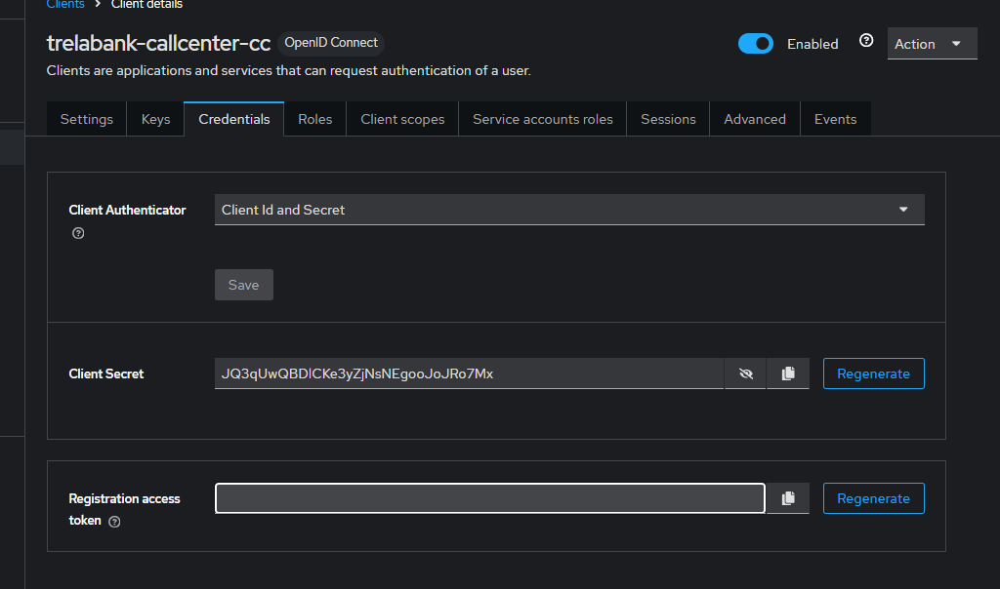

---

# Section 12: Microservices Security

---

## 🛡️ **MICROSERVICE SECURITY**

**Securing Microservices from Unauthorized Access**

How can we secure our microservices and protect them from unauthorized access by client applications or end users?

Currently, all our services are unsecured — anyone can invoke them and receive responses that may contain sensitive data.

---

### 🔐 **Authentication & Authorization**

How can our microservices **authenticate** and **authorize** users and other services in order to grant access?

Our microservices should be capable of:

* **Identifying** the user,
* **Authenticating** the user,
* **Authorizing** the user or client.

---

### 🏢 **Centralized Identity and Access Management (IAM)**

How can we maintain a centralized component to store user credentials and handle identity and access management?

By using:

* **OAuth2 / OpenID Connect**
* **Keycloak** (IAM system)
* **Spring Security**

We can secure our microservices and address all of the above security challenges.

---

## 🌐 **Introduction to OAuth2**

> How does Google allow us to use a single set of credentials to access services like Google Maps, Google Photos, Gmail, and more?

Google uses an **Authorization Server** that manages authentication and token issuance.

---

### 🔐 **Example: Logging in to StackOverflow with GitHub**

When you log in to StackOverflow using GitHub:

* GitHub (as an **Authorization Server**) issues access permissions (“keys”) to StackOverflow.
* It also returns identity data (e.g., your GitHub username or email) that StackOverflow can use to create or link your account.

You grant access **without sharing your GitHub password** with StackOverflow.

---

## 🔓 **What is OAuth2?**

OAuth stands for **Open Authorization** — it’s a free and open protocol built on IETF standards and licensed by the Open Web Foundation.

OAuth 2.1 is a **security standard** that allows one application to access your data in another application on your behalf. The process of granting this access is known as **authorization** or **delegated authorization**.

You **authorize** one app to access your data or use features of another app — **without sharing your password**.

---

### ✅ **Benefits of OAuth2**

* **Supports all kinds of applications:**
  Server-to-server, browser-based, mobile/native, IoT devices, consoles, and TVs.

* **Flexible authorization flows:**
  Examples include `Authorization Code Grant` and `Client Credentials Grant`, tailored to different types of apps and communication models.

* **Separation of authentication logic:**
  All auth logic is centralized in an **Authorization Server**, which handles login and issues tokens.
  All applications in the organization can delegate login/auth to this server.

* **Centralized credential storage:**
  User credentials and client secrets are securely stored inside the Authorization Server.

* **No need to share credentials:**
  Third-party apps can access your resources via tokens — without ever seeing your login credentials.

---

🔑 **OAuth2 Access Tokens** are like keycards in an office/hotel: they grant **limited access**, without giving away the **master key**.

---

## 📘 **OAuth2 Terminology**

* **Resource Owner**
  You, the end user. The one who owns the resources (e.g., email, profile) and wants to share them with another app (like StackOverflow using GitHub).

* **Client**
  The application that acts on behalf of the user and makes requests to access their data (e.g., StackOverflow).

* **Authorization Server**
  The server that holds identity and login logic. It authenticates the user and issues tokens (e.g., GitHub login server).

* **Resource Server**
  The server where protected resources are hosted — such as user emails or profile data (e.g., GitHub API).

* **Scopes**
  Fine-grained permissions the client requests (e.g., `email`, `read:user`). The user must approve these during login.

🔍 You can browse the available GitHub scopes here:
👉 [https://docs.github.com/en/apps/oauth-apps/building-oauth-apps/scopes-for-oauth-apps](https://docs.github.com/en/apps/oauth-apps/building-oauth-apps/scopes-for-oauth-apps)

---

## 🔐 **The Problem with OAuth2 Alone**

OAuth2 provides **authorization** but does not include **authentication**.
That means: **we know what the user can access**, but we don’t actually know **who** the user is.

### 🔧 How organizations tried to solve it:

Many companies tried to manually include identity details (e.g., email, phone number) **inside the access token** — but each one did it differently (custom formats, naming, etc.).

> There was **no standard way** to represent user identity in OAuth2.

This led to confusion, incompatibility, and security risks.

---

## 🧩 **What is OpenID Connect (OIDC) and Why Is It Important?**

OpenID Connect is a **layer on top of OAuth2**, which adds **authentication**.

While OAuth2 gives you an **access token** for authorization, OIDC introduces a new token — the **ID Token** — which carries **identity claims** (e.g., who the user is, their email, username, etc.).

### 📌 Key Differences

| **OpenID Connect**         | **OAuth 2.0**               |
| -------------------------- | --------------------------- |
| ✅ Authentication           | 🔓 Authorization            |
| 🆔 ID Token with user info | 🔑 Access Token with scopes |

### ✅ Why Is OIDC Important?

* Identity is **central to modern apps**.
* OAuth2 alone doesn’t tell you **who is logging in**.
* OIDC completes the picture, enabling a full **IAM (Identity and Access Management)** solution.

---

### 🧱 What Does OIDC Add?

1. **Standardized Scopes:**
   `openid`, `profile`, `email`, `address`

2. **ID Token:**
   A secure JWT (JSON Web Token) containing identity claims (e.g., `sub`, `name`, `email`, `exp`)

3. **`/userinfo` endpoint:**
   A standardized endpoint that client apps can use to fetch user details from the Identity Provider (e.g., Keycloak)

---

A demand has arisen for OAuth in every organization, which led to the creation of projects like **Keycloak**.
**Keycloak** is an open-source identity and access management solution:
🔗 [https://www.keycloak.org/](https://www.keycloak.org/)

We also have **Okta**, which is very popular for enterprise applications.
Organizations that can afford it often choose to use Okta:
🔗 [https://www.okta.com/](https://www.okta.com/)

Another option is **AWS Cognito**:
🔗 [https://aws.amazon.com/cognito/](https://aws.amazon.com/cognito/)

There are also other solutions.

Additionally, the **Spring Boot** team recently created the **Spring Authorization Server** project, which can also be used as an OAuth2 provider.

---

### Let's Start with the **Client Credentials Grant Type Flow**

We use this grant type when two backend services need to communicate with each other.
In this case, the client is the backend server.

#### Client Credentials Grant Type in OAuth2

In **Step 1**, the client sends a request to the **Authorization Server**’s token endpoint.
The request must include the following key information:

* `client_id` and `client_secret` – credentials to identify and authenticate the client
* `scope` – similar to roles (authorities); defines the level of access requested, e.g., `EMAIL`, `PROFILE`
* `grant_type` – should be set to `client_credentials` to indicate this type of flow

#### Key Characteristics

* This is the **simplest** OAuth2 flow
* It is used **only** when there is **no user** and **no UI** involved (i.e., server-to-server communication)
* Example use case: two backend applications exchanging data over an API

#### Diagram: Client Credentials Flow Using Keycloak


> ⚠️ Note: Backend services should **not** be tightly secured or over-protected, as this can add complexity and negatively impact performance.

---

### Let’s Get Started

First, let's install Keycloak using Docker (without Docker Compose for now):

```bash
docker run -d -p 127.0.0.1:7080:8080 \
  -e KC_BOOTSTRAP_ADMIN_USERNAME=admin \
  -e KC_BOOTSTRAP_ADMIN_PASSWORD=admin \
  quay.io/keycloak/keycloak:26.3.1 start-dev
```

* The `start-dev` flag means we are running in **development mode**, and Keycloak will use its **own internal database**.
* ⚠️ In production, you should **not** use the internal DB — instead, connect Keycloak to an **external database**.

After running the container, open your browser and go to:

```
http://127.0.0.1:7080
```

Log in using the credentials defined in the Docker command (`admin` / `admin`).

---

The first thing you’ll see is the **"master realm"**.
What does that mean?

A *realm* is like an **environment** in your project.
You don't want QA to use the same credentials or configuration as production — each realm can isolate users, roles, clients, etc.

---

So now, in Keycloak, to implement the **Client Credentials Authorization Flow**, we need to **register our external application**.

As shown in the screenshot below,
there is **no option to choose between OpenID and OAuth2**, because **OpenID is a wrapper around OAuth2** — so by selecting OpenID, we're effectively choosing OAuth2.

Let’s say we want to authorize an external app, such as a **call center system**.
To do that, we create a **client ID**, e.g.
`trelabank-callcenter-cc`

Then, we select the option for the **Client Credentials Flow**
(screenshot below)


The **client secret** is generated automatically by Keycloak (screenshot below):


So now we have:

* `client_id`: `trelabank-callcenter-cc`
* `client_secret`: `JQ3qUwQBDlCKe3yZjNsNEgooJoJRo7Mx`

Now we need the **token endpoint**. All available endpoints can be found by accessing the Keycloak realm’s metadata.
Screenshot below:


Now we can act as the **external call center application** and request a token:
Screenshot below:


In the same metadata URL, you can also see the supported **grant types**:

```json
"grant_types_supported": [
  "authorization_code",
  "client_credentials",
  "implicit",
  "password",
  "refresh_token",
  "urn:ietf:params:oauth:grant-type:device_code",
  "urn:ietf:params:oauth:grant-type:token-exchange",
  "urn:ietf:params:oauth:grant-type:uma-ticket",
  "urn:openid:params:grant-type:ciba"
]
```

**Scopes** are added by default — you can check them in the client configuration.
`openid` is always included by default (because it implies an ID token).

The response looks like this:

```json
{
  "access_token": "...",
  "expires_in": 60,
  "refresh_expires_in": 0,
  "token_type": "Bearer",
  "id_token": "...",
  "not-before-policy": 0,
  "scope": "openid profile email"
}
```

---

### What happens if we remove `openid` from the request?

If you remove `openid` from the request scope, you won’t receive an `id_token` in the response.

You can still decode the `access_token`.

---

Now that we’ve built the **Auth Server** in Keycloak,
what’s missing is the **Resource Server**.

We add the following dependencies to the **Gateway Server**:

```xml
<dependency>
    <groupId>org.springframework.boot</groupId>
    <artifactId>spring-boot-starter-oauth2-resource-server</artifactId>
</dependency>
<dependency>
    <groupId>org.springframework.boot</groupId>
    <artifactId>spring-boot-starter-security</artifactId>
</dependency>
<dependency>
    <groupId>org.springframework.security</groupId>
    <artifactId>spring-security-oauth2-jose</artifactId>
</dependency>
```

Then, we configure **WebFlux Security** because we are using a **reactive Gateway**:

```java
@Configuration
@EnableWebFluxSecurity
public class SecurityConfig {

    @Bean
    public SecurityWebFilterChain springSecurityFilterChain(ServerHttpSecurity serverHttpSecurity) {
        serverHttpSecurity
            .authorizeExchange(exchanges -> exchanges
                .pathMatchers(HttpMethod.GET).permitAll()
                .pathMatchers("/trelabank/accounts/**").authenticated()
                .pathMatchers("/trelabank/cards/**").authenticated()
                .pathMatchers("/trelabank/loans/**").authenticated())
            .oauth2ResourceServer(oauth2 -> oauth2.jwt(Customizer.withDefaults()));
        
        serverHttpSecurity.csrf(csrf -> csrf.disable());
        return serverHttpSecurity.build();
    }
}
```

We first allow all `GET` requests.
Now we need to tell the **Resource Server** how to **validate the token**.

In `application.yml` for the gateway, we add:

```yaml
# OAuth2 Resource Server
security:
  oauth2:
    resourceserver:
      jwt:
        jwk-set-uri: http://localhost:7080/realms/master/protocol/openid-connect/certs
```

The certificate URL is taken from Keycloak. What does this URL mean?
The **resource server (our gateway)** receives the **public certificate** from Keycloak.
Using this certificate, the resource server can verify that the token was **issued by Keycloak**.

---

Below are diagrams showing how token **generation** and **validation** work using asymmetric keys:


### Token generation process:

1. Split data into **metadata** and **payload**
2. Base64Url encode the metadata (JWT Header) and payload
3. Create the signature:

    * 3.1 Combine header and payload with a dot `.`
    * 3.2 Hash the combination using SHA-256
    * 3.3 Encrypt the hash using the **private key**

This results in a JWT token of the format:
`HEADER.PAYLOAD.SIGNATURE`

---

### Token verification process:

1. Take the JWT token
2. Extract the **header** and **payload**
3. Concatenate them with a dot
4. Hash this combination with SHA-256
5. Decode with Base64Url and Decrypt the **signature** using the **public key**
6. Compare the hash from step 4 with the decrypted signature

If the hashes match, the token is valid.
If not, the token is invalid (e.g., forged).

---

### In short:

We are verifying the hash of the header and payload.
This hash is like an **encrypted message** — we know what hash should result for a specific header and payload.
By decrypting the signature using the **public key**, we can compare it and ensure the token is authentic.
If the hashes match, we’re **100% sure** the token is valid and was issued by our Keycloak server.

So basically, if someone sends a token with a signature created using a different key, and we try to decrypt the "message" (i.e., the hash) using the public key,
we will get a different hash that won’t match the header and payload. 

---

Here's the English translation of your entire message, clearly structured and polished for clarity and fluency:

---

Now we can test our application — the API Gateway is already equipped with the public key URL, which allows it to verify every incoming token.

We use:

```
GET http://localhost:8072/trelabank/accounts/api/contact-info
```

And we receive a **200 OK** response, just as we configured it — to allow GET requests.

---

Now let’s try another endpoint:

```
POST http://localhost:8072/trelabank/accounts/api/create
```

With the body:

```json
{
  "name": "Marcin Trela",
  "email": "marcin.trela.dev@gmail.com",
  "mobileNumber": "4354437687"
}
```

We get a **401 Unauthorized** — which means that the API Gateway protection is working!

---

First, we obtain the token from Keycloak (pretending to be an external application, like a call center).
(See screenshot below)


Then we attach that token to our previous request.
(See screenshot below)


This time, we get a **201 Created** response:

```json
{
  "statusCode": "201",
  "statusMsg": "Account created successfully"
}
```

Behind the scenes, when the request with a token is sent, the gateway requests the public certificate, validates the token’s authenticity, and then allows the request to proceed.

---

So everything works — but **so far we are only authenticating**, not authorizing users.
We now want to **authorize access based on roles**.

Let’s change the config:

```java
.pathMatchers("/trelabank/accounts/**").hasRole("ACCOUNTS")
.pathMatchers("/trelabank/cards/**").hasRole("CARDS")
.pathMatchers("/trelabank/loans/**").hasRole("LOANS")
```

This means we now require a specific role for each microservice.

---

### 🛠️ How do we assign roles?

We need to assign roles to our client (callcenter) in Keycloak.

In Keycloak, there are two sections: **"Roles"** and **"Service Account Roles"**.
For full application clients, we should use **"Service Account Roles"**.
(See screenshot below)


We create a new role:


And we assign it, e.g., the `accounts` role:


---

### 🔄 Next, we need to create a role converter for Spring Security:

```java
public class KeycloakRoleConverter implements Converter<Jwt, Collection<GrantedAuthority>> {
    @Override
    public Collection<GrantedAuthority> convert(Jwt source) {
        Map<String, Object> realmAccess = (Map<String, Object>) source.getClaims().get("realm_access");
        if (realmAccess == null || realmAccess.isEmpty()) {
            return new ArrayList<>();
        }
        Collection<GrantedAuthority> returnValue = ((List<String>) realmAccess.get("roles"))
                .stream()
                .map(roleName -> "ROLE_" + roleName)
                .map(SimpleGrantedAuthority::new)
                .collect(Collectors.toList());
        return returnValue;
    }
}
```

We use `realm_access` because, after decoding the JWT, we see that roles are defined there:

```json
"realm_access": {
  "roles": [
    "default-roles-master",
    "ACCOUNTS",
    "offline_access",
    "uma_authorization"
  ]
}
```

We prepend `ROLE_` because that's the format Spring Security expects.

---

### 🧩 Now we register the converter in Spring Security

Create the bean:

```java
@Bean
private Converter<Jwt, Mono<AbstractAuthenticationToken>> grantedAuthoritiesExtractor() {
    JwtAuthenticationConverter jwtAuthenticationConverter = new JwtAuthenticationConverter();
    jwtAuthenticationConverter.setJwtGrantedAuthoritiesConverter(new KeycloakRoleConverter());
    return new ReactiveJwtAuthenticationConverterAdapter(jwtAuthenticationConverter);
}
```

And register it in the security config like this:

```java
.oauth2ResourceServer(oauth2 -> 
    oauth2.jwt(jwt -> 
        jwt.jwtAuthenticationConverter(grantedAuthoritiesExtractor())
    )
);
```

---

### ✅ Now back to Postman — let’s test if it works!

We send a request to:

```
POST http://localhost:8072/trelabank/accounts/api/create
```

Since we gave our client the `accounts` role, this works.

But requests to `cards` and `loans` endpoints fail — **as expected** — because the client doesn't have those roles.

Now let’s add the `cards` role to the client in Keycloak:


And test again:

```
POST http://localhost:8072/trelabank/cards/api/create?mobileNumber=4354437687
```

✅ **It works now!** The added role was recognized and access was granted.

Finally, we repeat the same for the `loans` role — and that works as well.

---

Pewnie! Poniżej masz tłumaczenie Twojego tekstu na **płynny i profesjonalny angielski**, z zachowaniem technicznej precyzji:

---

## 🔐 Authorization Code Grant Type Flow

> ⚠️ This explanation refers specifically to the Authorization Code Grant Flow. It's strongly recommended to use it **only with PKCE**, due to the security risks of authorization code interception and unsafe client credential storage.

---

### 📌 Steps 2 and 3 – Authorization Request

In steps 2 and 3, where the client sends a request to the authorization server’s endpoint, it must provide the following important parameters:

* **`client_id`** – The client identifier that tells the authorization server which application is making the request. It is assigned during client registration.
* **`redirect_uri`** – The URI where the authorization server will redirect the user after successful authentication. If a default URI is registered, this parameter is optional.
* **`scope`** – Defines the level of access the client is requesting (similar to permissions), e.g., `READ`.
* **`state`** – A CSRF token value used to prevent Cross-Site Request Forgery (CSRF) attacks.
* **`response_type`** – The value `code`, which indicates that the Authorization Code Grant is being used (authorization code will be issued to obtain the token).

---

### 📌 Step 5 – Token Request

Once the client receives the authorization code from the authorization server, it sends another request to the same server in order to obtain an access token. The request includes:

* **`code`** – The authorization code obtained in the previous step.
* **`client_id`** and **`client_secret`** – The credentials identifying the registered client (note: these are not the user's credentials).
* **`grant_type`** – The value `authorization_code`, indicating the type of grant being used.
* **`redirect_uri`** – Must exactly match the one provided in the earlier request to obtain the code.

---

💡 A great place to test various OAuth 2.0 flows interactively is:
👉 [https://www.oauth.com/playground/](https://www.oauth.com/playground/) – it's an excellent visual and educational tool.

---

## ⚙️ In Our Case: Implementation Note

Here, we are implementing the **Authorization Code Flow without PKCE**, because that's how the course instructor designed it.
However, generally speaking, **using PKCE is always the safer and recommended choice.**

---

## 🔧 Creating a Client in Keycloak

We create a new client in Keycloak using the Authorization Code flow, as shown in the screenshots below:


Make sure to define a **redirect URI** to prevent malicious actors from injecting their own redirect addresses.
🔐 This is known as **Redirect URI Validation** – and it protects against attacks like:

> **"Token hijacking via open redirect"** – where the attacker redirects the user to the login page and steals the access token by using a malicious `redirect_uri`.

Since we don’t have a front-end redirect or web origin, we can use a wildcard `*` instead:


And now the client is successfully created:


---

## 👤 Creating an End User in Keycloak

Next, we create a user:


And assign them a password:


Thus, we've created an end user.

> ❓ Will we always create users manually like this?
> ❌ No. Keycloak provides REST API endpoints to create users programmatically.

You can read more about that here:
🔗 [Keycloak REST API Docs](https://www.keycloak.org/docs-api/latest/rest-api/index.html)

---

## ▶️ Testing the Flow with Postman

Now let's test our setup. We can run both our application and Postman to simulate a UI client.

Because Postman can't handle redirects like a browser, we enable the setting shown below:


Then we configure the request as in the next screenshot:


When we request a token, a new browser window opens:


We use the credentials of the end user we created earlier:


And we successfully receive an access token:


---

## ❗403 Error – Missing Role

Although we got the token, we receive a **403 Forbidden** error when calling a protected endpoint.
That’s because we haven’t assigned the required role.
Previously, we defined that the `accounts` endpoint requires the `accounts` role.

So, we go to the **Role Mapping** tab for the user **marcin**, and assign the appropriate client role:


✅ Now it works!

```json
{
  "statusCode": "201",
  "statusMsg": "Account created successfully"
}
```

---

## 📦 Next Step: Building Docker Images for Our Microservices

Now that everything is working, we can proceed to build Docker images for our microservices.

Now we will edit our docker-compose file so that no one except the API gateway can access our internal services.

We’re adding Keycloak:
yaml
Kopiuj
Edytuj
keycloak:
image: quay.io/keycloak/keycloak:22.0.1
container_name: keycloak
ports:
- "7080:8080"
environment:
KEYCLOAK_ADMIN: "admin"
KEYCLOAK_ADMIN_PASSWORD: "admin"
command: "start-dev"
extends:
file: common-config.yml
service: network-deploy-service
We removed the ports section from the accounts service,
so that it’s no longer directly accessible from outside.
As a result, the accounts service is now inaccessible to the outside world.

This is network-level protection.

In addition, we configured the gateway to connect to Keycloak by adding:

yaml
Kopiuj
Edytuj
SPRING_SECURITY_OAUTH2_RESOURCESERVER_JWT_JWK-SET-URI: http://keycloak:8080/realms/master/protocol/openid-connect/certs
Now we can launch the Docker Compose setup.
See the screenshot below:


To test it, we need to re-add the OAuth2 clients in Keycloak
(just like we did earlier), and it works! ✅

Notice that none of the endpoints from the individual microservices work directly anymore:
For example:
http://localhost:8080/api/java-version → ❌ Not accessible

You can now only make requests through the API gateway.


