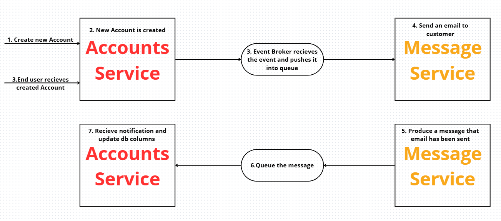
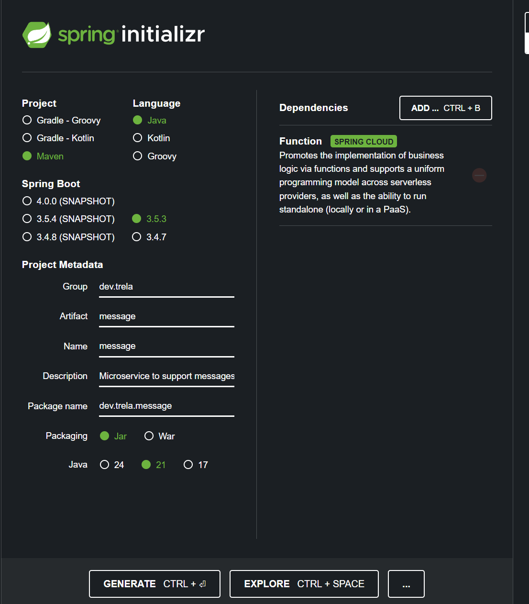
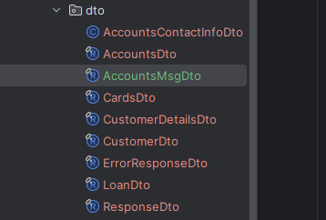
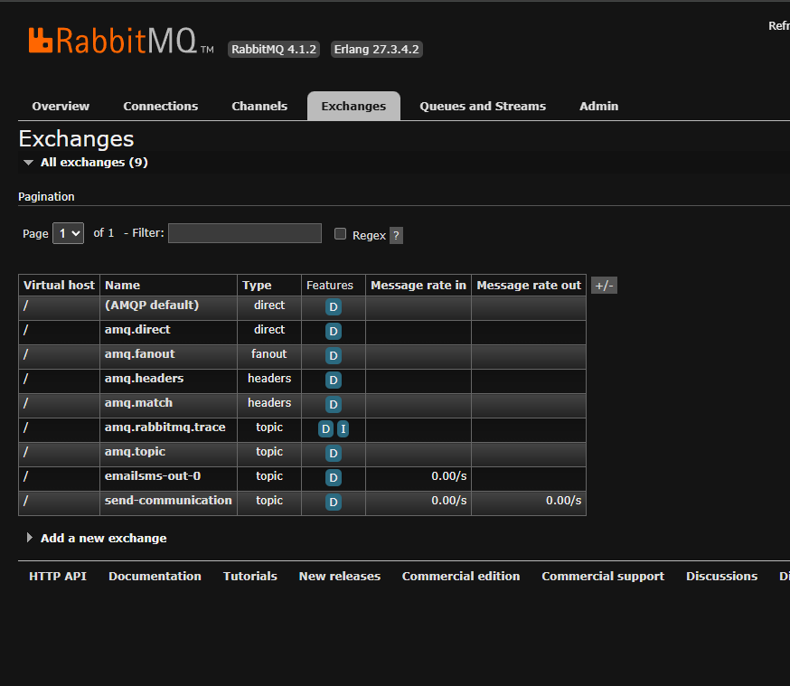
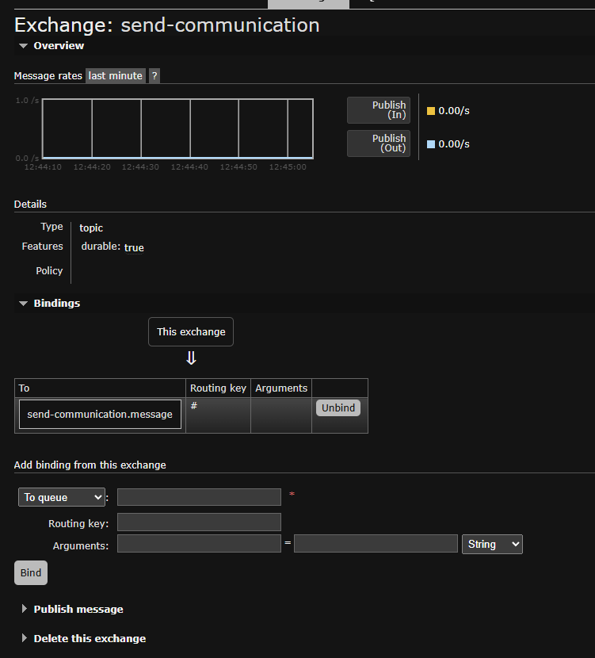
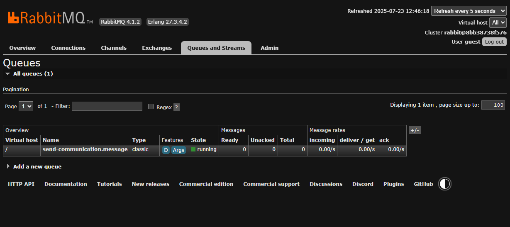
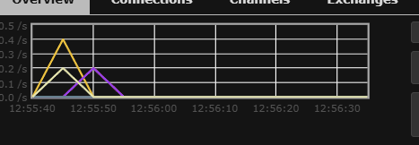
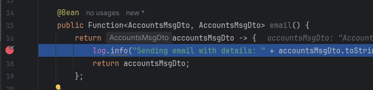
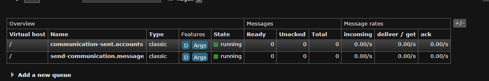
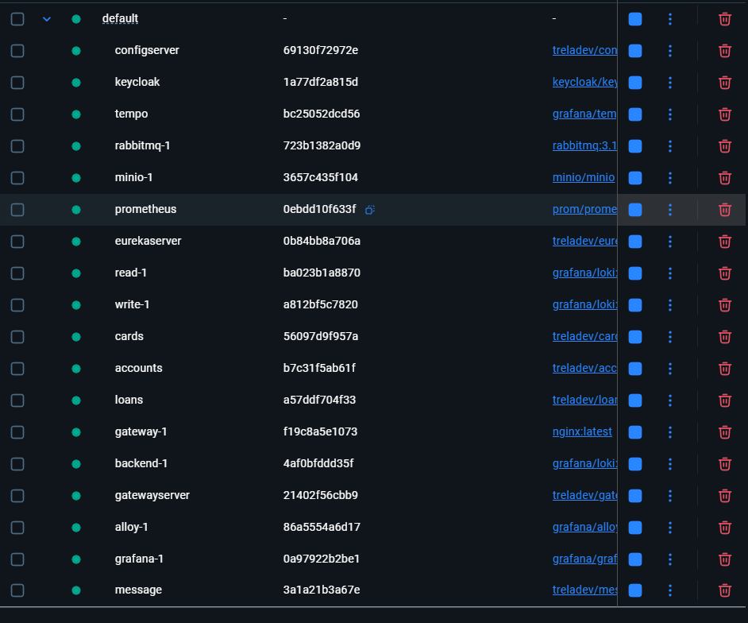

---

# Section 13: Event Driven microservices using RabbitMQ, Spring Cloud Functions & Stream

---

### 🔄 What is **loose coupling**?

Loose coupling means that we **deploy each of our applications independently**, which makes them **easy to scale** and **develop** separately. This is exactly what we wanted to achieve from the very beginning of this course — and thanks to this approach, we’ve successfully achieved **loose coupling**.

---

### ⏱️ What is **temporal coupling**?

**Temporal coupling** happens when a **caller service** waits for a response from the **callee service**. In other words, a tight dependency is formed between the services — but only for the **duration of the request**.

So, if the second microservice is slow or unavailable, it directly affects the first one.

---

### ❌ Why should we avoid temporal coupling?

We should **avoid temporal coupling** wherever possible. One common source of temporal coupling is **REST API** communication — because it’s synchronous by nature.

---

### 🛡️ How can we avoid temporal coupling?

To escape temporal coupling, we need to adopt **asynchronous communication** between our microservices.

Sometimes, synchronous communication is necessary — for example, when checking an account balance, we expect the amount to be returned immediately. But **wherever possible**, we should prefer **asynchronous communication**.

---

### 🚀 How do we achieve this?

We need to build an **event-driven application**.

For example, in Amazon, when you place an order:

* The **Order Microservice** must notify the **Delivery Microservice**.
* But it doesn’t have to do this synchronously.
* Instead, it can **publish an event** (e.g., `OrderPlaced`).
* The **Order Microservice** is only responsible for **generating the event**, and doesn’t care what happens next.

---

### 🧱 What do we need to build such a system?

To build an event-driven application, we need:

* **Event-driven architecture**
* **Producing and consuming events** using asynchronous communication
* **Event brokers** (e.g., Kafka, RabbitMQ)
* **Spring Cloud Function**
* **Spring Cloud Stream**

---

Żeby zbudować event driven microservice
mamy 2 głównie używane podejścia

📌 Modele architektury sterowanej zdarzeniami (Event-driven models)
🔔 Model Publisher/Subscriber (Pub/Sub)
Ten model opiera się na subskrypcjach.
Producent (Publisher) generuje zdarzenia, które są rozsyłane do wszystkich subskrybentów (Subscribers), którzy mogą je odebrać i przetworzyć.

Po odebraniu zdarzenia nie ma możliwości jego ponownego odczytania – oznacza to, że nowi subskrybenci, którzy dołączą później, nie mają dostępu do wcześniejszych zdarzeń.

👉 Model Pub/Sub jest często stosowany z RabbitMQ, które jest popularnym rozwiązaniem w tym obszarze.
Z kolei Apache Kafka to potężna platforma szeroko stosowana do przetwarzania strumieni zdarzeń.

📡 Model strumieniowania zdarzeń (Event Streaming Model)
W tym modelu zdarzenia są zapisywane sekwencyjnie do specjalnego dziennika (logu).
Producent publikuje zdarzenia w momencie ich wystąpienia, a zdarzenia są przechowywane w uporządkowany sposób.

Zamiast subskrypcji, konsumenci mogą czytać zdarzenia z dowolnego miejsca w strumieniu.

✅ Główną zaletą tego modelu jest to, że zdarzenia mogą być odtwarzane (replayed) — dzięki temu nowi klienci mogą dołączyć w dowolnym momencie i otrzymać całą historię zdarzeń.

i zależenie od scenario wybieramy sobie model

---

## 📚 In this section, we will implement the **publish/subscribe model**

### 🔧 What are we going to do?

So far, **all of our services use synchronous communication**, and we **don’t want to change that** — that’s fine for now.

Currently, our user can perform CRUD operations on **accounts**, **cards**, and **loans**, and that works well — we **get an immediate response**.

---

### 📤 So here’s the plan:

Every time a **new account is created**, we will **send a notification**.

To do this, we’ll build an entirely **new service** responsible for sending notifications.

---

We'll publish every event to a **message broker**, and the **message service** will subscribe to it.

Since we’re using the **publish/subscribe model**, we’ll use **RabbitMQ** as our broker.

---

We’ll follow the structure shown in the diagram below:


---

## 🔁 Using RabbitMQ for publish/subscribe communications

**RabbitMQ** is an **open-source message broker**, well known for its use of the **AMQP (Advanced Message Queuing Protocol)** and its ability to support:

* flexible asynchronous messaging,
* distributed deployments,
* and powerful monitoring capabilities.

In its recent versions, **RabbitMQ** has also introduced support for **event streaming**.

---

## 🎯 Roles in AMQP-based communication (like RabbitMQ)

In AMQP-based solutions, there are three primary participants:

* **Producer** – the component responsible for sending messages (also called the *publisher*).
* **Consumer** – the component responsible for receiving messages (also called the *subscriber*).
* **Message Broker** – middleware that receives messages from producers and routes them to the appropriate consumers.

---

## 🔄 How it works – RabbitMQ model

RabbitMQ relies on the concepts of **exchanges** and **queues**:

1. A **producer** sends a message to an **exchange**.
2. Based on routing rules, RabbitMQ determines **which queues** should receive a copy of the message.
3. **Consumers** then read messages from those queues.

---

### 🧱 Visual model:

```
Producer → [Exchange] → [Queue 1] → Consumer 1
                          ↓
                        [Queue 2] → Consumer 2
```

In the **publish/subscribe model**:

* the exchange can send a copy of the message to **multiple queues**,
* each consumer subscribes to its own queue and **does not interfere with others**.

---

Here's the full English translation of your text, keeping the tone instructional and organized for a documentation-style explanation:

---

## 🚀 Getting Started with RabbitMQ Implementation

To start implementing **RabbitMQ**, we need to create a **separate microservice** responsible for handling **messages**.

To build this **message microservice**, we **won’t follow the traditional approach** – we won’t be creating REST controllers.
Instead, we’ll use **Spring Cloud Function**.

---

## ✅ Why use **Spring Cloud Function**?

**Spring Cloud Function** simplifies the development of business logic by using functions that follow the standard Java 8 interfaces:

* **Supplier**
* **Function**
* **Consumer**

---

### 🔹 Supplier

A function that **produces a result without needing any input**.
It’s also called a **producer**, **publisher**, or **source**.

---

### 🔹 Function

A function that **takes input and returns a result**.
Often referred to as a **processor**.

---

### 🔹 Consumer

A function that **accepts input but doesn’t return any result**.
Also known as a **subscriber** or **sink**.

---

## ✨ Features and Benefits of Spring Cloud Function

* Supports multiple programming styles: **reactive**, **imperative**, or **hybrid**.
* Allows plain Java classes (**POJOs**) to act as functions – if they comply with `@FunctionalInterface`, they’re treated as functions.
* **Function composition** – you can combine imperative and reactive functions.
* **REST support** – easily expose functions as HTTP endpoints.
* **Streaming support** – send/receive data via Apache Kafka, Solace, RabbitMQ, and others using **Spring Cloud Stream**.
* **Deployment-ready** – functions can be packaged and deployed to platforms like **AWS Lambda** or other serverless providers.

---

You can visit the official Spring Cloud Function page:
👉 [https://spring.io/projects/spring-cloud-function](https://spring.io/projects/spring-cloud-function)

---

## ⚙️ Let’s generate our message microservice

We generate the project (see screenshot below):



---

### 🧱 Start by creating a DTO

We want both the **accounts service** and the **message service** to use the **same DTO**, so they operate on a shared object.

```java
package dev.trela.message.dto;

public record AccountsMsgDto() {
}
```

---

Then we create the class:

```java
package dev.trela.message.functions;

@Configuration
public class MessageFunctions {
}
```

All the methods (functions) defined in this class will **handle message-related logic for the end user**.

---

### ✉️ Email Function

Now, let’s create a function inside `MessageFunctions` that will handle email sending.
Essentially, we return a **lambda** that receives the DTO, logs the message, and returns the DTO back.

```java
@Bean
public Function<AccountsMsgDto, AccountsMsgDto> email() {
    return accountsMsgDto -> {
        log.info("Sending email with details: " + accountsMsgDto.toString());
        return accountsMsgDto;
    };
}
```

We won’t implement the real email logic yet — just logging for now.

📝 Sometimes, you **need to return the same object** just to match the function signature – even if the function only performs a **side effect**.
This enables powerful **function composition and flexibility** in a scalable, functional architecture.

---

### 📱 SMS Function

Now let’s add another function for sending SMS:

```java
@Bean
public Function<AccountsMsgDto, Long> sms() {
    return accountsMsgDto -> {
        log.info("Sending sms with details: " + accountsMsgDto.toString());
        return accountsMsgDto.accountNumber();
    };
}
```

---

### 🤔 Why do these functions return different values?

We want the **accounts service** to call `email()` by passing an `AccountsMsgDto`, and we want **`sms()` to be called as well**.

Could we do this in a single function? Yes — but we want to demonstrate **different Spring Cloud Function features**, so we’ll build two separate functions.

In the **sms function**, we want to return the **loan number**, so that the **accounts microservice** can store it.

We’ll also add a **new column to the `accounts` table** to store the returned loan number.

---

To convert these methods into REST endpoints, you simply need to add the required dependency in `pom.xml`:

```xml
<dependency>
    <groupId>org.springframework.cloud</groupId>
    <artifactId>spring-cloud-starter-function-web</artifactId>
</dependency>
```

Now, let's start our application and open **Postman**.

Use the following endpoint:

```
http://localhost:8080/email
```

With the body:

```json
{
  "accountNumber": 12345643434,
  "name": "Marcin Trela",
  "email": "marcin.trela.dev@gmail.com",
  "mobileNumber": "4354437687"
}
```

And the response will be:

```json
{
  "accountNumber": 12345643434,
  "name": "Marcin Trela",
  "email": "marcin.trela.dev@gmail.com",
  "mobileNumber": "4354437687"
}
```

Which means:

👉 **You don’t need to write a `@RestController` or a service class.**

---

### 📌 In short:

💡 Your functions are **automatically exposed as microservice endpoints**, without writing any controller code.

This is a **very powerful and flexible model**, which allows you to:

* quickly build lightweight microservices,
* easily test individual functions,
* seamlessly migrate them to AWS Lambda or other serverless platforms without rewriting any code.

---

Similarly, the endpoint:

```
http://localhost:8080/sms
```

also works the same way.

So if a client wants to send an email, they can use the `/email` endpoint. If they want to send an SMS, they can use `/sms`.

---

### 💡 But now let’s go one step further...

We want to give our clients **more flexibility**, allowing them to call a single REST API that internally invokes **both `email` and `sms` functions as a unit**.

To do that, we need to **compose our functions**.

Open your `application.yml` and add the following:

```yaml
spring:
  application:
    name: message
  cloud:
    function:
      definition: email|sms
```

Now, you can hit the endpoint:

```
http://localhost:9010/emailsms
```

With the same body:

```json
{
  "accountNumber": 12345643434,
  "name": "Marcin Trela",
  "email": "marcin.trela.dev@gmail.com",
  "mobileNumber": "4354437687"
}
```

And you’ll get this response:

```
12345643434
```

And in the logs, you can see that **both functions were executed**:

```
INFO ... Sending email with details: AccountsMsgDto[accountNumber=12345643434, name=Marcin Trela, email=marcin.trela.dev@gmail.com, mobileNumber=4354437687]
INFO ... Sending sms with details: AccountsMsgDto[accountNumber=12345643434, name=Marcin Trela, email=marcin.trela.dev@gmail.com, mobileNumber=4354437687]
```

So this is the power of **function composition**.

---

Now, let’s comment out for now the dependencies related to function web

```xml
<!--  
    <dependency>
        <groupId>org.springframework.cloud</groupId>
        <artifactId>spring-cloud-starter-function-web</artifactId>
    </dependency>
-->
```

because we do not want to expose our methods as REST APIs.

---

Now let’s dive into what Spring Cloud Stream is and what good advantages it offers us.

So far, we made it so that our functions were exposed as REST APIs.
But what if we want to integrate our functions with brokers like RabbitMQ or Apache Kafka?

That’s exactly what Spring Cloud Stream is for.

Spring Cloud Stream is a framework designed for building scalable, reactive (event-driven), and streaming applications.
Its main idea is to allow developers to focus on business logic, while the framework handles infrastructure aspects like integration with the message broker.

Spring Cloud Stream leverages the native capabilities of each message broker, while providing an abstraction layer that ensures a consistent experience regardless of the underlying messaging system.

You just need to add the appropriate dependency to your project — and your functions will be automatically connected to the external message broker.
The biggest advantage of this approach is that you don’t have to modify your application code — only the configuration in the `application.yml` file.

---

The framework supports integration with:

* RabbitMQ
* Apache Kafka
* Kafka Streams
* Amazon Kinesis

Additionally, partners maintain integrations with:

* Google Pub/Sub
* Solace PubSub+
* Azure Event Hubs
* Apache RocketMQ

---

### 🧱 Key elements of Spring Cloud Stream:

* **Destination Binders** – components responsible for integrating with external messaging systems (e.g., RabbitMQ, Kafka).
* **Destination Bindings** – intermediaries between the application (producer/consumer) and the messaging system.
* **Message** – the standard data structure used by producers and consumers to communicate via Destination Binders (i.e., indirectly with other applications through the message broker).

Spring Cloud Stream enables very easy and declarative connection to messaging systems such as:

* Apache Kafka
* RabbitMQ
* (and others: Amazon Kinesis, Azure Event Hubs, Google Pub/Sub, etc.)

---

Alright, now let’s add Spring Cloud Stream to our services,
remove all the dependencies we used so far,
and add new dependencies:

```xml
<dependency>
    <groupId>org.springframework.amqp</groupId>
    <artifactId>spring-rabbit-stream</artifactId>
</dependency>
<dependency>
    <groupId>org.springframework.cloud</groupId>
    <artifactId>spring-cloud-stream-binder-rabbit</artifactId>
</dependency>

<dependency>
    <groupId>org.springframework.boot</groupId>
    <artifactId>spring-boot-starter-test</artifactId>
    <scope>test</scope>
</dependency>
<dependency>
    <groupId>org.springframework.cloud</groupId>
    <artifactId>spring-cloud-stream-test-binder</artifactId>
    <scope>test</scope>
</dependency>
```

---

Why did we remove the Spring Cloud Function dependency?

Because when we add Spring Cloud Stream dependency, it also brings Spring Cloud Function with it.

---

Let’s also add Google Jib to be able to build a Docker image in the future.

---

Example configuration snippet:

```yaml
stream:
  bindings:
    emailsms-in-0:
      destination: send-communication
      group: ${spring.application.name}

rabbitmq:
  host: localhost
  port: 5672
  username: guest
  password: guest
  connection-timeout: 10s
```

---

So, **`in`** means the function **accepts a value from the queue**,
and **`out`** would mean it **sends to the queue**.
To have an `out`, the function must return some value (it must be a `Function` or a `Supplier`, but not a `Consumer`).

---

So, **`emailsms-in-0`** is the name of the binding,
and **`destination`** is the name of the RabbitMQ exchange (other services will connect to this exchange to know where to send messages).

---

## 📤 Sending Messages from `accounts` Microservice

### 1. ✅ Add Dependencies

We need to add support for sending messages to the destination from the `accounts` microservice.

Add the following dependencies:

```xml
<dependency>
  <groupId>org.springframework.amqp</groupId>
  <artifactId>spring-rabbit-stream</artifactId>
</dependency>
<dependency>
  <groupId>org.springframework.cloud</groupId>
  <artifactId>spring-cloud-stream-binder-rabbit</artifactId>
</dependency>
```

---

### 2. 🧾 Copy the DTO

Now let’s copy the same DTO from the `message` service:
*(see screenshot below)*


---

### 3. 📦 Configure the Output Binding

Next, whenever we create a new account in the `accounts` microservice, we want to publish an event to the message broker.

In `application.yml`, add:

```yaml
stream:
  bindings:
    sendCommunication-out-0:
      destination: send-communication
```

* We define an output (`out`) binding to the same destination as in the `message` service: `send-communication`.
* Here, the **destination is the exchange**.
* If it were an input binding (`in`), the destination would represent a **queue**.

Also, we need to configure the RabbitMQ connection:

```yaml
rabbitmq:
  host: localhost
  port: 5672
  username: guest
  password: guest
  connection-timeout: 10s
```

---

### 4. 🛠 Modify the Service

Let’s go into the service where we create an account and modify the method to send a communication message.

```java
@Override
public void createAccount(CustomerDto customerDto) {
    Customer customer = CustomerMapper.mapToCustomer(customerDto);
    
    // validate if customer already exists
    if (customerRepository.findByMobileNumber(customerDto.mobileNumber()).isPresent()) {
        throw new CustomerAlreadyExistsException("Customer already registered with given mobile Number: " + customerDto.mobileNumber());
    }

    customer.setCreatedAt(LocalDateTime.now());
    customer.setCreatedBy("Anonymous");
    
    Customer savedCustomer = customerRepository.save(customer);
    Accounts savedAccount = accountsRepository.save(createNewAccount(savedCustomer));
    
    sendCommunication(savedAccount, savedCustomer);
}

private void sendCommunication(Accounts account, Customer customer) {
    AccountsMsgDto accountsMsgDto = new AccountsMsgDto(
        account.getAccountNumber(),
        customer.getName(),
        customer.getEmail(),
        customer.getMobileNumber()
    );
    log.info("Sending Communication request for the details: {}", accountsMsgDto);
    Boolean result = streamBridge.send("sendCommunication-out-0", accountsMsgDto);
    log.info("Is the communication request successfully processed?: {}", result);
}
```

---

### 5. ▶️ Run the System

Now we can start the program and test it.

First, start RabbitMQ without Docker Compose:

```bash
docker run -it --rm --name rabbitmq -p 5672:5672 -p 15672:15672 rabbitmq:4-management
```

Also, run Keycloak:

```bash
docker run -d -p 127.0.0.1:7080:8080 \
  -e KC_BOOTSTRAP_ADMIN_USERNAME=admin \
  -e KC_BOOTSTRAP_ADMIN_PASSWORD=admin \
  quay.io/keycloak/keycloak:26.3.1 start-dev
```

---

### 6. 🕵️‍♂️ Check RabbitMQ UI

Open the RabbitMQ console at:
**[http://localhost:15672](http://localhost:15672)**
Login:

* **Username**: `guest`
* **Password**: `guest`

Navigate to the **"Exchanges"** tab:
*(see screenshot below)*


You will see the exchange we created:

```
/
emailsms-out-0      (type: topic)
/
send-communication  (type: topic)
```

Clicking on `send-communication`, you’ll see the queue bindings:



We see a queue called `send-communication.message`, which comes from this snippet in `application.yml`:

```yaml
stream:
  bindings:
    emailsms-in-0:
      destination: send-communication
      group: ${spring.application.name}
```

---

### ❓ Why do we also see `emailsms-out-0`?

Spring Cloud Stream always creates **two exchanges** for each function:

* One for **input**
* One for **output**

In our case:

* We named the input manually (`emailsms-in-0`)
* The output was auto-named

---

### 7. 🧪 Test the Account Creation

Now let’s try to create a new account and see if the `message-service` receives the communication event:

Send a request to:
`http://localhost:8072/trelabank/accounts/api/create`

And we see in the logs:

```
INFO  MessageFunctions: Sending email with details: AccountsMsgDto[accountNumber=..., name=Marcin Trela, email=..., mobileNumber=...]
INFO  MessageFunctions: Sending sms with details: AccountsMsgDto[accountNumber=..., name=Marcin Trela, email=..., mobileNumber=...]
```

We also see a spike in RabbitMQ UI:


---

### 🧪 Test Asynchronous Behavior

Now let’s put a **breakpoint** in the `email` function:


Then create a new account again.

Even if the `message-service` is **shut down**, we still get a **successful response** from the API:

```json
{
  "statusCode": "201",
  "statusMsg": "Account created successfully"
}
```

This shows that the `accounts-service` is **decoupled** from the `message-service` and communication is **asynchronous**.

If `message-service` is down, the account service will still create new events.
Once the message service is back up, it will start receiving them.

---

### ⏭️ Next Step

Next, we want the `message-service` to **emit an event back to other microservices** when email and SMS are sent.

That will complete our **bi-directional asynchronous communication**.

---

Now, looking at our schema (below)

we managed to reach step 4, which is sending SMS and email messages.
However, now we want to emit an event from the message service to the accounts service, i.e., steps 5-7.

So, we add:
We simply name the communication **communication-sent**

```yaml
emailsms-out-0:
  destination: communication-sent
```

Since we now have the **communication-sent** exchange, i.e., also new queues, we can enter the account service to receive it.

We create a class `AccountsFunctions`
and we will receive messages from the stream.
Which function type should we use if we consume something and do not return anything?
**Consumer**

We want to update the column with information whether the message was sent,
so we need to change our database schema.

We add a column in migration:

```sql
`communication_sw` BOOLEAN DEFAULT FALSE,
```

and add a new instance variable to the entity:

```java
private Boolean communicationSw;
```

Also, we add a new method in `AccountsServiceImpl`:

```java
@Override
public boolean updateCommunicationStatus(Long accountNumber) {
    boolean isUpdated = false;
    if(accountNumber != null) {
        Accounts account = accountsRepository.findById(accountNumber).orElseThrow(() 
            -> new ResourceNotFoundException("Account", "accountNumber", accountNumber.toString()));

        account.setCommunicationSw(true);
        accountsRepository.save(account);

        isUpdated = true;
    }
    return isUpdated;
}
```

We simply save the boolean value if we find the account by that number.

And we create a function that will consume from the `communication-sent` queue and save the boolean in the database:

```java
@Bean
public Consumer<Long> updateCommunication(AccountService accountService) {
    return accountNumber -> {
        log.info("Updating communication for the account number {}", accountNumber);
        accountService.updateCommunicationStatus(accountNumber);
    };
}
```

Now we need to go to `application.yml`:

```yaml
# RabbitMQ
function:
  definition: updateCommunication
stream:
  bindings:
    sendCommunication-out-0:
      destination: send-communication
      group: ${spring.application.name}
    updateCommunication-in-0:
      destination: communication-sent
      group: ${spring.application.name}
```

We add the function to the definition and use it to receive messages from the `communication-sent` exchange and save them in the database.

---

We call the API:

```
http://localhost:8072/trelabank/accounts/api/create

{
  "name": "Marcin Trela",
  "email": "marcin.trela.dev@gmail.com",
  "mobileNumber": "4354437417"
}
```

We send the request and in H2 we see:
the value `true`

```sql
SELECT * FROM ACCOUNTS;
ACCOUNT_NUMBER    CUSTOMER_ID    ACCOUNT_TYPE    BRANCH_ADDRESS                COMMUNICATION_SW    CREATED_AT                      CREATED_BY    UPDATED_AT                      UPDATED_BY  
1092552833       1              Savings         123 Main Street, New York     TRUE                2025-07-23 13:56:24.814005      ACCOUNTS_MS  2025-07-23 13:56:25.14323      ACCOUNTS_MS
(1 row, 1 ms)
```

But if we send another request and turn off the message application:

```
1808558902    2    Savings    123 Main Street, New York    FALSE    2025-07-23 14:04:02.313148    ACCOUNTS_MS    null    null
```

and after a while turn message service back on:

```
1808558902    2    Savings    123 Main Street, New York    TRUE    2025-07-23 14:04:02.313148    ACCOUNTS_MS    2025-07-23 14:04:37.910442    ACCOUNTS_MS
```

So asynchronous communication works.

We will also see a new queue in RabbitMQ: `communication-sent.accounts`
(screenshot below)


---

Now, let’s build the images of our microservices and create a Docker Compose.

We add RabbitMQ:

```yaml
rabbitmq:
  image: rabbitmq:3.12-management
  hostname: rabbitmq
  ports:
    - "5672:5672"
    - "15672:15672"
  healthcheck:
    test: rabbitmq-diagnostics check_port_connectivity
    interval: 10s
    timeout: 5s
    retries: 10
    start_period: 5s
  extends:
    file: common-config.yml
    service: network-deploy-service
```

In the accounts service, we add a dependency on RabbitMQ:

```yaml
depends_on:
  rabbitmq:
    condition: service_healthy
```

We also add a new service: message

```yaml
message:
  image: "treladev/message:s13"
  container_name: message
  depends_on:
    rabbitmq:
      condition: service_healthy
  environment:
    # RabbitMQ
    SPRING_RABBITMQ_HOST: rabbitmq
  extends:
    file: common-config.yml
    service: network-deploy-service
```

And now all services are running (screenshot below):



We go to localhost:15672 (RabbitMq UI)
and we can see our exchanges (screenshot below):


