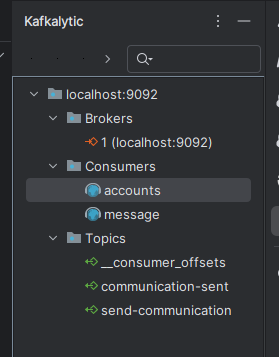

---

# Section 14: Event Driven microservices using Kafka, Spring Cloud Functions & Stream

---

### **Apache Kafka vs RabbitMQ**

Kafka and RabbitMQ are popular messaging systems, but they differ significantly in design philosophy, architecture, and use cases. Here are the key differences between Kafka and RabbitMQ:

* **Design:** Kafka is a distributed event streaming platform, whereas RabbitMQ is a message broker. This means Kafka is designed to handle large volumes of data, while RabbitMQ is better suited for lower volumes with more complex routing requirements.

* **Data Storage:** Kafka stores data on disk, while RabbitMQ stores messages in memory. As a result, Kafka can retain messages for longer periods, whereas RabbitMQ is more suitable for applications that require low latency.

* **Performance:** Kafka is generally faster than RabbitMQ, especially when handling large volumes of data. However, RabbitMQ can be more efficient in applications requiring complex routing logic.

* **Scalability:** Kafka is highly scalable, whereas RabbitMQ has more limited scalability. Kafka can scale horizontally almost without limits by adding more brokers to the cluster.

Ultimately, the best choice depends on your specific needs and requirements. If you need a high-throughput messaging system that can handle large volumes of data, Kafka is a great choice. If you need a system with advanced routing capabilities, RabbitMQ is more suitable.

---

Kafka was designed to process and transmit very large volumes of data (data streams) — for example, millions of messages per second. Kafka stores data on disk and allows it to be read multiple times by different consumers. This makes it well-suited for systems with a high and continuous data flow, such as logging and real-time analytics.

RabbitMQ, on the other hand, is more of a traditional message broker focused on delivering and routing smaller volumes of messages. It is not optimized for very high throughput and does not store messages long-term on disk (primarily using memory). Therefore, RabbitMQ works well where the volume of messages is smaller, but accurate delivery and flexible routing are essential.

**In summary:**
Kafka can handle and stream very large volumes of data with ease — this is its main strength.

RabbitMQ has limits on how much data it can effectively send and process — it’s more appropriate for smaller but more complex routing scenarios.

---

## **Introduction to Apache Kafka**

Apache Kafka is an **open-source, distributed event streaming platform**. It is designed to handle **large, real-time data streams**, providing **high throughput, fault tolerance, and scalability**. Kafka is used to build data pipelines and applications that react to real-time events.

---

### **Key Kafka Concepts and Components:**

* **Producers:** Responsible for **publishing messages to Kafka topics**. A producer writes messages to a specific topic, and Kafka appends them to that topic's log.

* **Topics:** Kafka organizes data into **topics**, which are streams of messages. A topic can be split into **partitions**, and each message in a topic has a unique **offset**.

* **Brokers:** These are Kafka servers that **manage storage and replication of topics**. A broker receives messages from producers, assigns them offsets, and delivers them to consumers.

* **Partitions:** Topics can be split into multiple partitions to enable **parallel processing** and **load distribution**. Each partition is an ordered, immutable sequence of messages, each with a unique offset.

* **Offsets:** Unique identifiers assigned to each message within a partition. Offsets are used to **track consumer progress** — consumers can manage them manually (e.g., rewind or skip messages).

* **Replication:** Kafka allows topics to be replicated across multiple brokers to ensure **fault tolerance**. Replication creates redundant data, which ensures **high availability**.

* **Consumers:** Read messages from Kafka topics. They subscribe to one or more topics and fetch data from specific partitions. Each consumer **tracks its own offset** to know which messages have been read.

* **Consumer Groups:** Consumers can be organized into groups. **Each message is delivered to only one consumer within a group**, allowing for parallel processing across group members.

* **Streams:** Kafka Streams is a client library that enables **stream processing** directly within Kafka. It allows you to build applications that **consume, transform, and produce data in real time**.

---

(You can explore Kafka concepts visually at: [https://softwaremill.com/kafka-visualisation/](https://softwaremill.com/kafka-visualisation/))

Kafka is a broad topic, so the following is a simplified overview.

---

## **Producer Side Story**

### Producer Configuration:

Before sending messages to Kafka, a producer must be properly configured. This includes specifying properties such as Kafka broker addresses, message serialization format, and optional settings like compression or batching.

### Topic Selection:

The producer must specify the topic to which it wants to send messages. Topics are predefined data streams in Kafka. If the topic doesn’t exist, it may be created dynamically depending on the broker configuration.

### Producing Messages:

The producer sends messages to Kafka using the client library API. It specifies the target topic and the serialized message. It can also optionally provide a partition key to determine which partition the message will go to.

### Partition Assignment:

If a partition key is provided, Kafka uses it to determine the correct partition. If not, Kafka uses a round-robin algorithm or a hashing function to evenly distribute messages across partitions.

### Message Routing and Offset Assignment:

The producer sends the message to the appropriate Kafka broker based on the topic and assigned partition. The broker receives the message and appends it to the partition’s log in a **durable** and **ordered** manner, assigning it a unique **offset**.

### Message Replication:

Kafka ensures high availability and fault tolerance by replicating messages across multiple brokers. Once a message is written to the leader partition, Kafka asynchronously replicates it to the follower replicas.

### Acknowledgments and Error Handling:

The producer receives an acknowledgment from Kafka once the message is successfully written to the leader partition. The producer can then handle potential errors, retry sending, or react accordingly. Depending on the configured **ack mode**, the producer may wait for confirmation from only the leader or all replicas.

---

## **Consumer Side Story**

### Consumer Group and Topic Subscription:

Kafka consumers are usually organized into **consumer groups**. Before reading messages, a consumer must join a group and subscribe to one or more topics.

### Partition Assignment:

Kafka assigns partitions from the subscribed topics to each consumer in the group. A single partition is handled by only one consumer in the group. Kafka ensures even distribution of partitions for parallel processing.

### Offset Management:

Each consumer keeps track of its **own offset** (read position) for each partition it reads from. Initially, the offset is set to the last committed one or to a default starting point defined in the configuration. As messages are read, the offset is updated.

### Fetch Request:

The consumer sends a **fetch request** to a Kafka broker. This request includes the topic name, partition number, and offset to begin reading from. It can also specify the maximum number of messages to retrieve in one request.

### Message Retrieval:

Upon receiving the request, the Kafka broker reads the corresponding messages from the partition log and sends them back to the consumer in a response, including their offsets and metadata.

### Message Processing:

After receiving the messages, the consumer processes them according to application logic. This may include transformations, aggregations, computations, or other business logic.

### Offset Commit:

After processing a batch of messages, the consumer commits the offset back to Kafka. This signals that the messages up to that offset were successfully processed. This mechanism allows Kafka to resume processing from the correct position in case of failure or restart.

### Polling Loop:

The consumer continuously repeats the cycle: sending fetch requests, receiving messages, processing them, and committing offsets. This loop enables continuous consumption and processing of new messages as they become available.

---

Sure! Here's the English translation of your technical walkthrough, keeping the tone clear and instructional:

---

## Developer Infrastructure Makes Kafka Integration with Spring Cloud Stream Easy — Here's How

First, go to [https://kafka.apache.org](https://kafka.apache.org)

Click on **"Get Started"**, and you’ll find the option to run Kafka using Docker:

```bash
docker run -d -p 9092:9092 apache/kafka:4.0.0
```

### What’s next?

Now we go to our project and **replace RabbitMQ with Kafka** in the `pom.xml`.

Simply swap out the RabbitMQ binder dependency for the Kafka one:

```xml
<dependency>
  <groupId>org.springframework.cloud</groupId>
  <artifactId>spring-cloud-stream-binder-kafka</artifactId>
</dependency>
```

Do the same for the **message service**.

Then, open the `application.yml` file inside the **message service** and configure it as follows:

```yaml
server:
  port: 9010

spring:
  application:
    name: message
  cloud:
    function:
      definition: email|sms
    stream:
      bindings:
        emailsms-in-0:
          destination: send-communication
          group: ${spring.application.name}
        emailsms-out-0:
          destination: communication-sent
      kafka:
        binder:
          brokers:
            - localhost:9092
```

This is all we need to do to connect with Kafka — **that’s the power of Spring Cloud Stream!**

### Now let’s run our services and use the KafkaLytic plugin

Add a new connection in KafkaLytic (see screenshot below):


Then we can browse the brokers — we should see one broker and three topics:



### Now let’s test it by creating a new account:

Send a POST request to:

```
http://localhost:8072/trelabank/accounts/api/create
```

With the following payload:

```json
{
  "name": "Marcin Trela",
  "email": "marcin.trela.devas@gmail.com",
  "mobileNumber": "4354437327"
}
```

### Then check the logs in the **message service**:

```
2025-07-23T19:58:38.093+02:00  INFO ... message: partitions assigned: [send-communication-0]
2025-07-23T20:08:29.378+02:00  INFO ... Sending email with details: AccountsMsgDto[accountNumber=1524137231, name=Marcin Trela, email=marcin.trela.devas@gmail.com, mobileNumber=4354437327]
2025-07-23T20:08:29.380+02:00  INFO ... Sending sms with details: AccountsMsgDto[accountNumber=1524137231, name=Marcin Trela, email=marcin.trela.devas@gmail.com, mobileNumber=4354437327]
```

And in the **accounts service**:

```
2025-07-23T20:08:29.450+02:00  INFO ... Updating communication for the account number 1524137231
```

---

✅ **Kafka is now successfully set up and working!**

Now we can proceed to build a Docker image and create a `docker-compose` setup.

---


On this page you can find a Kafka Docker Compose example:
🔗 [https://hub.docker.com/r/apache/kafka](https://hub.docker.com/r/apache/kafka)

```yaml
kafka:
  image: apache/kafka:latest
  container_name: kafka
  ports:
    - "9092:9092"
  environment:
    KAFKA_NODE_ID: 1
    KAFKA_PROCESS_ROLES: broker,controller
    KAFKA_LISTENERS: PLAINTEXT://0.0.0.0:9092,CONTROLLER://0.0.0.0:9093
    KAFKA_ADVERTISED_LISTENERS: PLAINTEXT://kafka:9092
    KAFKA_CONTROLLER_LISTENER_NAMES: CONTROLLER
    KAFKA_LISTENER_SECURITY_PROTOCOL_MAP: CONTROLLER:PLAINTEXT,PLAINTEXT:PLAINTEXT
    KAFKA_CONTROLLER_QUORUM_VOTERS: 1@kafka:9093
    KAFKA_OFFSETS_TOPIC_REPLICATION_FACTOR: 1
    KAFKA_TRANSACTION_STATE_LOG_REPLICATION_FACTOR: 1
    KAFKA_TRANSACTION_STATE_LOG_MIN_ISR: 1
    KAFKA_GROUP_INITIAL_REBALANCE_DELAY_MS: 0
    KAFKA_NUM_PARTITIONS: 3
  extends:
    file: common-config.yml
    service: network-deploy-service
```

Then we add the following environment variable to the `accounts` and `message` services:

```yaml
# Kafka
SPRING_CLOUD_STREAM_KAFKA_BINDER_BROKERS: kafka:9092
```

Now we can start everything using Docker Compose.

---

We send a request:

```
POST http://localhost:8072/trelabank/accounts/api/create
{
  "name": "Marcin Trela",
  "email": "marcin.trela.devas@gmail.com",
  "mobileNumber": "4354437327"
}
```

This creates an account and triggers a notification in the `message` service:

```
2025-07-24T04:58:24.221Z  INFO 1 --- [message] [container-0-C-1] d.t.message.functions.MessageFunctions   : Sending email with details: AccountsMsgDto[accountNumber=1753933122, name=Marcin Trela, email=marcin.trela.devas@gmail.com, mobileNumber=4354437327]
2025-07-24T04:58:24.223Z  INFO 1 --- [message] [container-0-C-1] d.t.message.functions.MessageFunctions   : Sending sms with details: AccountsMsgDto[accountNumber=1753933122, name=Marcin Trela
```

And in the `accounts` service:

```
2025-07-24T04:58:24.306Z  INFO 1 --- [accounts] [container-0-C-1] d.t.a.functions.AccountsFunctions        : Updating communication for the  account number 1753933122
```

---
