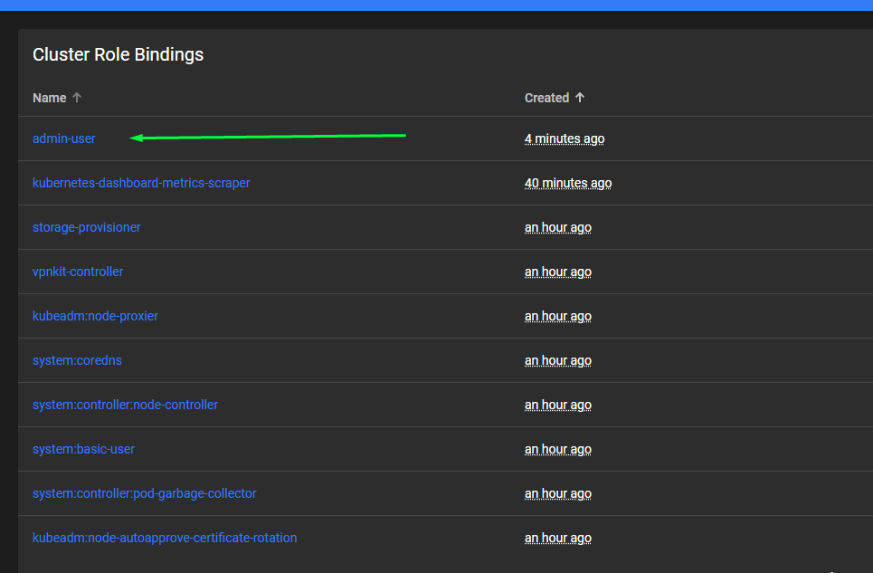
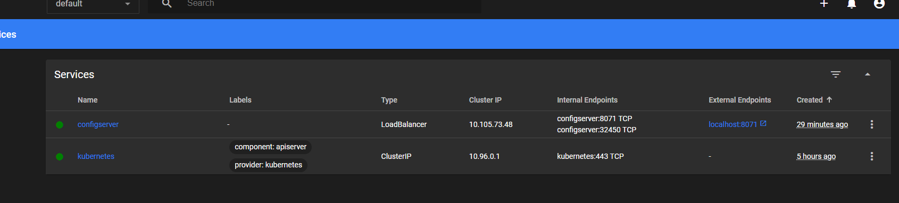

---

# Section 15: Container Orchestration using Kubernetes

---

By now, you already know that we are trying to build many microservices, and as part of this journey:

first, we are developing Spring Boot applications, then packaging them as Docker images.
Using the Docker server, we convert those images into running containers,
so that we can access all our microservice applications.

So far, in this course, we’ve built a maximum of 6 or 7 microservices,
but in real production applications, you might have over 100.

That means you could have more than 100 different containers running on your production server.

So whenever you have such a large number of containers within an organization,
you need a component that will take care of container orchestration (container management).

Just like a conductor leads a group of musicians,
we also need a component that will manage our containers based on the needs.

---

### Why should we take care of container orchestration in our microservices network?

The first question is: how can we **automate deployments, rollouts, and rollbacks**?

In the world of microservices, we should automate as much as possible,
because we are dealing with hundreds of applications.
In a monolithic architecture, there’s only one application,
so even without automation, it’s manageable.

However, with microservices, every operation should be automated —
such as deployments, rollouts, and rollbacks.

You’re probably familiar with the term **deployment**,
but let me explain what **rollout** and **rollback** mean.

A **rollout** refers to gradually deploying a new version of a microservice.
Whenever you make changes or build a new version of a microservice,
you need to push it to the production environment.

In large organizations, downtime is unacceptable.

That’s why they use **rollouts** —
which means replacing old containers one by one with new ones using the latest Docker image.

For example, if the **accounts** microservice is running in three containers in production,
first, a new container is created with the updated Docker image.
Only after this new container is available and working properly,
the old one is terminated.

This avoids any downtime during the deployment process.

---

### How can you make your microservices self-healing?

This means that if one of your microservice containers is not responding properly
or is responding too slowly,
you need a component that regularly performs **health checks** on the running containers
and makes automatic decisions — like killing the misbehaving container
and replacing it with a new one.

So how do you plan to implement this self-healing capability in your microservice network?

---

### And the final question about container orchestration is:

How will you enable **auto scaling** for your services?

What is scaling?

When we notice an increase in the traffic going to our application,
we can try to spin up more containers or more servers.

This is called **vertical scaling**.
But doing this manually for each microservice would be extremely difficult.

That’s why we need to find ways to **automate microservice scaling**,
based on CPU usage or other metrics of the running containers.

We should be able to automatically decide
whether to **scale up** or **scale down** the number of running containers.

Take **Netflix** as an example.

Traffic on Netflix typically increases significantly on **Friday evenings, Saturdays, and Sundays**.
On those days, Netflix should automatically scale the number of microservice instances or applications,
so they can stream content to users without any issues.

Similarly, there might be sudden traffic spikes —
perhaps due to a long weekend or a holiday in the middle of the week.

In all such scenarios, Netflix should be able to handle that automatically,
by increasing the number of microservices in real time using **auto scaling**.

In the same way, we should also implement **auto scaling** in our own microservices.

---


**The answer to all these questions is Kubernetes!**

So, what is Kubernetes?

Kubernetes is an open-source container orchestration platform that enables automation of deployments, rollouts, scaling, and management of all your containerized applications.

Kubernetes was originally developed by Google,
then released as an open-source project and is currently maintained by the Cloud Native Computing Foundation (CNCF).

---

### WHAT IS KUBERNETES?

Kubernetes is an open-source system for automating deployment, scaling, and management of containerized applications.
It is the most popular orchestration platform and is cloud-neutral.

Google released the Kubernetes project as open-source in 2014.
Kubernetes combines over 15 years of Google’s experience running production workloads at scale
with the best ideas and practices from the community.

For example:
Kubernetes provides a framework for reliably running distributed systems.
It handles scaling and failover of your application,
offers deployment patterns, and much more. It includes features such as:

* **Service discovery and load balancing**
* **Container and storage orchestration**
* **Automated rollouts and rollbacks**
* **Self-healing**
* **Secret and configuration management**

The name **Kubernetes** comes from Greek and means **helmsman** or **pilot**.
The abbreviation **K8s** is formed by counting the eight letters between the “K” and the “s” in *Kubernetes*.

---

### Components of the Control Panel (Master Node)

The master node is responsible for managing the entire cluster. It monitors the health of all nodes in the cluster, stores member information about different nodes, plans containers to be scheduled on specific worker nodes, monitors containers and nodes, etc. So, when a worker node fails, the master moves the workload from the failed node to another healthy worker node.
Below are details of the four basic components present inside the control panel:

* **API server** – The API server is the primary interface for interacting with the Kubernetes cluster. It exposes the Kubernetes API, allowing users and other components to communicate with the cluster. All administrative operations and control commands are sent to the API server, which then processes and validates them.
* **Scheduler** – The scheduler is responsible for placing Pods on available nodes in the cluster. It takes into account factors like resource requirements, affinity, anti-affinity, and other constraints to make intelligent decisions about which node to assign a Pod to. The scheduler continuously monitors the cluster and ensures Pods are optimally distributed.
* **Controller manager** – The controller manager maintains the cluster. It handles node failures, replicates components, maintains the correct number of Pods, etc. It constantly tries to keep the system in the desired state by comparing it with the current state.
* **etcd** – etcd is a distributed key-value store that serves as the cluster’s primary data store. It stores configuration data and the desired state of the system, including information about Pods, Services, ReplicationControllers, and more. The API server interacts with etcd to read and write cluster data.

---

### Components of Worker Node

A worker node is essentially a virtual machine (VM) running in the cloud or on-premises (a physical server in your data center). Any hardware capable of running a container runtime can become a worker node. These nodes expose underlying compute, storage, and networking resources to applications. Worker nodes do the heavy lifting for applications running inside the Kubernetes cluster. Together, these nodes form a cluster — the workload is assigned to them by the master node component, similar to how a manager assigns tasks to team members. This enables fault tolerance and replication.

Pods are the smallest deployable unit in Kubernetes, just as a container is the smallest deployable unit in Docker. To simplify, pods can be thought of as lightweight virtual machines in the virtual world. Each pod consists of one or more containers. Each time a pod spins up, it gets a new IP address from the virtual IP range assigned by the pod networking solution.

Below are the details of the three basic components present inside the worker node:

* **Kubelet** – Kubelet is an agent running on each worker node that communicates with the control plane components. It receives instructions from the control plane, such as Pod creation and deletion requests, and ensures that the desired state of Pods is maintained on the node. The kubelet is responsible for starting, stopping, and monitoring containers based on Pod specifications.
* **Kube-proxy** – Kube-proxy is a network proxy running on each node in your cluster, implementing part of the Kubernetes Service concept. Kube-proxy maintains network rules on nodes. These network rules allow network communication to your Pods from network sessions inside or outside the cluster.
* **Container Runtime** – The container runtime is responsible for running and managing containers on a worker node. Kubernetes supports multiple container runtimes, with Docker being the most commonly used. Other runtimes like containerd and rkt are also supported. The container runtime pulls container images, creates and manages container instances, and handles container lifecycle operations.

---


Now we have a basic understanding of Kubernetes, and we want to start a **local Kubernetes cluster**.
We don’t want to run it in the cloud yet because it might cost money while we are still learning, so we’ll do it locally.

To run a local Kubernetes cluster, there are different solutions.
Using **Minikube**, we can start a small Kubernetes cluster on our local system.
However, Minikube has some downsides — the `kubectl` commands you run on Minikube may differ from those on a production cluster.
Therefore, we won’t install Minikube.
Instead, we will just use Kubernetes running in Docker, which behaves very similarly to a production cluster.

See: [https://docs.docker.com/desktop/features/kubernetes/](https://docs.docker.com/desktop/features/kubernetes/)

In Docker Desktop, simply go to settings and enable Kubernetes (see screenshot below).


The Kubernetes server runs as a single or multi-node cluster inside Docker container(s). This lightweight setup helps you explore Kubernetes features, test workloads, and work with container orchestration alongside other Docker features.

---

We can use this command to list Kubernetes contexts:

```bash
kubectl config get-contexts
```

Example output:

```
CURRENT   NAME                 CLUSTER              AUTHINFO             NAMESPACE
          docker-desktop       docker-desktop       docker-desktop
*         kind-microservices   kind-microservices   kind-microservices
```

This shows available Kubernetes clusters (contexts).

You can switch to another context like this:

```bash
kubectl config use-context docker-desktop
```

Then check nodes with:

```bash
kubectl get nodes
```

Example output:

```
NAME             STATUS   ROLES           AGE   VERSION
docker-desktop   Ready    control-plane   16m   v1.32.2
```

This shows we have one control plane node (the control panel).

---

So far, we’ve interacted with our Kubernetes cluster using `kubectl` commands.
But we also have an admin UI (Dashboard).

Open this page:

[https://kubernetes.io/docs/tasks/access-application-cluster/web-ui-dashboard/](https://kubernetes.io/docs/tasks/access-application-cluster/web-ui-dashboard/)

As you can see, we need to run some commands to start the UI, but to do that we need **Helm**.

Go to [https://helm.sh](https://helm.sh) and install Helm, for example using Chocolatey:

```powershell
choco install kubernetes-helm
```

After installation, if you run:

```bash
helm version
```

You should get a response like:

```
version.BuildInfo{Version:"v3.18.4", GitCommit:"...", GitTreeState:"clean", GoVersion:"go1.24.4"}
```

Now we can install the Kubernetes Dashboard UI with Helm:

```bash
# Add the Kubernetes Dashboard Helm repo
helm repo add kubernetes-dashboard https://kubernetes.github.io/dashboard/

# Deploy (or upgrade) the kubernetes-dashboard release in its namespace
helm upgrade --install kubernetes-dashboard kubernetes-dashboard/kubernetes-dashboard --create-namespace --namespace kubernetes-dashboard
```

Then run port forwarding:

```bash
kubectl -n kubernetes-dashboard port-forward svc/kubernetes-dashboard-kong-proxy 8443:443
```

Access the UI at:

[https://localhost:8443/](https://localhost:8443/)

---

To log in, as explained here:

[https://kubernetes.io/docs/tasks/access-application-cluster/web-ui-dashboard/](https://kubernetes.io/docs/tasks/access-application-cluster/web-ui-dashboard/)

we need to create a user:

[https://github.com/kubernetes/dashboard/blob/master/docs/user/access-control/creating-sample-user.md](https://github.com/kubernetes/dashboard/blob/master/docs/user/access-control/creating-sample-user.md)

Create a file `dashboard-adminuser.yaml` with:

```yaml
apiVersion: v1
kind: ServiceAccount
metadata:
  name: admin-user
  namespace: kubernetes-dashboard
```

Apply it:

```bash
kubectl apply -f dashboard-adminuser.yaml
```

Then create a cluster role binding:

Create `dashboard-rolebinding.yaml` with:

```yaml
apiVersion: rbac.authorization.k8s.io/v1
kind: ClusterRoleBinding
metadata:
  name: admin-user
roleRef:
  apiGroup: rbac.authorization.k8s.io
  kind: ClusterRole
  name: cluster-admin
subjects:
- kind: ServiceAccount
  name: admin-user
  namespace: kubernetes-dashboard
```

Apply it:

```bash
kubectl apply -f dashboard-rolebinding.yaml
```

Now get the login token:

```bash
kubectl -n kubernetes-dashboard create token admin-user
```

In short: first we create a new user, then give it admin rights, then get a token.

---

We paste the token into the Kubernetes Dashboard login UI and log in.

You can also view the user and role you created (screenshots below).





If you check the cluster-admin role’s metadata, you see it has full permissions (`*`):


---

The token expires after some time, but we want a **long-lived token** for convenience.

Create a new file `secret.yaml` with:

```yaml
apiVersion: v1
kind: Secret
metadata:
  name: admin-user
  namespace: kubernetes-dashboard
  annotations:
    kubernetes.io/service-account.name: "admin-user"
type: kubernetes.io/service-account-token
```

Apply it:

```bash
kubectl apply -f secret.yaml
```

This creates a secret tied to the admin-user service account.

Then you can get the token with either:

```bash
kubectl get secret admin-user -n kubernetes-dashboard -o jsonpath="{.data.token}" | base64 -d
```

(or)

```bash
kubectl -n kubernetes-dashboard create token admin-user
```

Use that token to log out and log back in to the Dashboard UI.

---

Now we need to deploy our microservices into the Kubernetes cluster.

So, in order to start deploying our microservices, we first need to write deployment instructions for Kubernetes.
All of these configurations are provided in YAML files.
We can’t use Docker Compose here because Kubernetes does not understand Docker Compose syntax.

In this lesson, we’ll try to deploy the **Config Server** to Kubernetes first, because the Config Server must be running before all other services.

We create a new folder called `kubernetes`,
and inside it we create a new file called `configserver.yml` (see screenshot below):


We’re now going to write the configuration. In a real-world scenario, a developer typically wouldn’t write these configs—this would usually be handled by the DevOps team.
However, as developers, we should still understand the basic syntax of Kubernetes configuration files.

We can refer to the official Kubernetes documentation for how to write these files:
[https://kubernetes.io/docs/concepts/workloads/controllers/deployment/](https://kubernetes.io/docs/concepts/workloads/controllers/deployment/)

This is how we define a deployment config for the Config Server:

```yaml
apiVersion: apps/v1
kind: Deployment
metadata:
  name: configserver-deployment
  labels:
    app: configserver
spec:
  replicas: 1
  selector:
    matchLabels:
      app: configserver
  template:
    metadata:
      labels:
        app: configserver
    spec:
      containers:
        - name: configserver
          image: trelabank/configserver:s14
          ports:
            - containerPort: 8071
```

Note that it pulls the image from Docker Hub by default.
How does Kubernetes know that we're using Docker for the image?
Because **Docker is the default image registry**.

Kubernetes will create the deployment, and a Pod will be created on one of the worker nodes.
This Pod will contain one container.
What if your container needs a “helper” container?
You can just add an additional container under the `containers` list.

So that’s how we deploy a container to our Kubernetes cluster.

---

But we’re not done yet.
We also need to **expose this container**—either to the outside world or restrict access to it.
To control access, we need to create a **Service object**.

If we use `"---"` in a YAML file, it tells Kubernetes to treat the file as containing **multiple YAML documents**.
That means we can define multiple Kubernetes resources in a single file.
We could separate these into different files, but then we’d have to pass each file individually when applying it, which would be inconvenient.

We can use a service definition similar to what’s shown in the official docs:
[https://kubernetes.io/docs/concepts/services-networking/service/](https://kubernetes.io/docs/concepts/services-networking/service/)

Here’s our service definition:

```yaml
apiVersion: v1
kind: Service
metadata:
  name: configserver
spec:
  selector:
    app: configserver
  type: LoadBalancer
  ports:
    - protocol: TCP
      port: 8071
      targetPort: 8071
```

So we’ve completed the configuration for the Config Server.
These are called **manifest files**.

---

Now let’s deploy the Config Server to Kubernetes.

First, let’s check the current deployments:

```bash
kubectl get deployment
```

We should see:

```
No resources found in default namespace.
```

Which means we don’t have any deployments yet.

Let’s also check the services:

```bash
kubectl get services
```

Output:

```
NAME         TYPE        CLUSTER-IP   EXTERNAL-IP   PORT(S)   AGE
kubernetes   ClusterIP   10.96.0.1    <none>        443/TCP   4h22m
```

This is the default Kubernetes service.

Check replica sets:

```bash
kubectl get replicaset
```

Also empty.

So which command do we use to apply our config?

```bash
kubectl apply -f configserver.yml
```

Now if we run:

```bash
kubectl get deployments
```

We get:

```
NAME                      READY   UP-TO-DATE   AVAILABLE   AGE
configserver-deployment   1/1     1            1           5m7s
```

And:

```bash
kubectl get services
```

We now see the new service:

```
NAME           TYPE           CLUSTER-IP     EXTERNAL-IP   PORT(S)          AGE
configserver   LoadBalancer   10.105.73.48   localhost     8071:32450/TCP   6m9s
kubernetes     ClusterIP      10.96.0.1      <none>        443/TCP          4h48m
```

Check replica sets again:

```bash
kubectl get replicaset
```

Output:

```
NAME                                DESIRED   CURRENT   READY   AGE
configserver-deployment-5d495fcdf   1         1         1       11m
configserver-deployment-c778b979b   0         0         0       16m
```

Check the pods:

```bash
kubectl get pods
```

```
NAME                                      READY   STATUS    RESTARTS   AGE
configserver-deployment-5d495fcdf-lgvkr   1/1     Running   0          13m
```

You can also view all of this in the Kubernetes dashboard (see screenshot below):


We can also test our Config Server by calling one of its endpoints:

[http://localhost:8071/accounts/prod](http://localhost:8071/accounts/prod)

And it works — here’s the response:

```json
{
  "name": "accounts",
  "profiles": ["prod"],
  "label": null,
  "version": "397a1cfb1cead6263b8c884aeafd5c50d265e872",
  "state": "",
  "propertySources": [
    {
      "name": "https://github.com/Trela-dev/trelabank-config.git/accounts-prod.yml",
      "source": {
        "build.version": "2.0",
        "accounts.message": "Welcome to TrelaBank accounts related prod APIs",
        "accounts.contactDetails.name": "Example prod Contacto",
        "accounts.contactDetails.email": "example.prod.contact@gmail.com",
        "accounts.onCallSupport[0]": "(123) 416-7890",
        "accounts.onCallSupport[1]": "(123) 523-7890"
      }
    },
    {
      "name": "https://github.com/Trela-dev/trelabank-config.git/accounts.yml",
      "source": {
        "build.version": "3.0",
        "accounts.message": "Welcome to TrelaBank accounts related local APIs:)",
        "accounts.contactDetails.name": "Marcin Trela Developer",
        "accounts.contactDetails.email": "marcin.trela.dev@gmail.com",
        "accounts.onCallSupport[0]": "(123) 456-7890",
        "accounts.onCallSupport[1]": "(123) 523-7890"
      }
    }
  ]
}
```

---

Let’s now deploy the rest of the services to Kubernetes — but we need to add environment variables!
Just like in Docker Compose, we have a lot of environment variables to manage.

To handle this, we’ll create a **ConfigMap** object in Kubernetes:

📖 [https://kubernetes.io/docs/concepts/configuration/configmap/](https://kubernetes.io/docs/concepts/configuration/configmap/)

---

### ✅ So what is a ConfigMap?

A **ConfigMap stores key-value pairs**, like this:

```yaml
apiVersion: v1
kind: ConfigMap
metadata:
  name: trelabank-configmap
data:
  SPRING_PROFILES_ACTIVE: "prod"
  SPRING_CONFIG_IMPORT: "configserver:http://configserver:8071/"
  EUREKA_CLIENT_SERVICEURL_DEFAULTZONE: "http://eurekaserver:8070/eureka/"
  CONFIGSERVER_APPLICATION_NAME: "configserver"
  EUREKA_APPLICATION_NAME: "eurekaserver"
  ACCOUNTS_APPLICATION_NAME: "accounts"
  LOANS_APPLICATION_NAME: "loans"
  CARDS_APPLICATION_NAME: "cards"
  GATEWAY_APPLICATION_NAME: "gatewayserver"
  KEYCLOAK_ADMIN: "admin"
  KEYCLOAK_ADMIN_PASSWORD: "admin"
  SPRING_SECURITY_OAUTH2_RESOURCESERVER_JWT_JWK-SET-URI: "http://keycloak:7080/realms/master/protocol/openid-connect/certs"
```

This is an object that stores configuration values.

---

We apply the config using:

```bash
kubectl apply -f configmaps.yaml
```

When we open the **ConfigMap** in the Kubernetes Dashboard UI,
we’ll see our newly created config and all the environment variables we added.

📷 (screenshot below)


---

### 🚀 Next step

Using these environment variables, we’ll now deploy the rest of our microservices.

---

If we look inside the `kubernetes-dashboard` namespace and go to **Secrets**,
we won’t immediately see the actual values — they are hidden by default.

📷 (screenshot below)


However, when we click on the secret, we can see the token and reveal its value.

📷 (screenshot below)


---

### ⚠️ Note on secrets

So this **is not a perfect way to store sensitive data** — there’s even a joke in Kubernetes:

> **"Your secrets in Kubernetes aren’t really secret."**

There are much better approaches for managing secrets in cloud environments (e.g., using Vault, AWS Secrets Manager, Azure Key Vault, etc.).

---


### Now let’s deploy all the other microservices

Let’s add a number prefix to each of our YAML files so we know the correct deployment order.

We’ll use the Docker images from **Section 12**, so for now we’ll deploy **without Kafka**.

Let’s create the deployments by loading environment variables from our config map — for example, the `gateway` service:

```yaml
apiVersion: apps/v1
kind: Deployment
metadata:
  name: gatewayserver-deployment
  labels:
    app: gatewayserver
spec:
  replicas: 1
  selector:
    matchLabels:
      app: gatewayserver
  template:
    metadata:
      labels:
        app: gatewayserver
    spec:
      containers:
        - name: gatewayserver
          image: treladev/gatewayserver:s12
          ports:
            - containerPort: 8072
          env:
            - name: SPRING_APPLICATION_NAME
              valueFrom:
                configMapKeyRef:
                  name: trelabank-configmap
                  key: GATEWAY_APPLICATION_NAME
            - name: SPRING_PROFILES_ACTIVE
              valueFrom:
                configMapKeyRef:
                  name: trelabank-configmap
                  key: SPRING_PROFILES_ACTIVE
            - name: SPRING_CONFIG_IMPORT
              valueFrom:
                configMapKeyRef:
                  name: trelabank-configmap
                  key: SPRING_CONFIG_IMPORT
            - name: EUREKA_CLIENT_SERVICEURL_DEFAULTZONE
              valueFrom:
                configMapKeyRef:
                  name: trelabank-configmap
                  key: EUREKA_CLIENT_SERVICEURL_DEFAULTZONE
            - name: SPRING_SECURITY_OAUTH2_RESOURCESERVER_JWT_JWK-SET-URI
              valueFrom:
                configMapKeyRef:
                  name: trelabank-configmap
                  key: SPRING_SECURITY_OAUTH2_RESOURCESERVER_JWT_JWK-SET-URI
---
apiVersion: v1
kind: Service
metadata:
  name: gatewayserver
spec:
  selector:
    app: gatewayserver
  type: LoadBalancer
  ports:
    - protocol: TCP
      port: 8072
      targetPort: 8072
```

---

Apart from this, we also have other microservices (see screenshot below):


For now, we’re **not adding Kafka** and we’re using the **images from Section 12**. Later, when we learn about Helm, we’ll see an easier way to handle Kafka deployment.

---

### Now let’s deploy all of our microservices in order:

```bash
kubectl apply -f 1_keycloak.yml
kubectl apply -f 2_configmap.yaml
kubectl apply -f 3_configserver.yml
kubectl apply -f 4_eurekaserver.yml
kubectl apply -f 5_accounts.yml
kubectl apply -f 6_loans.yml
kubectl apply -f 7_cards.yml
kubectl apply -f 8_gateway.yml
```

---

We can view all running pods in the Kubernetes Dashboard:


---

### In Docker we have healthchecks,

but in **Kubernetes**, we don’t —
so the deployment **must be done in a specific order**.
Otherwise, the pods will keep **restarting indefinitely**.

(*Note: ChatGPT claims that there’s a `readinessProbe` in Kubernetes — and that’s correct — but perhaps the course instructor hasn’t covered that part yet.*)

---

Under the Eureka dashboard, we can see that all our microservices are running:
[http://localhost:8070/](http://localhost:8070/)


---


### ✅ Let’s test if the application works

First, of course, we need to **create a client and role in Keycloak**, then test the endpoint:

**POST**: `http://localhost:8072/trelabank/accounts/api/create`

```json
{
  "name": "Marcin Trela",
  "email": "marcin.trela.devas@gmail.com",
  "mobileNumber": "4354437327"
}
```

> *(You can find all test endpoints in the provided Postman collection.)*

---

Here’s the full English translation of your text, cleaned up and clearly structured:

---

### Now let's explore Kubernetes' **self-healing** capabilities

If Kubernetes detects that a microservice is not functioning properly,
it will immediately try to **"heal"** the container by creating a **new container** to replace the old one.

---

### First, let's check the current ReplicaSets:

```bash
kubectl get replicaset
```

Output:

```
NAME                                  DESIRED   CURRENT   READY   AGE
accounts-deployment-554d4fc54b        1         1         1       41m
cards-deployment-5477d6c8f5           1         1         1       41m
configserver-deployment-5d495fcdf     1         1         1       7h47m
eurekaserver-deployment-7c944dc656    1         1         1       41m
gatewayserver-deployment-777dd5dc9c   1         1         1       40m
keycloak-5d8d754d99                   1         1         1       43m
loans-deployment-575fb495c5           1         1         1       41m
```

Each ReplicaSet has a `DESIRED` and `CURRENT` count.
Based on this, Kubernetes decides whether it needs to **spin up a new container**.

---

### Let's check the pods:

```bash
kubectl get pods
```

```
NAME                                        READY   STATUS    RESTARTS   AGE
accounts-deployment-554d4fc54b-zjrv8        1/1     Running   0          46m
cards-deployment-5477d6c8f5-hzvr8           1/1     Running   0          46m
configserver-deployment-5d495fcdf-4fr7w     1/1     Running   0          7h52m
eurekaserver-deployment-7c944dc656-fm92g    1/1     Running   0          46m
gatewayserver-deployment-777dd5dc9c-lfm9p   1/1     Running   0          45m
keycloak-5d8d754d99-9h7n7                   1/1     Running   0          48m
loans-deployment-575fb495c5-f9s88           1/1     Running   0          46m
```

---

### Now let’s update the `replicas` in the manifest (for example, in `accounts`):

```yaml
spec:
  replicas: 2
```

Apply the change:

```bash
kubectl apply -f 5_accounts.yml
```

Now we see 2 replicas:

```bash
kubectl get replicaset
```

```
accounts-deployment-554d4fc54b        2         2         2       49m
```

And the pods:

```bash
kubectl get pods
```

```
accounts-deployment-554d4fc54b-x8k85        1/1     Running   0          44s
accounts-deployment-554d4fc54b-zjrv8        1/1     Running   0          50m
```

---

### To **demonstrate self-healing**, let's manually delete a pod

We’ll remove one pod from the accounts service:

```bash
kubectl delete pod accounts-deployment-554d4fc54b-zjrv8
```

Check the ReplicaSet again:

```bash
kubectl get replicaset
```

Output still shows:

```
accounts-deployment-554d4fc54b        2         2         2       54m
```

Let’s confirm with `kubectl get pods`:

```bash
kubectl get pods
```

```
accounts-deployment-554d4fc54b-v5flk        1/1     Running   0          78s
accounts-deployment-554d4fc54b-x8k85        1/1     Running   0          5m28s
```

We can see that a new pod (`v5flk`) has replaced the deleted one (`zjrv8`).
The old pod no longer exists.

---

Kubernetes **always tries to match the current state with the desired state**.
You can’t achieve this behavior with just Docker or Docker Compose – this is the real beauty of Kubernetes. 💡

---

### Let’s see what happened behind the scenes

Run the following command:

```bash
kubectl get events --sort-by=.metadata.creationTimestamp
```

We can see in the logs that the deleted instance was immediately replaced with a new one:

```
4m59s  Normal  Killing   pod/accounts-deployment-554d4fc54b-zjrv8   Stopping container accounts  
4m58s  Normal  Created   pod/accounts-deployment-554d4fc54b-v5flk   Created container: accounts  
4m58s  Normal  Pulled    pod/accounts-deployment-554d4fc54b-v5flk   Container image "treladev/accounts:s12" already present on machine  
4m58s  Normal  Started   pod/accounts-deployment-554d4fc54b-v5flk   Started container accounts  
```

---

Here's the full English translation of your text:

---

Another Kubernetes feature is deploying new changes to our Kubernetes cluster **without any downtime**, and if we encounter any problems, how easily we can roll back — also without downtime.

So when we want to update the replicas of a microservice, we have two approaches:

1. One way is to directly update the number of replicas in the manifest file.
   But this time we’re not going to use that approach — instead, we’ll use another one.

2. The second way is:

Let’s type:

```bash
kubectl scale deployment accounts-deployment --replicas=1
```

So this changes the number of replicas to 1.

Now we should see just one instance of our microservice.

As we can see, there’s only one now:

```bash
kubectl get replicaset
```

```
NAME                                  DESIRED   CURRENT   READY   AGE
accounts-deployment-554d4fc54b        1         1         1       74m
cards-deployment-5477d6c8f5           1         1         1       74m
configserver-deployment-5d495fcdf     1         1         1       8h
eurekaserver-deployment-7c944dc656    1         1         1       75m
gatewayserver-deployment-777dd5dc9c   1         1         1       74m
keycloak-5d8d754d99                   1         1         1       76m
loans-deployment-575fb495c5           1         1         1       74m
```

Now let’s see how to deploy a new change to the Kubernetes cluster **without any downtime**.

If we run this command:

```bash
kubectl describe pod gatewayserver-deployment-777dd5dc9c
```

We’ll get information about the pod, including the image version:

```
Image: treladev/gatewayserver:s12
```

So we’re currently using the version **with security**.
But what if we want to switch to a version **without security**, from another section?

So we’ll use a different image — let’s say `s11` (a Docker image from section 11).
We have two options:

1. Change it in the manifest file
2. Or run the command:

```bash
kubectl set image deployment gatewayserver-deployment gatewayserver=treladev/gatewayserver:s111 --record
```

Here we’ve used image `s111` which **does not exist** — let’s see what happens.

As we can see, there’s an error:

```bash
kubectl get pods
```

```
NAME                                        READY   STATUS         RESTARTS   AGE
accounts-deployment-554d4fc54b-x8k85        1/1     Running        0          35m
cards-deployment-5477d6c8f5-hzvr8           1/1     Running        0          84m
configserver-deployment-5d495fcdf-4fr7w     1/1     Running        0          8h
eurekaserver-deployment-7c944dc656-fm92g    1/1     Running        0          85m
gatewayserver-deployment-5bff6f4bff-4pk62   0/1     ErrImagePull   0          37s
gatewayserver-deployment-68768d4f66-vrdc2   1/1     Running        0          88s
keycloak-5d8d754d99-9h7n7                   1/1     Running        0          86m
loans-deployment-575fb495c5-f9s88           1/1     Running        0          84m
```

But the best part is: **Kubernetes did not shut down the working gatewayserver!**

Now let’s use the **correct version**:

```bash
kubectl set image deployment gatewayserver-deployment gatewayserver=treladev/gatewayserver:s11 --record
```

Check the pods:

```
kubectl get pods
```

```
NAME                                        READY   STATUS              RESTARTS   AGE
accounts-deployment-554d4fc54b-x8k85        1/1     Running             0          38m
cards-deployment-5477d6c8f5-hzvr8           1/1     Running             0          87m
configserver-deployment-5d495fcdf-4fr7w     1/1     Running             0          8h
eurekaserver-deployment-7c944dc656-fm92g    1/1     Running             0          88m
gatewayserver-deployment-68768d4f66-hfznl   1/1     Running             0          54s
gatewayserver-deployment-777dd5dc9c-cx7d5   0/1     ContainerCreating   0          2s
keycloak-5d8d754d99-9h7n7                   1/1     Running             0          89m
loans-deployment-575fb495c5-f9s88           1/1     Running             0          87m
```

As we can see, a new instance is being created, while the old one that’s still running **is not shut down**.
And after some time, we can see that it’s been replaced by the new instance (version `s11`):

```bash
kubectl get pods
```

```
NAME                                        READY   STATUS    RESTARTS   AGE
accounts-deployment-554d4fc54b-x8k85        1/1     Running   0          39m
cards-deployment-5477d6c8f5-hzvr8           1/1     Running   0          88m
configserver-deployment-5d495fcdf-4fr7w     1/1     Running   0          8h
eurekaserver-deployment-7c944dc656-fm92g    1/1     Running   0          89m
gatewayserver-deployment-777dd5dc9c-cx7d5   1/1     Running   0          65s
keycloak-5d8d754d99-9h7n7                   1/1     Running   0          90m
loans-deployment-575fb495c5-f9s88           1/1     Running   0          88m
```

So with deployment — **there’s never any downtime!**

We can now use the endpoint from the version without security and without a token:

```http
POST http://localhost:8072/trelabank/accounts/api/create
{
  "name": "Marcin Trela",
  "email": "marcin.trela.dev@gmail.com",
  "mobileNumber": "4354437687"
}
```

Response:

```json
{
  "statusCode": "201",
  "statusMsg": "Account created successfully"
}
```

As you can see — everything works!

Now let’s imagine something goes wrong and we want to **roll back** to the previous version.

First, we use the command:

```bash
kubectl rollout history deployment gatewayserver-deployment
```

Output:

```
REVISION  CHANGE-CAUSE
3         kubectl set image deployment gatewayserver-deployment gatewayserver=treladev/gatewayserver:s111 --record=true
6         kubectl set image deployment gatewayserver-deployment gatewayserver=treladev/gatewayserver:s12 --record=true
7         kubectl set image deployment gatewayserver-deployment gatewayserver=treladev/gatewayserver:s11 --record=true
```

We can see the full deployment history.
Let’s say we want to go back to version `s111`.

```bash
kubectl rollout undo deployment gatewayserver-deployment --to-revision=0
```

This will revert back to the **initial state**.

Now if we test the endpoint again (without token or authorization):

```http
POST http://localhost:8072/trelabank/accounts/api/create
```

We get:

```
401 Unauthorized
```

So even if I have, say, **100 instances** because I’m running a large app — I can easily switch versions, roll back, and make changes with a **single command** — and **no downtime**.
**AWESOME!**

---

Kubernetes also enables **auto-scaling** of our instances — we can create a **Horizontal Pod Autoscaler (HPA)** object.
So depending on traffic to our app, the number of containers will be scaled up or down automatically by Kubernetes.

More info here:
🔗 [https://kubernetes.io/docs/tasks/run-application/horizontal-pod-autoscale/](https://kubernetes.io/docs/tasks/run-application/horizontal-pod-autoscale/)

We won’t cover that now because the instructor considers it an advanced topic — your **Kubernetes admins** usually handle that in a **production cluster**.
But you can find everything in the official documentation.

---

Finally, here’s a meme showing how **Deployment**, **ReplicaSet**, **Pod**, and **Container** interact with each other.

So the hierarchy is:

**Deployment > ReplicaSet > Pod > Container**


---

### So far, we've deployed all our applications using a `LoadBalancer`:

```yaml
apiVersion: v1
kind: Service
metadata:
  name: accounts
spec:
  selector:
    app: accounts
  type: LoadBalancer
  ports:
    - protocol: TCP
      port: 8080
      targetPort: 8080
```

Earlier, we learned that a `LoadBalancer` exposes our microservices to the **outside world**.

But do you think it’s a good practice to expose **everything**?

> **Of course not!**

Because everyone who wants to communicate with our microservices should go through the **gateway server**.
So, we should only expose the **gateway server** using a `LoadBalancer`.

---

In Kubernetes, a `LoadBalancer` means **exposing an application publicly** to the outside world.
(This is a different concept than in, say, Eureka, where a load balancer is internal.)
In Kubernetes, it’s typically used to expose things like the gateway, and — if we have multiple gateway instances — it distributes traffic between them.

---

## Kubernetes has 3 main service types:

---

### 1. **ClusterIP** (default)

If we don’t define a `Service` explicitly in our manifest, Kubernetes will create a **ClusterIP** service by default.

**What does that mean?**
ClusterIP creates an **internal IP address** for communication **inside the cluster only**.

It’s perfect for service-to-service communication **within the cluster**.

📦 Example:

```yaml
apiVersion: v1
kind: Service
metadata:
  name: accounts
spec:
  selector:
    app: accounts
  type: ClusterIP
  ports:
    - protocol: TCP
      port: 80
      targetPort: 8080
```

When you create a `Service` with type `ClusterIP`, Kubernetes sets up a virtual IP that:

* Is **only accessible inside the cluster** (between pods),
* Is **not mapped** to any external node port,
* **Doesn’t have a public IP** address.

Think of it like a private IP address in a local LAN — external users can’t reach it unless they go through a **gateway** (like a router).

☑️ However, there **is still load balancing** within the cluster.
All service types in Kubernetes (`ClusterIP`, `NodePort`, `LoadBalancer`) **do internal load balancing** between pods.

---

### 2. **NodePort**

Kubernetes opens a **port on every node** in the cluster, allowing access from outside — typically in the range **30000–32767**.
If you don’t specify a port, Kubernetes picks one for you.

📦 Example:

```yaml
apiVersion: v1
kind: Service
metadata:
  name: accounts
spec:
  selector:
    app: accounts
  type: NodePort
  ports:
    - protocol: TCP
      port: 80          # internal port (cluster-only)
      targetPort: 8080  # container port
      nodePort: 30080   # external port (on each node)
```

---

### ✅ TL;DR – When to use `NodePort`

| Scenario                         | Use `NodePort`?                             |
| -------------------------------- | ------------------------------------------- |
| Local cluster (Minikube, K3s)    | ✅ Yes                                       |
| No cloud load balancer available | ✅ Yes                                       |
| Quick demo or prototype          | ✅ Yes                                       |
| Production in the cloud          | ❌ Better to use `LoadBalancer` or `Ingress` |
| You need HTTPS, domains, certs   | ❌ Not recommended                           |

---

### 3. **LoadBalancer**

A `LoadBalancer` works **similarly to `NodePort`**, but with a key upgrade:
it provisions a **real cloud load balancer** (e.g., AWS ELB, GCP Load Balancer), with:

* A **stable public IP** that doesn’t change,
* **Automatic routing and health checks**,
* True **external load balancing**.

✅ It’s a better option — but comes with **cloud costs**.

---

### In cloud environments, each `LoadBalancer` costs money.

If you have, say, 10 services each with their own `LoadBalancer`, you’ll pay 10x more.

So, the common and recommended pattern is:

* Create **a single `LoadBalancer` service** for your **Ingress controller**,
* Make all other services **`ClusterIP`** (internal only),
* Use Ingress to **route external traffic** to the correct service (based on domain, path, etc.).

---

### How do we expose our services?

```bash
kubectl get services
NAME            TYPE           CLUSTER-IP      EXTERNAL-IP   PORT(S)          AGE
accounts        LoadBalancer   10.104.9.30     localhost     8080:31953/TCP   4h57m
cards           LoadBalancer   10.102.50.128   localhost     9000:31431/TCP   4h57m
configserver    LoadBalancer   10.105.82.163   localhost     8071:31267/TCP   12h
eurekaserver    LoadBalancer   10.109.231.13   localhost     8070:32551/TCP   4h57m
gatewayserver   LoadBalancer   10.107.214.11   localhost     8072:31186/TCP   4h57m
keycloak        LoadBalancer   10.110.37.170   localhost     7080:30738/TCP   4h59m
kubernetes      ClusterIP      10.96.0.1       <none>        443/TCP          12h
loans           LoadBalancer   10.98.182.78    localhost     8090:30976/TCP   4h57m
```

As you can see, Kubernetes itself has a private **ClusterIP**, so it has no external IP.

We can check if the endpoint works at:
`http://localhost:8080/api/contact-info`

And it returns a response — so **accounts** is publicly exposed.
No matter how many instances of `accounts` I run,
when I call this URL, Kubernetes will evenly distribute the traffic to all the instances.

---

Now let’s change our microservices to **ClusterIP**:

```yaml
apiVersion: v1
kind: Service
metadata:
  name: accounts
spec:
  selector:
    app: accounts
  type: ClusterIP
  ports:
  - protocol: TCP
    port: 8080
    targetPort: 8080
```

Check services again:

```bash
kubectl get services
NAME            TYPE           CLUSTER-IP      EXTERNAL-IP   PORT(S)          AGE
accounts        ClusterIP      10.104.9.30     <none>        8080/TCP         5h6m
cards           ClusterIP      10.102.50.128   <none>        9000/TCP         5h5m
configserver    ClusterIP      10.105.82.163   <none>        8071/TCP         12h
eurekaserver    ClusterIP      10.109.231.13   <none>        8070/TCP         5h6m
gatewayserver   LoadBalancer   10.107.214.11   localhost     8072:31186/TCP   5h5m
keycloak        LoadBalancer   10.110.37.170   localhost     7080:30738/TCP   5h8m
kubernetes      ClusterIP      10.96.0.1       <none>        443/TCP          12h
loans           ClusterIP      10.98.182.78    <none>        8090/TCP         5h6m
```

Now, if we call:
`http://localhost:8080/api/contact-info`

we **don’t get a response** because it’s no longer exposed externally.

---

Let’s try now with **NodePort**:

```yaml
apiVersion: v1
kind: Service
metadata:
  name: accounts
spec:
  selector:
    app: accounts
  type: NodePort
  ports:
  - protocol: TCP
    port: 8080
    targetPort: 8080
```

Check services again:

```bash
kubectl get services
NAME            TYPE           CLUSTER-IP      EXTERNAL-IP   PORT(S)          AGE
accounts        NodePort       10.104.9.30     <none>        8080:30727/TCP   5h9m
cards           ClusterIP      10.102.50.128   <none>        9000/TCP         5h8m
configserver    ClusterIP      10.105.82.163   <none>        8071/TCP         12h
eurekaserver    ClusterIP      10.109.231.13   <none>        8070/TCP         5h9m
gatewayserver   LoadBalancer   10.107.214.11   localhost     8072:31186/TCP   5h8m
keycloak        LoadBalancer   10.110.37.170   localhost     7080:30738/TCP   5h10m
kubernetes      ClusterIP      10.96.0.1       <none>        443/TCP          12h
loans           ClusterIP      10.98.182.78    <none>        8090/TCP         5h8m
```

Here, `accounts` is exposed on port **30727** on the nodes.

If we try:
`http://localhost:8080/api/contact-info`

we get **no response**, but this will work:
`http://localhost:30727/api/contact-info`

---

### Summary:

Because of this, it is **recommended to use LoadBalancer** type services for external exposure.

---


So far, we've deployed our services using **manifest files**.
The way we’ve done it is good — you’ll be happy, and so will the DevOps team.

However, there are some problems with this **basic approach**.

In general, having manifest files is fine. But the **first issue** is that we have to **manually apply each one** using commands like:

```bash
kubectl apply -f configmap.yml
kubectl apply -f secret.yml
```

And so on for each file.

But there's **another challenge** — in most organizations, we have **multiple environments**, like:

* Development
* QA
* Production

Often, there’s a **separate Kubernetes cluster** for each of these environments.

Now, in one environment, we might have **1 replica of the `accounts` service**,
while in another (e.g., production), we might have **5 replicas**.

That means we may end up having **lots of YAML files for each environment**, which becomes hard to manage.

And if we ever want to “**clean out the cluster**,” we would have to manually delete each manifest one by one.

---

### So, what’s the solution to these problems?

The answer is **Helm** — a powerful tool that helps us manage Kubernetes deployments more efficiently.

And that's exactly what we’ll dive into in the next section.

---
