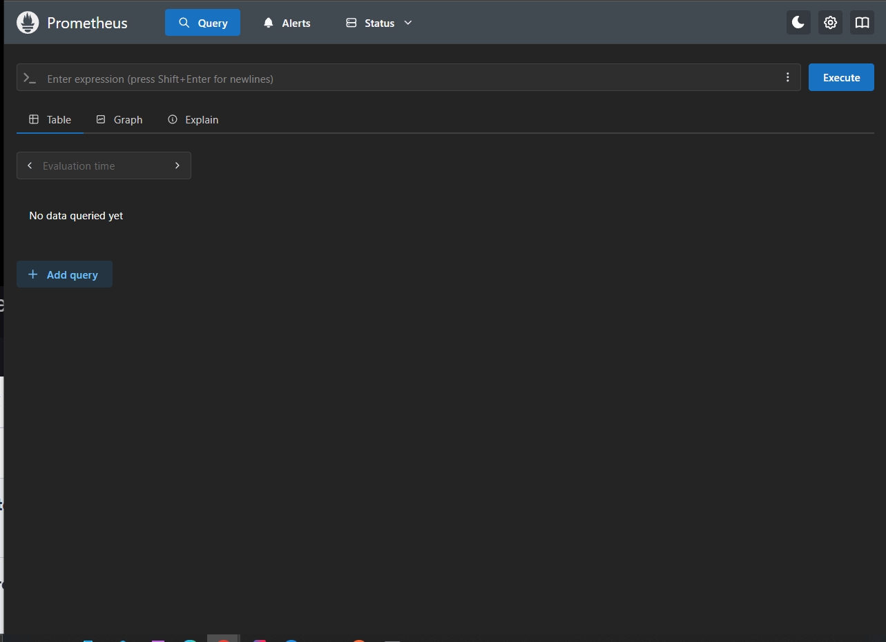

---

# Section 16: Deep dive on Helm

---

In the previous section, we had a very short introduction to Helm.

Helm is a package manager for Kubernetes
(it’s like an App Store for Kubernetes).

The main purpose of Helm is to help **developers** and **DevOps engineers** manage Kubernetes projects by offering a more convenient way to handle Kubernetes manifest files.

---

Without Helm, as we discussed earlier, we need to manually create a manifest file for **each** of our services.

And deleting or applying those files is done using `kubectl` commands.

But we can overcome these challenges with the help of Helm.
**So how does Helm do that?**

---

Helm uses a packaging format called a **chart**.
Charts are a collection of files that describe a related set of Kubernetes resources.

And the beautiful part is that Helm charts can have **parent and child charts**,
just like we have **parent and child classes** in Java.

---

So, in our example, let’s say we have the `accounts`, `loans`, and `cards` services.
If we want to expose them externally, each of them needs a service definition.

Each of these services might look almost identical:

```yaml
apiVersion: v1
kind: Service
metadata:
  name: accounts
spec:
  selector:
    app: accounts
  type: LoadBalancer
  ports:
    - protocol: TCP
      port: 8080
      targetPort: 8080
```

```yaml
apiVersion: v1
kind: Service
metadata:
  name: loans
spec:
  selector:
    app: loans
  type: LoadBalancer
  ports:
    - protocol: TCP
      port: 8090
      targetPort: 8090
```

```yaml
apiVersion: v1
kind: Service
metadata:
  name: cards
spec:
  selector:
    app: cards
  type: LoadBalancer
  ports:
    - protocol: TCP
      port: 9000
      targetPort: 9000
```

---

Thanks to Helm, we can create a **template YAML file**,
so no matter how many microservices we have, we only need **one template**:

```yaml
apiVersion: v1
kind: Service
metadata:
  name: {{ .Values.deploymentLabel }}
spec:
  selector:
    app: {{ .Values.deploymentLabel }}
  type: {{ .Values.serviceType }}
  ports:
    - protocol: TCP
      port: {{ .Values.servicePort }}
      targetPort: {{ .Values.servicePort }}
```

Then, we need to provide a `values.yaml` file:

```yaml
deploymentLabel: accounts
serviceType: ClusterIP
servicePort: 8080
```

Helm will **automatically generate** the Kubernetes manifest file for each service.

So we just need to provide a separate `values.yaml` file for each microservice,
and Helm will render the manifest files **at runtime** for each one.

---

This means we don’t have to manually run commands like:

```bash
kubectl apply -f accounts.yaml
kubectl apply -f loans.yaml
```

With Helm, we can **package all our YAML manifests into a chart**,
and those charts can be added to **public or private Helm repositories**.

---

This makes life easier for DevOps —
we won’t need to manually **setup/upgrade/rollback/remove** each microservice using `kubectl apply`,
because Helm can manage all of them with **a single command**.

For example, we can **roll back all microservices at once** using Helm,
while before, we had to execute separate commands for each one.

---

To install Helm, you need to visit the official Helm website:
[https://helm.sh/](https://helm.sh/)

(I installed it using Chocolatey.)

Once installed, if you run:

```
helm ls
```

you’ll see something like:

```
NAME    NAMESPACE       REVISION        UPDATED STATUS  CHART   APP V
```

As you can see, there are no charts installed yet.

---

**How does Helm connect to your Kubernetes cluster?**
Kubernetes looks for connection details in a hidden folder called `.kube` on your system, which contains the configuration needed to access your cluster.

---

Let’s try creating a simple Helm chart example.

You can search for charts with the command:

```
helm search hub wordpress
```

For example, if you want to deploy a WordPress site on Kubernetes, first you add the Bitnami repo:

```
helm repo add bitnami https://charts.bitnami.com/bitnami
```

Then install WordPress with:

```
helm install happy-panda bitnami/wordpress
```

This command installs the WordPress chart.

---

After installation, if you run:

```
kubectl get pods
```

you’ll see pods running:

```
happy-panda-mariadb-0                   1/1     Running   0          9m52s
happy-panda-wordpress-98986d669-s42bx  1/1     Running   0          9m53s
```

---

It also created ConfigMaps and Secrets for you.

---

Thanks to Helm, you can easily deploy a full WordPress website on Kubernetes.

---

You can view Helm environment variables like these:

```
HELM_BIN="C:\ProgramData\chocolatey\lib\kubernetes-helm\tools\windows-amd64\helm.exe"
HELM_CACHE_HOME="C:\Users\gaunt\AppData\Local\Temp\helm"
HELM_CONFIG_HOME="C:\Users\gaunt\AppData\Roaming\helm"
HELM_NAMESPACE="default"
... (and others)
```

Your cached charts are stored here:

```
C:\Users\gaunt\AppData\Local\Temp\helm
```

Inside, you’ll find the unpacked WordPress chart with its various files.

---

### Understanding the Helm chart structure

Inside the chart folder, focus on four main parts:

* `Chart.yaml`
* `values.yaml`
* `charts/` folder
* `templates/` folder

---

#### Chart.yaml

This file contains the chart metadata.

Example snippet:

```yaml
dependencies:
- condition: memcached.enabled
  name: memcached
  repository: oci://registry-1.docker.io/bitnamicharts
  version: 7.x.x
- condition: mariadb.enabled
  name: mariadb
  repository: oci://registry-1.docker.io/bitnamicharts
  version: 21.x.x
- name: common
  repository: oci://registry-1.docker.io/bitnamicharts
  tags:
    - bitnami-common
      version: 2.x.x
description: WordPress is the world's most popular blogging and content management platform. Powerful yet simple, everyone from students to global corporations use it to build beautiful, functional websites.
home: https://bitnami.com
icon: https://dyltqmyl993wv.cloudfront.net/assets/stacks/wordpress/img/wordpress-stack-220x234.png
keywords:
```

In short — **`Chart.yaml` is like the identity card of your Helm chart, containing:**

* Basic metadata: name, version, app version, description, maintainers, icon, homepage, keywords.
* Dependencies: other charts that this chart relies on or installs along with itself.
* API version to help Helm parse it correctly.

---

#### values.yaml

This file contains default configuration values that Helm injects into your templates during installation.

Example snippet:

```yaml
service:
  type: LoadBalancer
  ports:
    http: 80
    https: 443
```

If you have a list in `values.yaml`, you can iterate over it in templates to create multiple Kubernetes resources.

Example `values.yaml`:

```yaml
servers:
  - name: server1
    port: 8080
  - name: server2
    port: 9090
```

Corresponding Helm template:

```yaml
{{- range .Values.servers }}
apiVersion: v1
kind: Service
metadata:
  name: {{ .name }}
spec:
  ports:
    - port: {{ .port }}
  selector:
    app: {{ .name }}
---
{{- end }}
```

This generates two Service manifests, one for each server.

So **`values.yaml` works like a parameter template** for your Helm chart, allowing dynamic generation of Kubernetes manifests.

---

#### charts/ folder

Contains any dependent charts packaged alongside your chart.

---

#### templates/ folder

Contains Kubernetes manifest templates with placeholders for values from `values.yaml`.

---

Now that we’ve looked at a ready-made chart, let’s create your own custom Helm chart!

---

So now we need to create our own chart related to **Trelabank**.

### 🧹 Before that, let's remove the WordPress chart:

Run the command:

```bash
helm ls
```

You should see something like:

```
NAME            NAMESPACE       REVISION        UPDATED                                 STATUS    CHART              APP VERSION
happy-panda     default         1               2025-07-26 08:43:27.9792563 +0200 CEST  deployed  wordpress-25.0.5   6.8.2
```

To uninstall the chart, simply run:

```bash
helm uninstall happy-panda
```

This gives us a clean Kubernetes cluster again.
As we can see, **Helm lets us delete an entire chart with a single command** – and that’s the power of Helm.

---

Until now, we’ve only installed charts from public repositories.
But in any real-world project or enterprise organization, we’ll usually need to create our own Helm charts based on project requirements.

---

### Let’s create our own Helm structure

First, create a folder called `helm`
📸 *(screenshot below)*


Inside the `helm` folder, run:

```bash
helm create trelabank-common
```

This will generate the following files and folders:
📸 *(screenshot below)*


Next steps:

1. Delete **all contents** of the `templates/` directory.
2. Open `values.yaml` and remove **everything** from it.

---

### Edit the `Chart.yaml` file

You should have:

```yaml
apiVersion: v2
name: trelabank-common
description: A Helm chart for Kubernetes
type: application
version: 0.1.0
appVersion: "1.16.0"
```

Let’s change `appVersion` to `"1.0.0"`.

---

Now we’ll start building templates that will be reusable by all our services.

---

### ✅ 1. `service.yaml` template

```yaml
{{- define "common.service" -}}
apiVersion: v1
kind: Service
metadata:
  name: {{ .Values.serviceName }}
spec:
  selector:
    app: {{ .Values.appLabel }}
  type: {{ .Values.service.type }}
  ports:
    - name: http
      protocol: TCP
      port: {{ .Values.service.port }}
      targetPort: {{ .Values.service.targetPort }}
{{- end -}}
```

* `define` is a Helm function used to create reusable blocks/templates.
* `{{- end -}}` marks the end of the defined block.

> Helm syntax can be quite complex, and honestly, Helm deserves its own course.
> But as developers, we don’t need to know *everything* about it — just enough to be productive.

---

### ✅ 2. Fragment from a `deployment.yaml`

```yaml
{{- if .Values.appname_enabled }}
- name: SPRING_APPLICATION_NAME
  value: {{ .Values.appName }}
{{- end }}
```

This is very similar to the service example above, but here we use a **condition**.
We don’t always want to inject certain env variables, so we add logic to check if they're enabled.

This file also includes settings for OpenTelemetry and Kafka, and it’s located in the `templates/` directory.

---

### ✅ 3. `configmap.yaml`

We’ll use this to inject different values depending on the profile (e.g., `prod`, `qa`, etc.).

```yaml
{{- define "common.configmap" -}}
apiVersion: v1
kind: ConfigMap
metadata:
  name: {{ .Values.global.configMapName }}
data:
  SPRING_PROFILES_ACTIVE: {{ .Values.global.activeProfile }}
  SPRING_CONFIG_IMPORT: {{ .Values.global.configServerURL }}
  EUREKA_CLIENT_SERVICEURL_DEFAULTZONE: {{ .Values.global.eurekaServerURL }}
  SPRING_SECURITY_OAUTH2_RESOURCESERVER_JWT_JWK-SET-URI: {{ .Values.global.keyCloakURL }}
  JAVA_TOOL_OPTIONS: {{ .Values.global.openTelemetryJavaAgent }}
  OTEL_EXPORTER_OTLP_ENDPOINT: {{ .Values.global.otelExporterEndPoint }}
  OTEL_METRICS_EXPORTER: {{ .Values.global.otelMetricsExporter }}
  OTEL_LOGS_EXPORTER: {{ .Values.global.otelLogsExporter }}
  SPRING_CLOUD_STREAM_KAFKA_BINDER_BROKERS: {{ .Values.global.kafkaBrokerURL }}
{{- end -}}
```

---

We’re leaving `values.yaml` empty **on purpose**,
because all external configuration will be provided from other charts that depend on this one.

---

Now we want to create a Helm chart for our **Accounts microservice**,
which will **use the `trelabank-common` Helm chart**.

### 📁 Step 1: Create the folder

We start by creating a new folder:


Inside that folder, we create a new Helm chart named `accounts`:

```bash
helm create accounts
```

---

### 🧹 Step 2: Clean up the template

Just like before:

* Delete everything inside the `templates/` folder
* Clear the content of `values.yaml`

---

### 📝 Step 3: Update `Chart.yaml`

We change the version and add the following dependency:

```yaml
dependencies:
- name: trelabank-common
  version: 0.1.0
  repository: file://../../trelabank-common
```

This means we are linking the `trelabank-services` chart with `trelabank-common`.

> The `repository` field could normally point to a Helm chart URL,
> but since we don’t have a remote chart, we refer to the local path instead.

---

### 📂 Step 4: Use common templates

Now copy the `deployment` and `service` templates from `trelabank-common`
into `trelabank-services/accounts/templates`.

> We’re skipping the `configmap` template for now, since it’s not required to run the `accounts` service.


---

In the copied files, we **replace the content** with:

```yaml
{{- template "common.service" . -}}
{{- template "common.deployment" . -}}
```

This tells Helm to **render templates defined in `trelabank-common`**, using the current values.

---

### 📄 Step 5: Provide values

Now edit the `values.yaml` file in `accounts/`:

```yaml
deploymentName: accounts-deployment
serviceName: accounts
appLabel: accounts
appName: accounts

replicaCount: 1

image:
  repository: treladev/accounts
  tag: s14

containerPort: 8080

service:
  type: ClusterIP
  port: 8080
  targetPort: 8080

appname_enabled: true
profile_enabled: true
config_enabled: true
eureka_enabled: true
resouceserver_enabled: false
otel_enabled: true
kafka_enabled: true
```

All these values are used in the `deployment.yaml` and `service.yaml` files
from `trelabank-common` — you can check those files to see **how the values are injected**.

---

### 🧵 Step 6: Compile the Helm chart

You might notice that the `charts/` folder is still empty.
That’s because we haven’t yet **compiled the Helm chart dependencies**.

To do that:

```bash
cd trelabank-services/accounts
helm dependencies build
```

This will generate a `.tgz` package inside the `charts/` folder
for `trelabank-common` with version `0.1.0`.


---

Now let’s repeat this process for the other microservices.

We can simply **copy the `accounts` folder** and modify it to create the Helm chart for the **`cards`** service.

### 📝 Step 1: Update `Chart.yaml`

Change the name in `Chart.yaml`:

```yaml
apiVersion: v2
name: cards
description: A Helm chart for Kubernetes
```

---

### 📄 Step 2: Update `values.yaml`

Next, adjust the values, including the name, ports, and disable Kafka (since the `cards` service doesn’t use Kafka):

```yaml
deploymentName: cards-deployment
serviceName: cards
appLabel: cards
appName: cards

replicaCount: 1

image:
  repository: treladev/cards
  tag: s14

containerPort: 9000

service:
  type: ClusterIP
  port: 9000
  targetPort: 9000

appname_enabled: true
profile_enabled: true
config_enabled: true
eureka_enabled: true
resouceserver_enabled: false
otel_enabled: true
kafka_enabled: false
```

---

```bash
cd trelabank-services/accounts
helm dependencies build
```


### 🔁 Step 3: Repeat for other microservices

Follow the same approach for every other microservice:

* Copy the chart folder
* Update the `Chart.yaml` name
* Adjust the `values.yaml` accordingly

This allows all services to **reuse the common templates** from `trelabank-common`, while keeping their own specific configuration. ✅

---

✅ The remaining services have been added:


In each service, you need to update the configuration:

* Ports
* Names
* Environment variable flags (`true` or `false`)

---

🔧 Now you can **compile the charts** for each service using:

```bash
helm dependencies build
```

---


Now let's create a Helm chart specific to an environment.

We start by creating a new folder called `environments`:


Inside this folder, we create a new Helm chart:

```bash
helm create dev
```

As before, we remove the entire auto-generated `templates` folder and also clear out the contents of the `values.yaml` file.

Then, let's change the app version to:

```yaml
appVersion: "1.0.0"
```

Now we need to add dependencies to this chart. Add the following under `Chart.yaml`:

```yaml
dependencies:
- name: trelabank-common
  version: 0.1.0
  repository: file://../../trelabank-common

- name: configserver
  version: 0.1.0
  repository: file://../../trelabank-services/configserver

- name: eurekaserver
  version: 0.1.0
  repository: file://../../trelabank-services/eurekaserver

- name: accounts
  version: 0.1.0
  repository: file://../../trelabank-services/accounts

- name: cards
  version: 0.1.0
  repository: file://../../trelabank-services/cards

- name: loans
  version: 0.1.0
  repository: file://../../trelabank-services/loans

- name: gatewayserver
  version: 0.1.0
  repository: file://../../trelabank-services/gatewayserver

- name: message
  version: 0.1.0
  repository: file://../../trelabank-services/message
```

In the `templates` directory, we only add a `configmap.yaml` file, since that's all we currently need:

```gotpl
{{- define "common.configmap" -}}
```

Now let's add some environment-specific values to `values.yaml` for the `dev` environment:

```yaml
global:
  configMapName: trelabank-configmap
  activeProfile: default
  configServerURL: configserver:http://configserver:8071/
  eurekaServerURL: http://eurekaserver:8070/eureka/
  keyCloakURL: http://keycloak.default.svc.cluster.local:80/realms/master/protocol/openid-connect/certs
  openTelemetryJavaAgent: "-javaagent:/app/libs/opentelemetry-javaagent-2.11.0.jar"
  otelExporterEndPoint: http://tempo-grafana-tempo-distributor:4318
  otelMetricsExporter: none
  otelLogsExporter: none
  kafkaBrokerURL: kafka-controller-0.kafka-controller-headless.default.svc.cluster.local:9092
```

> `keycloak.default.svc.cluster.local:80` — Keycloak will run on port 80.
> This is something new, because soon we'll be deploying third-party components such as Keycloak using only Helm charts.
> In this process, these components will be set up in production-grade quality.
> That's exactly how the address for our Keycloak service will look.

---

Now we should compile this chart.

It compiled 7 files (see screenshot below):


So now we have 7 charts in a compressed format.

We did this for the `dev` environment — now let's do the same for `qa` and `prod`.

To do that, we copy the entire folder and just change a few values.

In `Chart.yaml`:

```yaml
name: qa
```

And in `values.yaml`:

```yaml
global:
  configMapName: trelabankqa-configmap
  activeProfile: qa
```

Same goes for `prod`.

At this point, we now have 3 profiles set up:


---

So far, we've done quite a bit of work preparing our Helm charts.

Before installing them, it's often helpful to preview the generated Kubernetes manifests.

To do that, we can use the `helm template` command. This lets us see all the manifest files that Helm will generate — a great way to verify what will be applied.

To use it, we need to be inside the specific Helm chart directory and run:

```bash
helm template .
```

This generates all the manifest files:


---

In the next step, we’ll deploy our microservices to the Kubernetes cluster.

But before that, we also want to add Keycloak, Kafka, and Grafana to the cluster.

We don’t need to create charts for them manually — since they’re commonly used, many open-source communities have already created Helm charts specifically for components like Keycloak, Grafana, and others.

---

A big advantage of Helm is that it has a large community, so we should easily find Helm charts for almost any product.

On the page
[https://github.com/bitnami/charts](https://github.com/bitnami/charts)
in the `bitnami` folder, we can find many popular Helm charts.
Let’s download all of them to our computer.

In the `bitnami` folder, we have all the charts we downloaded — naturally, we won’t use all of them (see screenshot below).

First, let’s find Keycloak and copy it to our own Helm folder (screenshot below).


By default, Keycloak comes with a ClusterIP service, but
we want to expose Keycloak via a LoadBalancer because we want to access it externally.
Therefore, we need to open the `values.yaml` file.

We find the `clusterIP` setting:


and change it to `LoadBalancer`:


Next, we can look for the admin password:


We can change it to the classic `admin/admin`:


Now let’s build our Keycloak Helm chart dependencies:

```bash
helm dependencies build
```

Then, from the Helm folder, install Keycloak:

```bash
helm install keycloak keycloak
```

(The first `keycloak` is the release name, the second is the folder name.)

Next, on Windows, we can get the service port and IP with:

```powershell
$HTTP_SERVICE_PORT = kubectl get svc keycloak --namespace default -o jsonpath="{.spec.ports[?(@.name=='http')].port}"
$SERVICE_IP = kubectl get svc keycloak --namespace default -o jsonpath="{.status.loadBalancer.ingress[0].ip}"

Write-Output "http://$SERVICE_IP`:$HTTP_SERVICE_PORT/"
```

Keycloak is running under the host:
`localhost:80`


We can also create a new client with client credentials — useful later for tests.
In Postman, we get a token, so Keycloak is working:


---

**Which Keycloak URL should we use in the configuration?**

```yaml
global:
  configMapName: trelabank-configmap
  activeProfile: default
  configServerURL: configserver:http://configserver:8071/
  eurekaServerURL: http://eurekaserver:8070/eureka/
  keyCloakURL: http://keycloak.default.svc.cluster.local:80/realms/master/protocol/openid-connect/certs
  openTelemetryJavaAgent: "-javaagent:/app/libs/opentelemetry-javaagent-2.11.0.jar"
  otelExporterEndPoint: http://tempo-grafana-tempo-distributor:4318
  otelMetricsExporter: none
  otelLogsExporter: none
  kafkaBrokerURL: kafka-controller-0.kafka-controller-headless.default.svc.cluster.local:9092
```

As we can see, Keycloak has the address:
`keycloak.default.svc.cluster.local:80`

So how do I know this hostname?

During the Keycloak installation, the console output said
that it will be available under the DNS:
`keycloak.default.svc.cluster.local` (port 80)

This is the DNS name within the same Kubernetes cluster, so it is also accessible by the gateway.
Therefore, the gateway can connect to Keycloak using this address.

---

Here is the full English translation of your text, rewritten clearly and naturally for a technical audience:

---

As we can see in our Kubernetes dashboard, we currently have two pods:

Keycloak and Postgres.

When we uninstall a Helm chart, its **persistent volumes are not deleted automatically** — they need to be removed manually, for example via the `panda` UI:


---

Now let's try adding Kafka from the `bitnami` folder.
We copy the Kafka chart to our `helm` folder:


By default, 3 Kafka brokers are deployed immediately. (I later changed to 3 again because 1 was causing problems.)
We want to change this, so we go into the `values.yaml` file and set the `replicaCount` from 3 to 1:


We also want to adjust some security-related parameters.
In production, communication with Kafka is always secured, but for our local setup, we’ll simplify it.
We search for the value `SASL_PLAINTEXT` and replace it with `PLAINTEXT`.

Now we can build and install the Kafka chart:

```bash
helm dependencies build
```

Then, from the `helm` folder:

```bash
helm install kafka kafka
```

After installation, we get this output:

```
kafka.default.svc.cluster.local
Each Kafka broker can be accessed by producers via port 9092 on the following DNS name(s) from within your cluster:
  kafka-controller-0.kafka-controller-headless.default.svc.cluster.local:9092
```

This matches what we have configured in `values.yaml`:

```yaml
kafkaBrokerURL: kafka-controller-0.kafka-controller-headless.default.svc.cluster.local:9092
```

In the Kubernetes UI, we can now see Kafka running:


---

Next, let’s add Prometheus (again, by copying the chart from the Bitnami folder into our `helm` folder):


We need to make some changes in `values.yaml`.

First, we look for the `additionalScrapeConfigs` section and set:

```yaml
enabled: true
type: internal
```

This is because everything Prometheus should scrape is internal — it's all inside our microservices.

We also leave the `external` config empty:

```yaml
additionalScrapeConfigs:
  enabled: true
  type: internal
  external:
    name: ""
    key: ""
  internal:
    jobList: []
```

Now we need to populate the `jobList` — this tells Prometheus which services to scrape.
In our `docker-compose` setup (section 11), we had something like this:

```yaml
- job_name: 'accounts'
  metrics_path: "/actuator/prometheus"
  static_configs:
    - targets: ['accounts:8080']
- job_name: 'cards'
  ...
```

But in `values.yaml`, this needs to be rewritten in JSON-style objects inside a list, like so:

```yaml
jobList: [
  {
    "job_name": "accounts",
    "metrics_path": "/actuator/prometheus",
    "static_configs": [
      { "targets": [ "accounts:8080" ] }
    ]
  },
  {
    "job_name": "cards",
    "metrics_path": "/actuator/prometheus",
    "static_configs": [
      { "targets": [ "cards:9000" ] }
    ]
  },
  {
    "job_name": "loans",
    "metrics_path": "/actuator/prometheus",
    "static_configs": [
      { "targets": [ "loans:8090" ] }
    ]
  },
  {
    "job_name": "gatewayserver",
    "metrics_path": "/actuator/prometheus",
    "static_configs": [
      { "targets": [ "gatewayserver:8072" ] }
    ]
  },
  {
    "job_name": "eurekaserver",
    "metrics_path": "/actuator/prometheus",
    "static_configs": [
      { "targets": [ "eurekaserver:8070" ] }
    ]
  },
  {
    "job_name": "configserver",
    "metrics_path": "/actuator/prometheus",
    "static_configs": [
      { "targets": [ "configserver:8071" ] }
    ]
  }
]
```

---

Now we can build and install the Prometheus chart:

```bash
helm dependencies build
```

Then, from the `helm` folder:

```bash
helm install prometheus kube-prometheus
```

By default, Prometheus uses a `ClusterIP` service, so we can't access it directly from our browser.
But we can use **port forwarding**:

```bash
echo "Prometheus URL: http://127.0.0.1:9090/"
kubectl port-forward --namespace default svc/prometheus-kube-prometheus-prometheus 9090:9090
```

Now we can access the Prometheus UI:


As we can see, our microservices aren’t running yet:


Additionally, Prometheus monitors a lot of other components by default — it’s production-ready out of the box.
But for now, we’ll ignore those and focus on our own services.

---

### Now let's add Grafana Loki and Tempo

First, we copy both charts from the Bitnami folder:


---

### Installing Loki

For **Loki**, we don’t need to change any configuration. We simply build and install the chart:

```bash
helm dependencies build
helm install loki grafana-loki
```

It’s that simple — no need to tweak settings or spend time configuring.

---

### Installing Grafana Tempo

With **Tempo**, we need to make a small configuration change related to OpenTelemetry (OTLP).
In the `values.yaml` file, we enable both HTTP and gRPC trace ingestion:

```yaml
thriftHttp: true
otlp:
  http: true      # Enable OpenTelemetry HTTP ingestion
  grpc: true      # Enable OpenTelemetry gRPC ingestion
```

Now we can build and install the chart:

```bash
helm dependencies build
helm install tempo grafana-tempo
```

---

### Setting up the OTLP Export Endpoint

At this point, we have a problem: our **microservices need to know the Tempo URL** to which they can send trace data.

But Helm did not output any link after installation.
To find the correct internal service address, we run:

```bash
kubectl get services
```

Example output:

```plaintext
tempo-grafana-tempo-distributor   ClusterIP   ...   PORT(S): 4318, ...
...
```

As you can see, there are **many Tempo services** — so which one should our microservices connect to?

The correct one is:

```
tempo-grafana-tempo-distributor
```

This service is responsible for receiving traces from clients.

So in our application's `values.yaml`, we should set:

```yaml
otelExporterEndPoint: http://tempo-grafana-tempo-distributor:4318
```

---

### How do we know which Tempo service to use?

If you’re ever unsure, you should:

* Check the official **Tempo documentation**
* Or simply **ask ChatGPT** 

Knowing that the *distributor* handles incoming trace traffic is crucial for connecting microservices to Tempo correctly.

---


## Now Let’s Add Grafana

Just like before, we copy the necessary configuration:


Now we need to locate in Grafana the place where we can add **data sources**:
**Prometheus**, **Loki**, and **Tempo**.

While it’s possible to add data sources manually via the UI,
we want this to be automated.

---

### Example: Adding datasources via Docker Compose

```yaml
datasources:
- name: Prometheus
  type: prometheus
  uid: prometheus
  url: http://prometheus:9090
  access: proxy
  orgId: 1
  basicAuth: false
  isDefault: false
  version: 1
  editable: true
  jsonData:
    httpMethod: GET

- name: Loki
  type: loki
  uid: loki
  access: proxy
  orgId: 1
  editable: true
  url: http://gateway:3100
  jsonData:
    httpHeaderName1: "X-Scope-OrgID"
    derivedFields:
    - datasourceUid: tempo
      matcherRegex: "\\[.+,(.+),.+\\]"
      name: TraceID
      url: '$${__value.raw}'
  secureJsonData:
    httpHeaderValue1: "tenant1"

- name: Tempo
  type: tempo
  uid: tempo
  url: http://tempo:3100
  access: proxy
  orgId: 1
  basicAuth: false
  isDefault: false
  version: 1
  editable: true
  jsonData:
    httpMethod: GET
    serviceMap:
      datasourceUid: 'prometheus'
```

---

### Now, let’s add them in Kubernetes as well:

Note that we’re using **DNS-based service names** in the cluster instead of static URLs.

```yaml
secretDefinition:
  apiVersion: 1

  deleteDatasources:
    - name: Prometheus
    - name: Loki
    - name: Tempo

  datasources:
    - name: Prometheus
      type: prometheus
      uid: prometheus
      url: http://prometheus-kube-prometheus-prometheus:9090
      access: proxy
      orgId: 1
      basicAuth: false
      isDefault: false
      version: 1
      editable: true
      jsonData:
        httpMethod: GET

    - name: Tempo
      type: tempo
      uid: tempo
      url: http://tempo-grafana-tempo-query-frontend:3200
      access: proxy
      orgId: 1
      basicAuth: false
      isDefault: false
      version: 1
      editable: true
      jsonData:
        httpMethod: GET
        serviceMap:
          datasourceUid: 'prometheus'

    - name: Loki
      type: loki
      uid: loki
      access: proxy
      orgId: 1
      editable: true
      url: http://loki-grafana-loki-gateway:80
      jsonData:
        httpHeaderName1: "X-Scope-OrgID"
        derivedFields:
          - datasourceUid: tempo
            matcherRegex: "\\[.+,(.+),.+\\]"
            name: TraceID
            url: '$${__value.raw}'
      secureJsonData:
        httpHeaderValue1: "tenant1"
```

---

### Compile and Install Grafana:

```bash
helm dependency build
helm install grafana grafana
```

---

### 1. Get the application URL

In Linux/macOS Bash:

```bash
echo "Browse to http://127.0.0.1:8080"
kubectl port-forward svc/grafana 8080:3000 &
```

In Windows PowerShell:

```powershell
Write-Output "Browse to http://127.0.0.1:8080"
kubectl port-forward svc/grafana 8080:3000
```

⚠️ **Note:** This can cause port conflicts.
It’s safer to forward to a different port (e.g., 3000 → 3000):

```powershell
Write-Output "Browse to http://127.0.0.1:3000"
kubectl port-forward svc/grafana 3000:3000
```

---

### 2. Get the admin credentials:

In Bash:

```bash
echo "User: admin"
echo "Password: $(kubectl get secret grafana-admin --namespace default -o jsonpath="{.data.GF_SECURITY_ADMIN_PASSWORD}" | base64 -d)"
```

In PowerShell:

```powershell
Write-Output "User: admin"
$encodedPassword = kubectl get secret grafana-admin --namespace default -o jsonpath="{.data.GF_SECURITY_ADMIN_PASSWORD}"
$decodedPassword = [System.Text.Encoding]::UTF8.GetString([System.Convert]::FromBase64String($encodedPassword))
Write-Output "Password: $decodedPassword"
```

> **Note:** Do not include `grafana.validateValues.database` in your `values.yaml`. See: [https://github.com/bitnami/charts/issues/20629](https://github.com/bitnami/charts/issues/20629)

---

### Now Grafana is Running on Port 3000


After logging in, we can see that **Prometheus**, **Loki**, and **Tempo** were added successfully 🎉


---

We can run `helm ls` to display all the currently installed charts:

```
NAME            NAMESPACE   REVISION  UPDATED                                 STATUS    CHART                   APP VERSION
grafana         default     1         2025-07-27 09:23:51.2956843 +0200 CEST  deployed  grafana-12.1.2           12.1.0     
kafka           default     1         2025-07-27 07:51:30.1450275 +0200 CEST  deployed  kafka-32.3.8              4.0.0
keycloak        default     1         2025-07-27 07:09:23.1976367 +0200 CEST  deployed  keycloak-24.8.1           26.3.2
loki            default     1         2025-07-27 08:47:10.7795659 +0200 CEST  deployed  grafana-loki-6.0.1        3.5.3
prometheus      default     1         2025-07-27 08:08:44.9371021 +0200 CEST  deployed  kube-prometheus-11.2.16   0.84.0
tempo           default     1         2025-07-27 08:50:52.6782849 +0200 CEST  deployed  grafana-tempo-4.0.13      2.8.1
```

This will list all Helm releases currently deployed in the cluster.

### ✅ Now We Can Finally Deploy All Our Microservices to Kubernetes

---

Finally, we will deploy our microservices to our Kubernetes cluster using **Helm**.

Previously, we mentioned that this can be done with a single command.

When we navigate to the `environments` folder, we can see three different environments: **dev**, **prod**, and **qa**.


We need to decide under which environment we want to deploy our microservices.

So, for example, to deploy under the `prod` environment, we can run the following command from `helm/environments`:

```bash
helm install trelabank prod
```

After running this, we can see all our microservices are deployed:


This means everything is working.

To test it, we can send a request to the following endpoint:

```
http://localhost:8072/trelabank/accounts/api/contact-info
```

And we receive the following response:

```json
{
  "message": "Welcome to TrelaBank accounts related prod APIs",
  "contactDetails": {
    "name": "Example prod Contacto",
    "email": "example.prod.contact@gmail.com"
  },
  "onCallSupport": [
    "(123) 416-7890",
    "(123) 523-7890"
  ]
}
```

We can also test an endpoint that requires a JWT token from **Keycloak**:

**Endpoint:**

```
http://localhost:8072/trelabank/accounts/api/create
```

**Payload:**

```json
{
  "name": "Marcin Trela",
  "email": "marcin.trela.dev@gmail.com",
  "mobileNumber": "4354437687"
}
```

**Response:**

```json
{
  "statusCode": "201",
  "statusMsg": "Account created successfully"
}
```

We can also check **Grafana** at `localhost:3000` to confirm it’s working.

Then we check **Loki** logs for the gateway:

We get the logs:


And we can trace the entire request in **Tempo**:


**Prometheus** is also working as expected:


---


Sometimes, after we’ve installed our applications using Helm charts,
we might want to introduce changes to our microservices
or update them with new values.

Let’s make a small change in the `gateway` service.
We’ll change the image tag in the gateway values file to `s11`:

```yaml
deploymentName: gatewayserver-deployment
serviceName: gatewayserver
appLabel: gatewayserver
appName: gatewayserver

replicaCount: 1

image:
  repository: treladev/gatewayserver
  tag: s11

containerPort: 8072

service:
  type: LoadBalancer
  port: 8072
  targetPort: 8072

appname_enabled: true
profile_enabled: true
config_enabled: true
eureka_enabled: true
resouceserver_enabled: true
otel_enabled: true
kafka_enabled: false
```

With this setup, **authentication will no longer be required** for the endpoints to work.

Now let’s rebuild the Helm dependencies in the `prod` environment:

```bash
helm dependencies build
```

And now the new part — we can upgrade the release using:

```bash
helm upgrade trelabank prod
```

After that, the endpoint:

```
http://localhost:8072/trelabank/accounts/api/create
```

works **without authentication!**
So this is how we can upgrade and change values on the fly using Helm.

---

### ⚠️ Quick side note about `tempo-ingester`:

I had an issue where the Tempo ingester pod was crashing after about 20 minutes.
It turned out to be an **OOM (Out of Memory)** error.
I solved it by increasing the memory limits:

```yaml
resources:
  requests:
    cpu: 200m
    memory: 512Mi
  limits:
    cpu: 500m
    memory: 1Gi
```

---

### 🔁 Now let’s explore Helm rollback

The beauty of Helm’s rollback feature is that it can **revert your entire Kubernetes cluster state**
to a previously working version.

Before we run a rollback, let’s check the history:

```bash
helm history trelabank
```

Output example:

```
REVISION    UPDATED                       STATUS      CHART       APP VERSION   DESCRIPTION
1           Tue Jul 29 12:35:26 2025      deployed    prod-0.1.0   1.0.0         Install complete
```

So far, we have only 1 revision since I had to uninstall the release earlier.

Now, let’s upgrade the image tag from `s11` to `s14` in the gateway’s `values.yaml`:

```yaml
image:
  repository: treladev/gatewayserver
  tag: s14
```

Then rebuild the dependencies in the `prod` folder:

```bash
helm dependencies build
```

And upgrade:

```bash
helm upgrade trelabank prod
```

Now when we hit the endpoint:

```
http://localhost:8072/trelabank/accounts/api/create
```

with this request body:

```json
{
  "name": "Marcin Trela",
  "email": "marcin.trela.dev@gmail.com",
  "mobileNumber": "4354437687"
}
```

we get an **unauthorized** error — meaning the upgrade was successful and authentication is now required.

If we run:

```bash
helm history trelabank
```

We’ll see something like this (note that I did a few test upgrades earlier, but the important ones are 1 and 4):

```
REVISION    UPDATED                       STATUS      CHART       APP VERSION   DESCRIPTION
1           Tue Jul 29 12:35:26 2025      superseded  prod-0.1.0   1.0.0         Install complete
2           Tue Jul 29 12:46:13 2025      superseded  prod-0.1.0   1.0.0         Upgrade complete
3           Tue Jul 29 12:50:44 2025      superseded  prod-0.1.0   1.0.0         Upgrade complete
4           Tue Jul 29 12:57:31 2025      deployed    prod-0.1.0   1.0.0         Upgrade complete
```

---

### 🔙 Let’s perform a rollback to `s11`

We’ll now roll back to revision 1, where authentication was disabled:

```bash
helm rollback trelabank 1
```

✅ **Rollback was a success! Happy Helming!**

Now the endpoint should once again be accessible **without authorization**:

```
http://localhost:8072/trelabank/accounts/api/create
```

With the same request body:

```json
{
  "name": "Marcin Trela",
  "email": "marcin.trela.dev@gmail.com",
  "mobileNumber": "4354437687"
}
```

You may now get a valid app-level error like:

```json
{
  "apiPath": "uri=/api/create",
  "errorCode": "CONFLICT",
  "errorMessage": "Loan already registered with given mobileNumber 4354437687",
  "errorTime": "2025-07-29T11:01:50.58833085"
}
```

Check history again:

```bash
helm history trelabank
```

You’ll now see:

```
REVISION    UPDATED                       STATUS      CHART       APP VERSION   DESCRIPTION
1           Tue Jul 29 12:35:26 2025      superseded  prod-0.1.0   1.0.0         Install complete
2           Tue Jul 29 12:46:13 2025      superseded  prod-0.1.0   1.0.0         Upgrade complete
3           Tue Jul 29 12:50:44 2025      superseded  prod-0.1.0   1.0.0         Upgrade complete
4           Tue Jul 29 12:57:31 2025      superseded  prod-0.1.0   1.0.0         Upgrade complete
5           Tue Jul 29 13:01:07 2025      deployed    prod-0.1.0   1.0.0         Rollback to 1
```

---

### 🧹 Optionally: Uninstalling a Helm release

You can list all installed charts with:

```bash
helm ls
```

Sample output:

```
NAME         NAMESPACE   REVISION  UPDATED                            STATUS     CHART                   APP VERSION
grafana      default     1         2025-07-27 15:56:25 +0200 CEST     deployed   grafana-12.1.2          12.1.0
kafka        default     1         2025-07-29 06:56:08 +0200 CEST     deployed   kafka-32.3.8            4.0.0
keycloak     default     1         2025-07-27 16:08:03 +0200 CEST     deployed   keycloak-24.8.1         26.3.2
loki         default     1         2025-07-27 15:55:33 +0200 CEST     deployed   grafana-loki-4.7.1      3.3.2
prometheus   default     1         2025-07-27 15:54:50 +0200 CEST     deployed   kube-prometheus-11.2.16 0.84.0
tempo        default     1         2025-07-29 12:34:14 +0200 CEST     deployed   grafana-tempo-4.0.13    2.8.1
trelabank    default     5         2025-07-29 13:01:07 +0200 CEST     deployed   prod-0.1.0              1.0.0
```

You can uninstall a Helm release like this:

```bash
helm uninstall trelabank
```

---

### 🧽 Don’t forget to clean up PVCs

To fully remove persistent data:

1. List PVCs:

```bash
kubectl get pvc
```

2. Delete a specific PVC (e.g., Kafka):

```bash
kubectl delete pvc data-kafka-controller-0
```
---

### ❓Are there any alternatives to Helm?

Yes — we also have [**Kustomize**](https://kustomize.io/).
It’s **a bit easier to use than Helm** in many cases.

In this course, the instructor chose **Helm** because it offers a large library of pre-built charts, especially from **Bitnami**.

But in practice, **both Helm and Kustomize are used**, often side by side depending on the use case.

---

### 🛠️ Useful Helm Commands (Cheat Sheet)

| **Command**                       | **Description**                                                                                                                   |
| --------------------------------- | --------------------------------------------------------------------------------------------------------------------------------- |
| `helm create eazybank`            | Creates a blank chart named `eazybank`. Inside the folder, you'll find `Chart.yaml`, `values.yaml`, `charts/`, `templates/`, etc. |
| `helm dependencies build`         | Reconstructs and builds the chart’s dependencies as defined in `Chart.yaml`.                                                      |
| `helm install [NAME] [CHART]`     | Installs the Helm chart with the given release name.                                                                              |
| `helm upgrade [NAME] [CHART]`     | Upgrades an existing release to a new version of the chart (e.g., with updated values or image tags).                             |
| `helm history [NAME]`             | Shows the revision history for a given release.                                                                                   |
| `helm rollback [NAME] [REVISION]` | Rolls back a release to a previous version. If no revision is given, it rolls back to the last deployed revision.                 |
| `helm uninstall [NAME]`           | Removes all Kubernetes resources created by the release, along with its revision history.                                         |
| `helm template [NAME] [CHART]`    | Renders the chart locally and outputs the raw Kubernetes manifests without applying them. Useful for debugging.                   |
| `helm ls`                         | Lists all currently installed Helm releases in the selected namespace.                                                            |

---

