---

# Section 17: Server-side service discovery and load balancing using Kubernetes

---

### In section 8, we learned about **client-side service discovery and load balancing**

This architecture looks like the following:
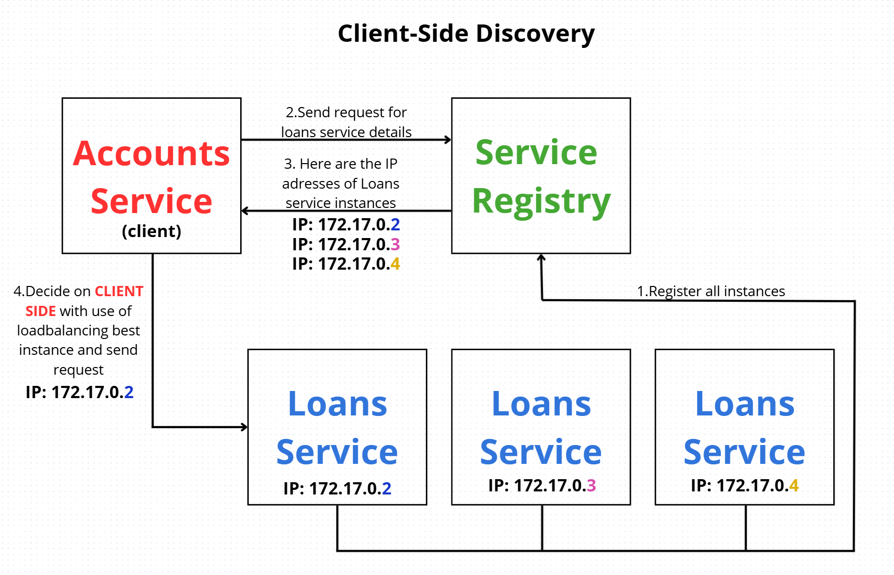

We can use client-side service discovery, but this approach has some drawbacks.
One of them is that we need a separate microservice, such as a Eureka server.

We can avoid this by using **server-side service discovery** instead.

---

### **Server-side service discovery (SSC)**

The responsibility for finding the correct service instance lies with the server/proxy (e.g., API Gateway or load balancer).

* The client only calls a single, fixed location (e.g., an API Gateway), which then routes the request to the appropriate service instance.
* The client does not need to maintain a list of services or implement any load balancing logic.

---

With server-side service discovery, the architecture looks different (diagram below):
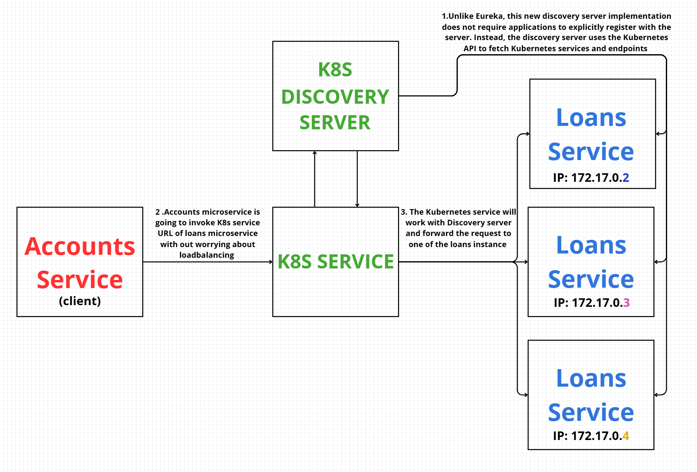

1. Unlike Eureka, this discovery server implementation doesn’t require applications to explicitly register themselves. Instead, the discovery server uses the Kubernetes API to fetch Kubernetes services and endpoints.
2. The **Accounts** microservice calls the Kubernetes service URL of the **Loans** microservice without worrying about load balancing.
3. The Kubernetes service works together with the Discovery Server and forwards the request to one of the Loans service instances.

---

### What are the advantages?

* Developers don’t need to worry about setting up a Eureka server or managing it.

### What are the disadvantages?

* Client applications have no control over load balancing — the load balancing algorithm is handled inside Kubernetes, and we can’t influence how it behaves.

> There is no “right” or “wrong” approach here — choose one based on your **business requirements**.

---

### To get started with server-side service discovery, we need help from one of the **Spring Cloud** projects:

[https://spring.io/projects/spring-cloud-kubernetes](https://spring.io/projects/spring-cloud-kubernetes)

We’ll use the **Spring Cloud Kubernetes** library to set up server-side discovery and default load balancing.
The Kubernetes cluster won’t need a dedicated service discovery or registration server.

The Spring blog provides instructions on how to set up the discovery server inside a Kubernetes cluster:
[https://spring.io/blog/2021/10/26/new-features-for-spring-cloud-kubernetes-in-spring-cloud-2021-0-0-m3](https://spring.io/blog/2021/10/26/new-features-for-spring-cloud-kubernetes-in-spring-cloud-2021-0-0-m3)

There you’ll find a **manifest file** for the discovery server:

---

### Kubernetes manifest:

```yaml
apiVersion: v1
kind: List
items:
- apiVersion: v1
  kind: Service
  metadata:
    labels:
      app: spring-cloud-kubernetes-discoveryserver
    name: spring-cloud-kubernetes-discoveryserver
  spec:
    ports:
    - name: http
      port: 80
      targetPort: 8761
    selector:
      app: spring-cloud-kubernetes-discoveryserver
    type: ClusterIP

- apiVersion: v1
  kind: ServiceAccount
  metadata:
    labels:
      app: spring-cloud-kubernetes-discoveryserver
    name: spring-cloud-kubernetes-discoveryserver

- apiVersion: rbac.authorization.k8s.io/v1
  kind: RoleBinding
  metadata:
    labels:
      app: spring-cloud-kubernetes-discoveryserver
    name: spring-cloud-kubernetes-discoveryserver:view
  roleRef:
    kind: Role
    apiGroup: rbac.authorization.k8s.io
    name: namespace-reader
  subjects:
  - kind: ServiceAccount
    name: spring-cloud-kubernetes-discoveryserver

- apiVersion: rbac.authorization.k8s.io/v1
  kind: Role
  metadata:
    namespace: default
    name: namespace-reader
  rules:
  - apiGroups: ["", "extensions", "apps"]
    resources: ["services", "endpoints", "pods"]
    verbs: ["get", "list", "watch"]

- apiVersion: apps/v1
  kind: Deployment
  metadata:
    name: spring-cloud-kubernetes-discoveryserver-deployment
  spec:
    selector:
      matchLabels:
        app: spring-cloud-kubernetes-discoveryserver
    template:
      metadata:
        labels:
          app: spring-cloud-kubernetes-discoveryserver
      spec:
        serviceAccount: spring-cloud-kubernetes-discoveryserver
        containers:
        - name: spring-cloud-kubernetes-discoveryserver
          image: springcloud/spring-cloud-kubernetes-discoveryserver:3.2.2
          imagePullPolicy: IfNotPresent
          readinessProbe:
            httpGet:
              port: 8761
              path: /actuator/health/readiness
            initialDelaySeconds: 100
            periodSeconds: 30
          livenessProbe:
            httpGet:
              port: 8761
              path: /actuator/health/liveness
            initialDelaySeconds: 100
            periodSeconds: 30
          ports:
          - containerPort: 8761
```

---

Let’s now create a new folder named `kubernetes`, and inside it, a file for the manifest (see screen below):
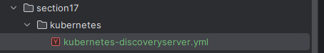
Paste the above manifest into that file.

Since the manifest uses `kind: List`, we can define multiple different Kubernetes objects inside a single file.

In the **RoleBinding**, we reference our service account.
The Role we assign is `namespace-reader`.
Then, we specify the **rules** that this role will follow when associated with the service account.

Since the blog post is a bit old, we need to **add `"pods"`** to the list of resources in the `rules` section:

```yaml
resources: ["services", "endpoints", "pods"]
```

---

The Docker image is provided by Spring Cloud, so we don’t need to create our own Eureka server or anything similar — Spring has already built the application for us.

In the blog, the version is `2.1.0-M3`, but let’s check DockerHub for newer versions:
[https://hub.docker.com/r/springcloud/spring-cloud-kubernetes-discoveryserver](https://hub.docker.com/r/springcloud/spring-cloud-kubernetes-discoveryserver)

We found a **stable version: `3.2.2`**
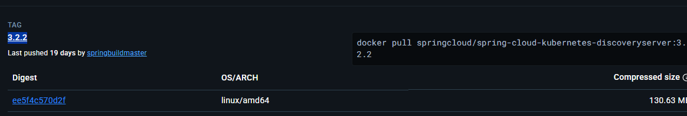

---

In the manifest, there’s a line:

```yaml
imagePullPolicy: IfNotPresent
```

This means: only pull the image if it’s not already available on the system.

We also have `readinessProbe` and `livenessProbe`, just like in Docker — here they serve the same purpose.

But there’s a potential issue when deploying the manifest:
By default, Kubernetes checks readiness and liveness every 10–20 seconds.
If the discovery server doesn’t start up within that short time frame, Kubernetes will restart it.
And if it keeps failing to become ready, it’ll keep restarting in a loop — effectively never starting.

To avoid this issue, we add additional settings:

```yaml
readinessProbe:
  httpGet:
    port: 8761
    path: /actuator/health/readiness
  initialDelaySeconds: 100
  periodSeconds: 30
```

This way, Kubernetes will wait **100 seconds** before performing the first readiness check, giving the server enough time to start.

Likewise, for the `livenessProbe`, we add:

```yaml
livenessProbe:
  httpGet:
    port: 8761
    path: /actuator/health/liveness
  initialDelaySeconds: 100
  periodSeconds: 30
```

This configuration should prevent restart loops during startup.

---


### The question arises: why aren't we using a Helm chart?

Because the **Discovery Server** is a **one-time setup** in Kubernetes.
So we only need to run it once.
Also, there is **no Helm chart** for this Discovery Server available in Bitnami.
So we deploy our own Discovery Server using:

```bash
kubectl apply -f kubernetes-discoveryserver.yml
```

We check the logs and see that our Discovery Server has started:
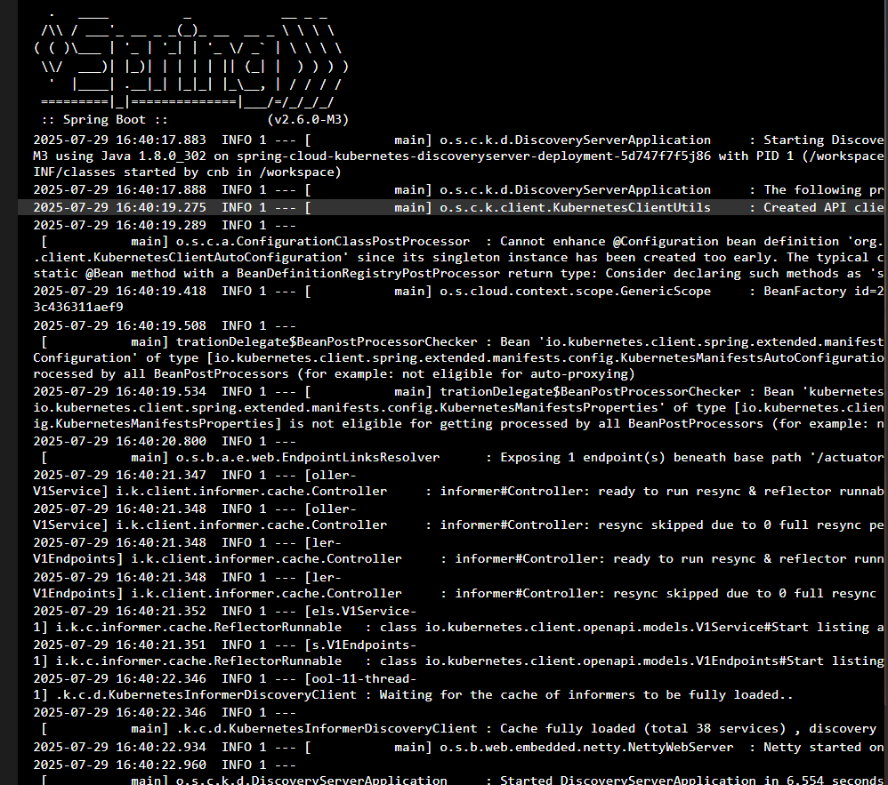

---

Now we need to **remove Eureka** from our code
and also make changes in our microservices.
So we take the code from **Section 14**, copy it, and continue working with it.

We can **remove `docker-compose` and the Eureka Server**:
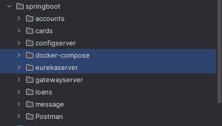

Let’s also **copy the Helm directory** from our project in **Section 16**.

---

Next, in the `accounts` service, we search for the Eureka client dependency and **remove**:

```xml
<dependency>
    <groupId>org.springframework.cloud</groupId>
    <artifactId>spring-cloud-starter-netflix-eureka-client</artifactId>
</dependency>
```

And **add**:

```xml
<dependency>
    <groupId>org.springframework.cloud</groupId>
    <artifactId>spring-cloud-starter-kubernetes-discoveryclient</artifactId>
</dependency>
```

Then, in our application main class, we need to add the annotation:

```java
@EnableDiscoveryClient
public class AccountsApplication {
    public static void main(String[] args) {
        SpringApplication.run(AccountsApplication.class, args);
    }
}
```

In `application.yml`, we also **remove Eureka** configuration and **add Kubernetes discovery config**:

```yaml
# Kubernetes discovery
kubernetes:
  discovery:
    all-namespaces: true
```

We deploy all our microservices in the **default namespace** in Kubernetes,
but this config allows discovery across **all namespaces**.

---

Next, we go to the place where we **communicate with other microservices**:
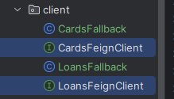

This line:

```java
@FeignClient(name = "cards", fallback = CardsFallback.class)
```

works best with Eureka Server, because it looks for an instance by name in Eureka.

However, this **won’t work with the Kubernetes Discovery Server**.
We need to **explicitly provide the URL and port**:

```java
@FeignClient(name = "cards", url = "http://cards:9000", fallback = CardsFallback.class)
```

Note: Feign Client will **not perform any load balancing** like it does with Eureka.
It will just forward the request to this URL, and Kubernetes will handle the load balancing.

Outside of the Kubernetes cluster, this won’t work — because there’s no hostname or DNS entry like `cards`.
So for **local testing**, try using your **localhost URL**.

Do the same for the `loans` service:

```java
@FeignClient(name = "loans", url = "http://loans:8090", fallback = LoansFallback.class)
```

---

In the `cards` service, we also **remove Eureka**.

Make these changes in **loans, cards, and accounts** (except for Feign client settings if not needed).

In the **gateway server**, update the `pom.xml` and add the appropriate annotations in the main class.
Also, we need to **update the routes** — specifically the URIs:

```java
.route("accounts-route", p -> p
    .path("/trelabank/accounts/**")
    .filters(f -> f.rewritePath("/trelabank/accounts/(?<segment>.*)", "/${segment}")
        .addResponseHeader("X-Response-Time", LocalDateTime.now().toString())
        .circuitBreaker(config -> config.setName("accounts-circuitbreaker")
            .setFallbackUri("forward:/contactSupport")))
    .uri("http://accounts:8080"))

.route("loans-route", p -> p
    .path("/trelabank/loans/**")
    .filters(f -> f.rewritePath("/trelabank/loans/(?<segment>.*)", "/${segment}")
        .addResponseHeader("X-Response-Time", LocalDateTime.now().toString())
        .retry(config -> config.setRetries(3)
            .setMethods(HttpMethod.GET)
            .setBackoff(Duration.ofMillis(100), Duration.ofMillis(1000), 2, true)))
    .uri("http://loans:8090"))

.route("cards-route", p -> p
    .path("/trelabank/cards/**")
    .filters(f -> f.rewritePath("/trelabank/cards/(?<segment>.*)", "/${segment}")
        .addResponseHeader("X-Response-Time", LocalDateTime.now().toString())
        .requestRateLimiter(config -> config.setRateLimiter(redisRateLimiter())
            .setKeyResolver(userKeyResolver())))
    .uri("http://cards:9000"))
.build();
```

These URIs:

```
.uri("http://accounts:8080"))
.uri("http://loans:8090"))
.uri("http://cards:9000"))
```

**Will only work inside the Kubernetes cluster!**

---

In the `gatewayserver`'s configuration, **remove**:

```yaml
discovery:
  locator:
    enabled: false
    lowerCaseServiceId: true
```

And **add**:

```yaml
kubernetes:
  discovery:
    enabled: true
    all-namespaces: true
    client:
      health-indicator:
        enabled: false
```

Setting `health-indicator.enabled: false` is required — otherwise, according to the instructor, it throws an error.

---

Now we can generate Docker images for all microservices.
Reminder: we're using **Jib**.

So we just run:

```bash
mvn compile jib:dockerBuild
```

Also, we already have a Kubernetes cluster running with all services like Keycloak, Grafana, etc.

The images are built:
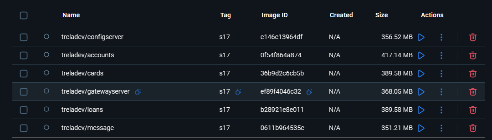

---

Now we use the command:

```bash
helm install <helm-name> <helm-path>
```

to install **Keycloak, Kafka, Loki, Prometheus, Tempo, and Grafana**:

```bash
helm install keycloak keycloak  
helm install kafka kafka  
helm install loki grafana-loki  
helm install prometheus kube-prometheus  
helm install tempo grafana-tempo  
helm install grafana grafana  
```

In our **Kubernetes UI** (as configured in **Section 15**), we can now see our pods:
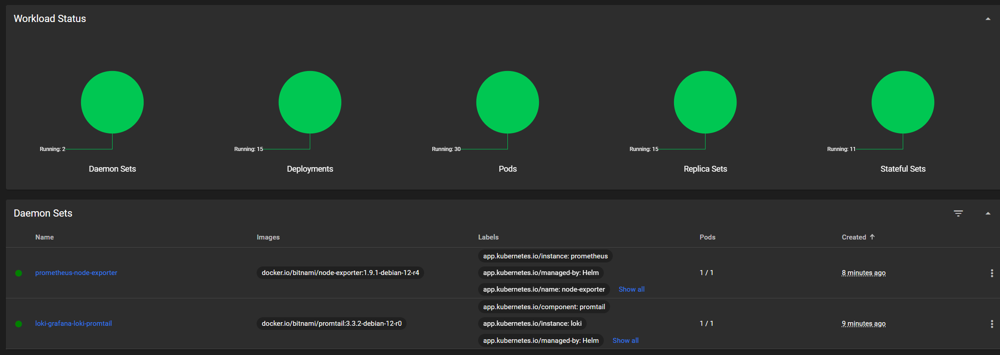

---

Now we need to **update the Helm charts for our `trelabank` microservices**.

First, we **remove the Eureka server** (screenshot below):
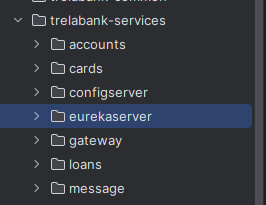

Then, in the `values.yaml` files of **all microservices**, we update the image tag from `s14` to `s17`:

```yaml
image:
  repository: treladev/accounts
  tag: s17
```

In the `accounts` service, we also increase the number of replicas:

```yaml
replicaCount: 2  # previously 1
```

We apply the tag update (`s17`) to **all microservices**:
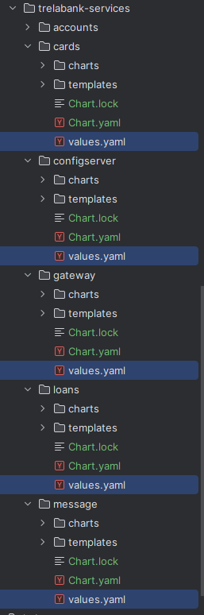

In the `Chart.yaml` files of environments `dev`, `prod`, and `qa`, we also **remove Eureka** from dependencies:
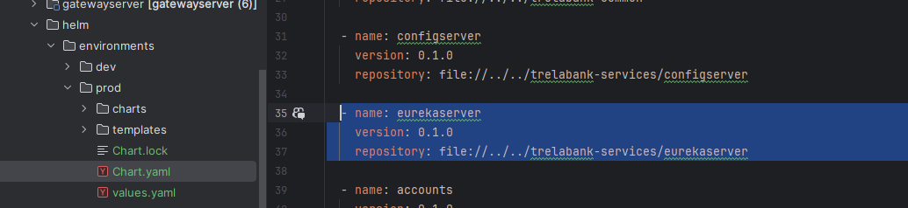

---

To apply these changes, we now **rebuild the Helm dependencies**.
We go into each environment folder and run:

```bash
helm dependencies build
```

Sometimes you may need to delete the `Chart.lock` file if it causes issues.

---

Next, let’s install our Helm chart for the **prod environment**:

```bash
helm install trelabank prod
```

In Kubernetes UI, we now see our microservices deployed:
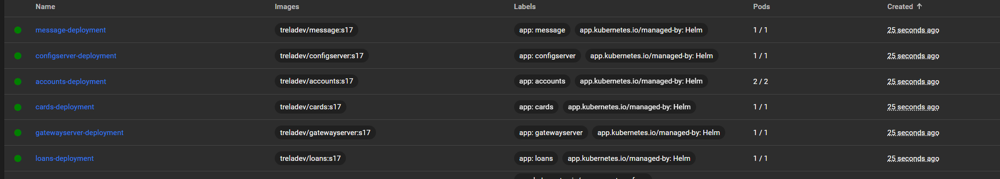

---

Now we access **Grafana**
(Instructions for accessing it are provided in **Section 16**).

---

We’re now seeing the following error in **every microservice**:

```
2025-07-30 06:58:55.075
org.springframework.beans.factory.UnsatisfiedDependencyException:
Error creating bean with name 'compositeDiscoveryClient':
... 'spring.cloud.kubernetes.discovery.discovery-server-url' must be specified and be a valid URL.
```

This means we **forgot to add** the property:

```yaml
spring.cloud.kubernetes.discovery.discovery-server-url
```

---

### 🛠️ Fixing the issue:

First, uninstall the `trelabank` release:

```bash
helm uninstall trelabank
```

Then, go to the **common config** and add a new config variable:

```yaml
SPRING.CLOUD.KUBERNETES.DISCOVERY.DISCOVERY-SERVER-URL: {{ .Values.global.discoveryServerURL }}
```

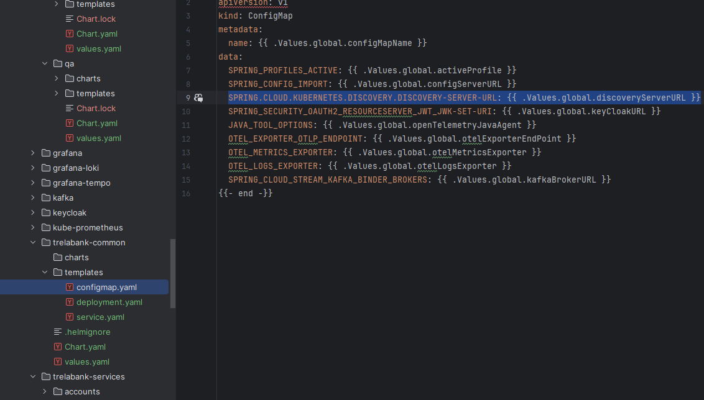

---

In `deployment.yaml`, we also need to **add an `if` condition** for this variable.

Find the old Eureka condition:

```yaml
{{- if .Values.eureka_enabled }}
- name: EUREKA_CLIENT_SERVICEURL_DEFAULTZONE
  valueFrom:
    configMapKeyRef:
      name: {{ .Values.global.configMapName }}
      key: EUREKA_CLIENT_SERVICEURL_DEFAULTZONE
{{- end }}
```

And **replace it with**:

```yaml
{{- if .Values.discovery_enabled }}
- name: SPRING.CLOUD.KUBERNETES.DISCOVERY.DISCOVERY-SERVER-URL
  valueFrom:
    configMapKeyRef:
      name: {{ .Values.global.configMapName }}
      key: SPRING.CLOUD.KUBERNETES.DISCOVERY.DISCOVERY-SERVER-URL
{{- end }}
```

---

In each microservice’s `values.yaml`, we also update the flag:

```yaml
discovery_enabled: true
```

(previously it was `eureka_enabled: true`)

---

Now go to the appropriate environment (e.g., `prod`) and update the actual URL:

```yaml
discoveryServerURL: "http://spring-cloud-kubernetes-discoveryserver:80/"
```

Where did that name come from?

From the `kubernetes-discoveryserver.yml`, specifically from:

```yaml
metadata:
  labels:
    name: spring-cloud-kubernetes-discoveryserver
```

---

Once that’s done, rebuild the Helm dependencies again for each environment:

```bash
helm dependencies build
```

To verify everything is correct, go to the `prod` folder and run:

```bash
helm template .
```

Make sure manifests are generated.

Now you can install the services again:

```bash
helm install trelabank prod
```

---

### ✅ Testing the setup

Try calling the endpoint:

**POST:**

```http
http://localhost:8072/trelabank/accounts/api/create
```

**Body:**

```json
{
  "name": "Marcin Trela",
  "email": "marcin.trela.dev@gmail.com",
  "mobileNumber": "4354437687"
}
```

Result: ✅ It works!

---

Now try using the **fetch API**:

**GET:**

```http
http://localhost:8072/trelabank/accounts/api/fetchCustomerDetails?mobileNumber=4354437687
```

**Response:**

```json
{
  "name": "Marcin Trela",
  "email": "marcin.trela.dev@gmail.com",
  "mobileNumber": "4354437687",
  "accountsDto": {
    "accountNumber": 1771454676,
    "accountType": "Savings",
    "branchAddress": "123 Main Street, New York"
  },
  "loansDto": null,
  "cardsDto": null
}
```

---

Since we previously configured **2 replicas** for the `accounts` service,
that means if we call the API again, eventually we may get a response saying the customer was not found —
**because each replica has its own H2 in-memory DB**.

When that happens, we’ll get a `404 Not Found` – proving **load balancing is working**.

If you **keep getting the account**, Kubernetes may be using **sticky sessions**.

This means that requests from the **same client (same IP)** are routed to the **same pod**.
To bypass that, try using **Incognito mode** in your browser or wait a bit between requests.

Eventually, you should see:

```json
{
  "apiPath": "uri=/api/fetchCustomerDetails",
  "errorCode": "BAD_REQUEST",
  "errorMessage": "Customer not found with the given input data moibleNumber: '4354437687'",
  "errorTime": "2025-07-30T10:49:00.992882115"
}
```

(Note: The code should ideally be `404`, but it still proves the system works.)

---
Keep in mind that with this approach, we don’t have control over load balancing — but we do relieve developers from the responsibility of creating and managing a discovery server.


