---

# Section 18: Deploying microservices into cloud Kubernetes cluster

---

So far, we have deployed our microservices to a local Kubernetes cluster.
In this section, we will learn how to deploy them to a Kubernetes cluster in one of the cloud providers.
Kubernetes is flexible and can be deployed on any cloud provider.

Creating and managing a Kubernetes cluster can be challenging on-premises,
which is why many organizations choose the cloud.

Below are some popular cloud providers and their Kubernetes services with their different names:

* GCP - GKE (Google Kubernetes Engine)
* AWS - EKS (Elastic Kubernetes Service)
* Azure - AKS (Azure Kubernetes Service)

In this course, we will deploy on GKE
because when we create a new account in GKE, we get \$300 of free credits to use.

[https://cloud.google.com/kubernetes-engine?hl=pl](https://cloud.google.com/kubernetes-engine?hl=pl)

and we receive \$300 of free credit.

Now, let's install the Google Cloud SDK on our local system.

If we install the Cloud SDK on our machine,
we can connect to the Kubernetes cluster inside Google Cloud
and from our local system use commands or install Helm charts, etc.

[https://cloud.google.com/sdk/docs/install](https://cloud.google.com/sdk/docs/install)
Let's install the Google Cloud CLI.

Then we check if we have gcloud CLI installed:

```
gcloud --version
Google Cloud SDK 532.0.0
bq 2.1.21
core 2025.07.25
gcloud-crc32c 1.0.0
gsutil 5.35
```

We log in and select the project.

---

Yes, exactly — that project name (eco-limiter-467511-q0) looks like it was automatically generated by Google Cloud, especially if:

* you did not create that project yourself knowingly,
* you just created your account or initialized the SDK (gcloud init),
* you are using some wizard (e.g., Firebase, Vertex AI, Cloud Run, etc.).

Google often creates a project with a random name when:

* you log into GCP for the first time and don't have any projects,
* a tool or service needs a project to operate and you didn't specify one,
* you use a sandbox tool that temporarily creates a project.

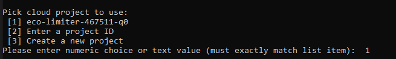

We click on "Create a Kubernetes cluster".

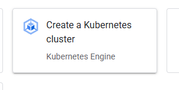
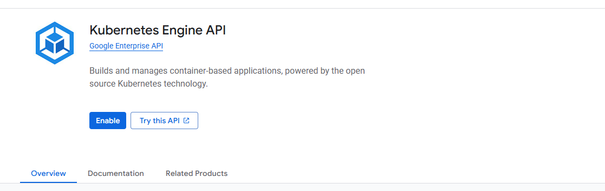
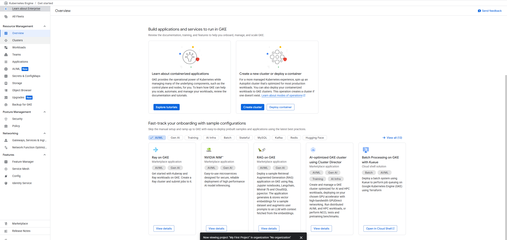

In the **Clusters** tab, we can create a new cluster.
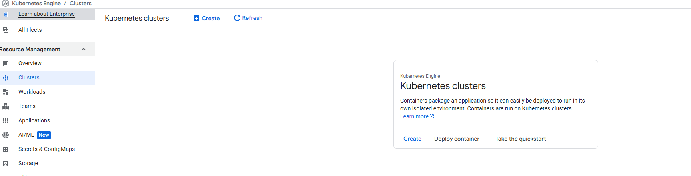

It shows us the option to create an Autopilot cluster:
Welcome to the new cluster creator
Learn how to create a cluster configuration that's ready for production workloads.

With Autopilot, GKE provisions and manages your cluster's underlying infrastructure, including nodes and node pools, giving you an optimized cluster with a hands-off experience. If you need more control over your cluster configuration, select "Switch to Standard cluster."

Depending on our workload, Autopilot will manage our cluster, but if we use it,
we won't be able to explore much about the Kubernetes cluster because the heavy lifting is done by Google Cloud.
This is the easiest way organizations can create a Kubernetes cluster.

But because we want to learn about the Kubernetes cluster, let's choose the **Standard cluster**.
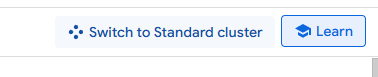

It immediately shows us the price:
Estimated monthly cost preview
\$244.84
That's about \$0.34 per hour

Our cluster is being created:
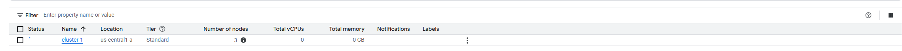

(I had to change the option to zonal to make it work)

---

### ✅ After the GKE cluster is created, we see the status marked in green

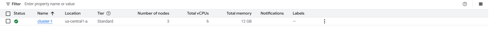

We can click on it to view the nodes:
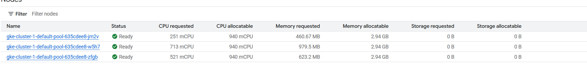

We also notice that Google has already installed some system pods behind the scenes to manage Kubernetes.
Thanks to those, we can see information about CPU, memory, disk usage, etc.
One of them is `gke-metrics`, which Google installs automatically — it allows us to monitor resource statistics:
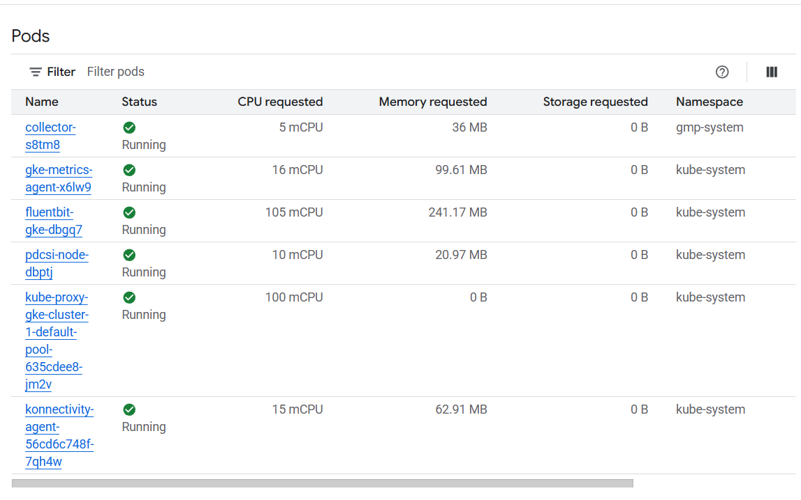

---

### 🔗 Now we need to connect to our cluster

To do that, we click **Connect**:
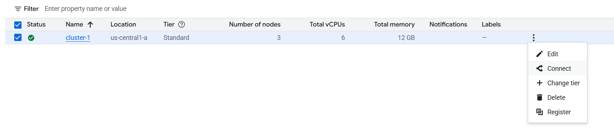

We receive a command to configure access to the cluster:

```bash
gcloud container clusters get-credentials cluster-1 --zone us-central1-a --project eco-limiter-467511-q0
```

The output:

```
Fetching cluster endpoint and auth data.
kubeconfig entry generated for cluster-1.
```

---

### 📦 Now we can check if the cluster is accessible with:

```bash
kubectl get nodes
```

Example output:

```
NAME                                       STATUS   ROLES    AGE   VERSION
gke-cluster-1-default-pool-635cdee8-jm2v   Ready    <none>   11m   v1.33.2-gke.1111000
gke-cluster-1-default-pool-635cdee8-w5h7   Ready    <none>   11m   v1.33.2-gke.1111000
gke-cluster-1-default-pool-635cdee8-zfgb   Ready    <none>   11m   v1.33.2-gke.1111000
```

---

### ❓ You might ask:

Earlier, we were connected to our **local Kubernetes cluster**, and now suddenly we are running commands in **Google Cloud’s cluster**.
How is that possible — we didn’t even delete our local cluster?

Let’s check current contexts:

```bash
kubectl config get-contexts
```

Example output:

```
CURRENT   NAME                                                CLUSTER                                             AUTHINFO                                            NAMESPACE
docker-desktop                                      docker-desktop                                      docker-desktop
*         gke_eco-limiter-467511-q0_us-central1-a_cluster-1   gke_eco-limiter-467511-q0_us-central1-a_cluster-1   gke_eco-limiter-467511-q0_us-central1-a_cluster-1
          kind-microservices                                  kind-microservices                                  kind-microservices
```

As you can see, we are currently using the **GKE cluster context** — that’s it!
You can always switch between contexts using:

```bash
kubectl config use-context <context-name>
```

---

### 🚀 Next Step: Apply Kubernetes Manifests and Helm Charts to GKE

Now we move on to **Section 17**, where we start applying resources to our cluster.

First, we apply the `kubernetes-discoveryserver.yml` manifest:
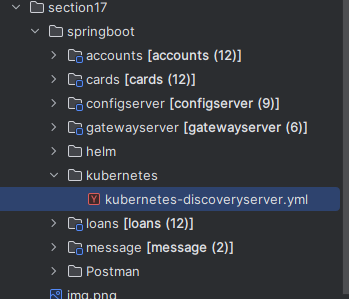

```bash
kubectl apply -f kubernetes-discoveryserver.yml
```

Response:

```
service/spring-cloud-kubernetes-discoveryserver created
serviceaccount/spring-cloud-kubernetes-discoveryserver created
rolebinding.rbac.authorization.k8s.io/spring-cloud-kubernetes-discoveryserver:view created
role.rbac.authorization.k8s.io/namespace-reader created
deployment.apps/spring-cloud-kubernetes-discoveryserver-deployment created
```

---

### 📦 Check Helm installations

```bash
helm ls
```

Output:

```
NAME    NAMESPACE       REVISION        UPDATED STATUS  CHART   APP VERSION
```

As we can see — no Helm charts installed yet in our Google Cloud cluster.

---

### 🛠️ Let’s install some components with Helm

```bash
helm install keycloak keycloak
helm install kafka kafka
helm install loki grafana-loki
helm install prometheus kube-prometheus
helm install tempo grafana-tempo
helm install grafana grafana
```

Finally, deploy the main app:

```bash
helm install trelabank prod
```

Now the full application is running in the GKE cluster 🎉

---

### 🔁 Note:

I had to recreate the cluster because earlier I didn’t allocate enough CPU and memory.
The cluster couldn't start due to insufficient resources.

Eventually, the best setup was using **5 nodes** with appropriate CPU.

---

### ✅ And now we can see all the pods!

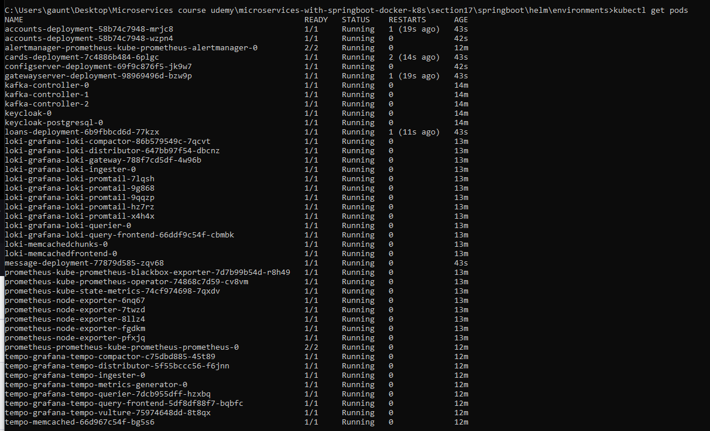

---

So, we can see all our pods in GKE.

But to make sure everything works as expected,
we need to confirm whether the **Gateway Server deployment** was successfully deployed or not.

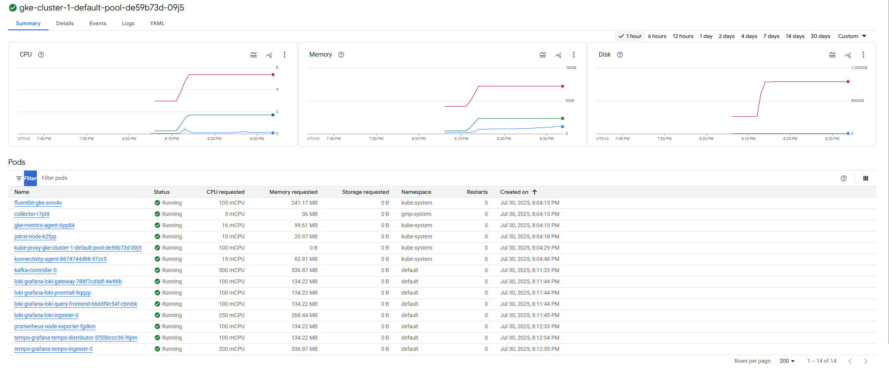

Now, we can either manually click through each node and look for the **gateway container**,
or we can use a few commands in the terminal:

```bash
kubectl get pods
```

This gives us a list of all pods, and we locate our **gateway server**:
`gatewayserver-deployment-98969496d-bzw9p`

Then we type:

```bash
kubectl describe pod gatewayserver-deployment-98969496d-bzw9p
```

This will show us the details of our **gateway server pod**, including the node it’s running on:

```
Node: gke-cluster-1-default-pool-de59b73d-4pss/10.128.0.23
```

So we look for that node in GKE:
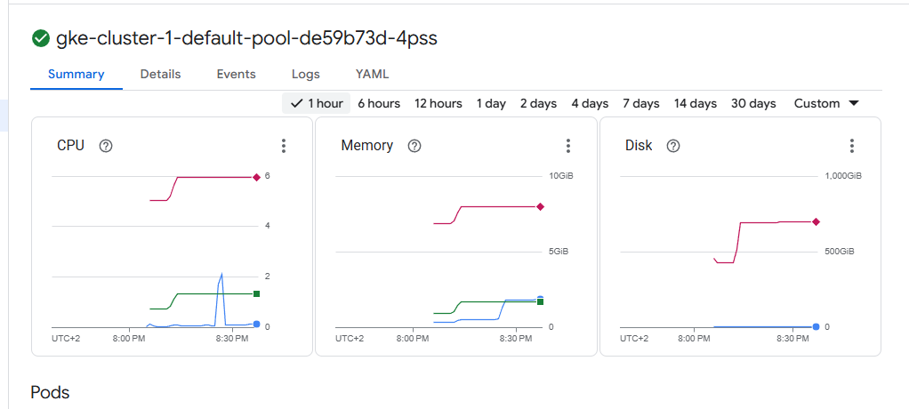

Click on the **gatewayserver container**:
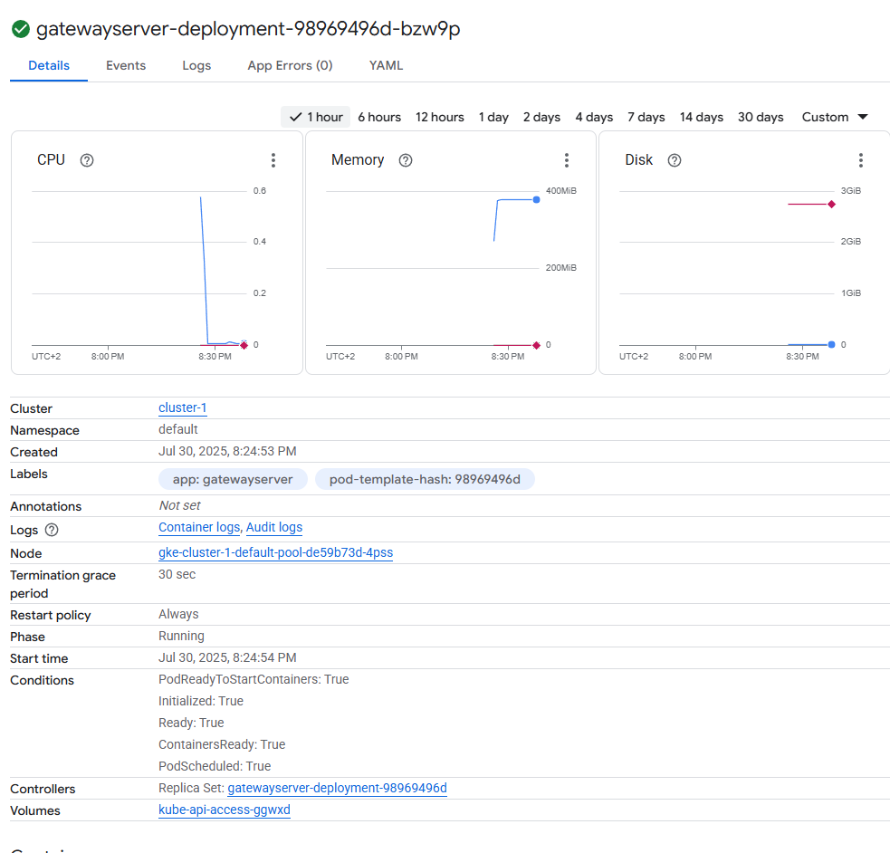

Then go to the **Events tab**, where we see that the image `s17` was pulled from our DockerHub:
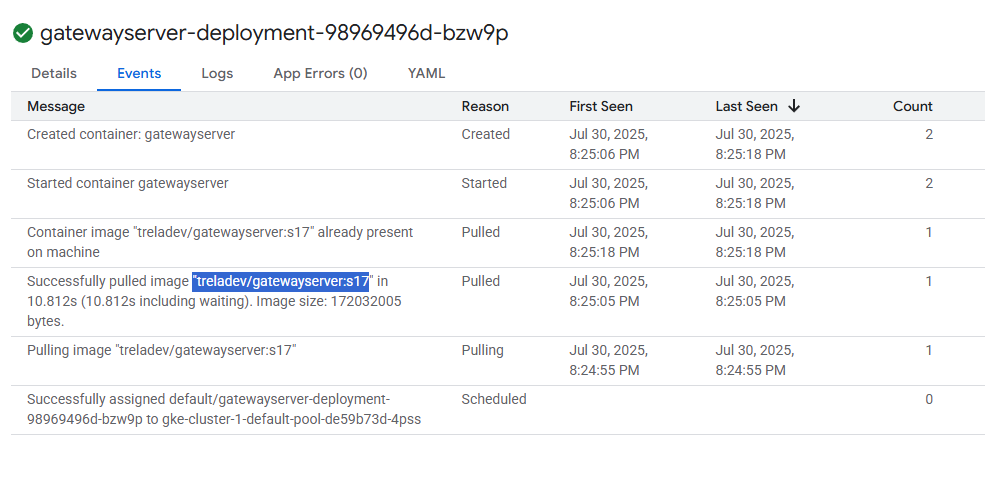

We can also check the **logs**:
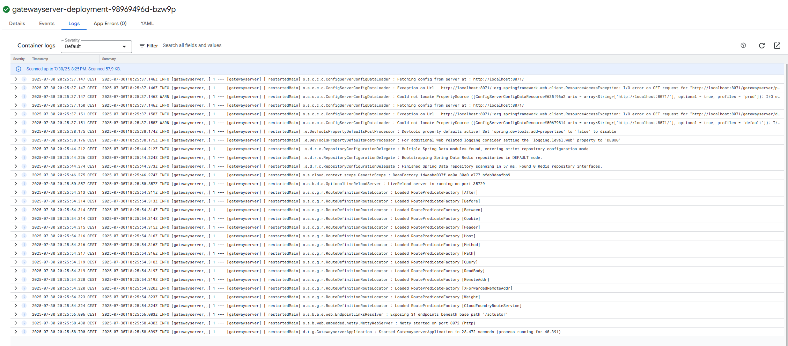

Then, we go to the **Services and Ingress** section, where we can see all our services:
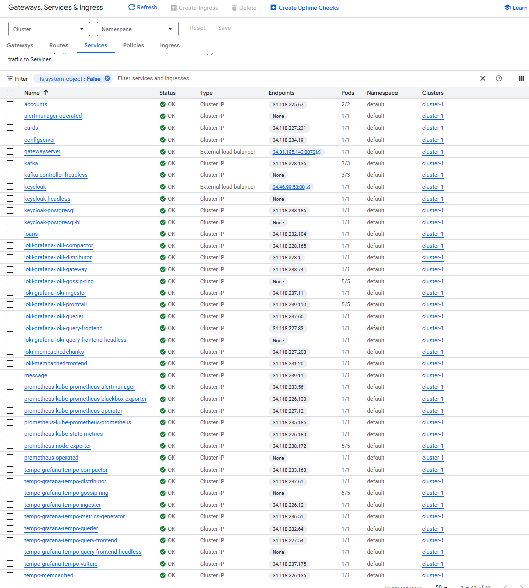

The **Gateway Server** receives a **public IP**:
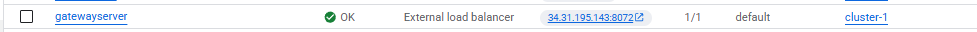

This public IP can be mapped to a domain name or DNS record.

---

Now let’s try accessing **Keycloak**.

We go to the address provided by GKE:
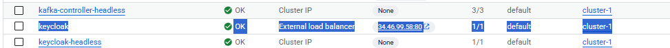

We open the link, create a client, and assign roles:
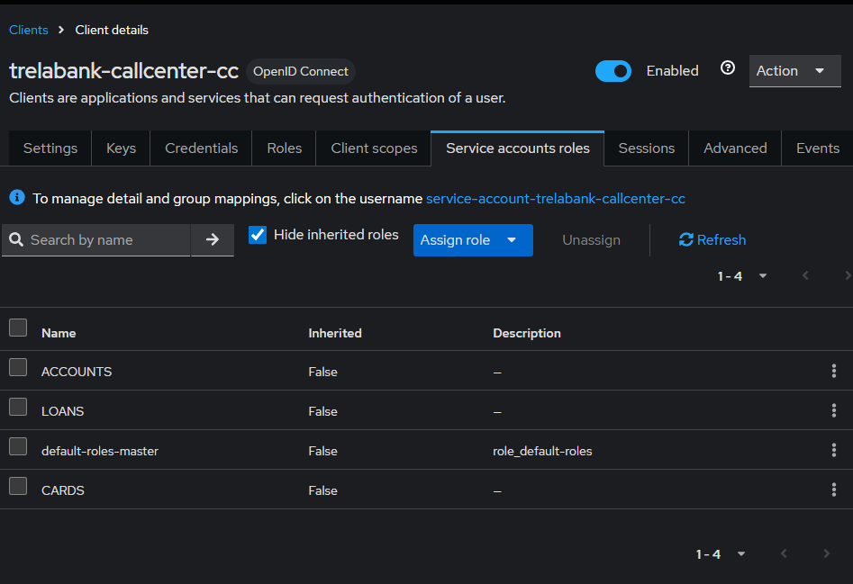

---

### Now let’s test it in **Postman**

#### Account creation:

**POST**
`http://34.31.195.143:8072/trelabank/accounts/api/create`

```json
{
  "name": "Marcin Trela!",
  "email": "marcin.trela.dev@gmail.com",
  "mobileNumber": "4354437687"
}
```

**Response:**

```json
{
  "statusCode": "201",
  "statusMsg": "Account created successfully"
}
```

It works!

---

#### Now for Cards:

**POST**
`http://34.31.195.143:8072/trelabank/cards/api/create?mobileNumber=4354437687`

```json
{
  "name": "Marcin Trela",
  "email": "marcin.trela.dev@gmail.com",
  "mobileNumber": "4354437687"
}
```

---

#### And Loans:

**POST**
`http://34.31.195.143:8072/trelabank/loans/api/create?mobileNumber=4354437687`

```json
{
  "name": "Marcin Trela",
  "email": "marcin.trela.dev@gmail.com",
  "mobileNumber": "4354437687"
}
```

---

### Now a GET request:

**GET**
`http://34.31.195.143:8072/trelabank/accounts/api/fetchCustomerDetails?mobileNumber=4354437683`

**Response:**

```json
{
  "name": "Marcin Trela!",
  "email": "marcin.trela.dev@gmail.com",
  "mobileNumber": "4354437687",
  "accountsDto": {
    "accountNumber": 1660041060,
    "accountType": "Savings",
    "branchAddress": "123 Main Street, New York"
  },
  "loansDto": {
    "mobileNumber": "4354437687",
    "loanNumber": "100187715553",
    "loanType": "Home Loan",
    "totalLoan": 100000,
    "amountPaid": 0,
    "outstandingAmount": 100000
  },
  "cardsDto": {
    "mobileNumber": "4354437687",
    "cardNumber": "100889230192",
    "cardType": "Credit Card",
    "totalLimit": 100000,
    "amountUsed": 0,
    "availableAmount": 100000
  }
}
```

It works!

---

### Let’s now check the **Grafana components**

As we know, our **Grafana service** has a `ClusterIP`.

So we have two options:

1. Update the Helm chart to use a LoadBalancer
2. Or, use **port forwarding** from our local system.

---

### Helm output instructions:

> **Please be patient while the chart is being deployed**
>
> 1. Get the application URL by running:
     >
     >    ```bash
>    echo "Browse to http://127.0.0.1:3000"
>    kubectl port-forward svc/grafana 3000:3000 &
>    ```
>
> 2. Get the admin credentials:
     >
     >    ```bash
>    echo "User: admin"
>    echo "Password: $(kubectl get secret grafana-admin --namespace default -o jsonpath="{.data.GF_SECURITY_ADMIN_PASSWORD}" | base64 -d)"
>    ```

Note: Don’t include `grafana.validateValues.database` — see [issue](https://github.com/bitnami/charts/issues/20629)

---

We forward port **3000**:
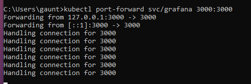

Then we get the password:
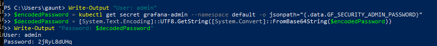

We log into **Grafana**, and we can see **Loki, Tempo, and Prometheus** — everything works:
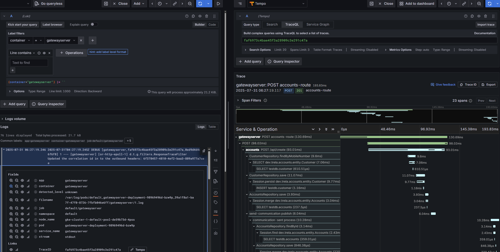

---
