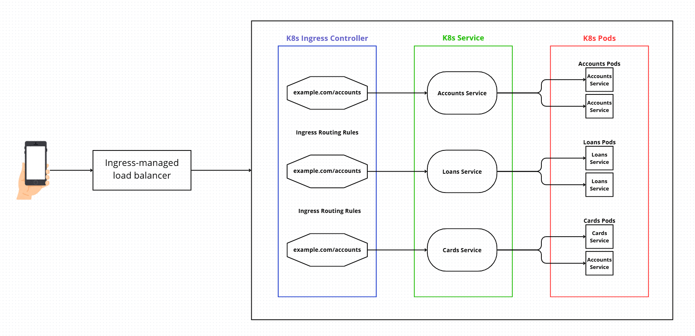
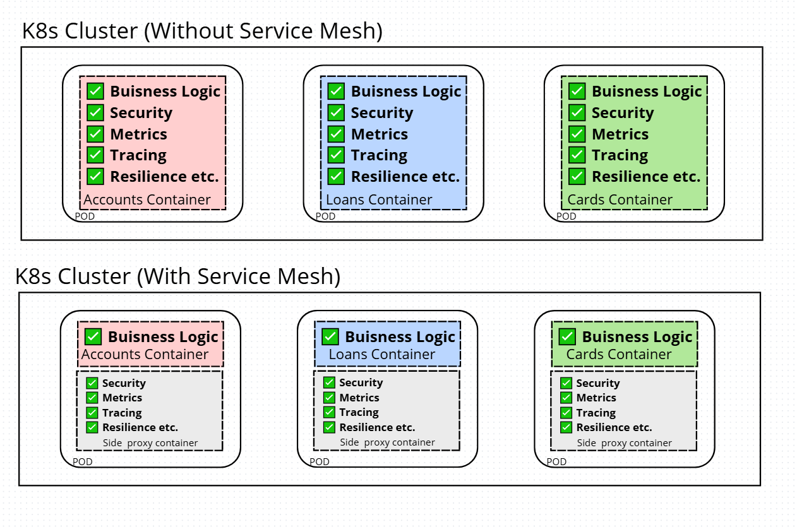
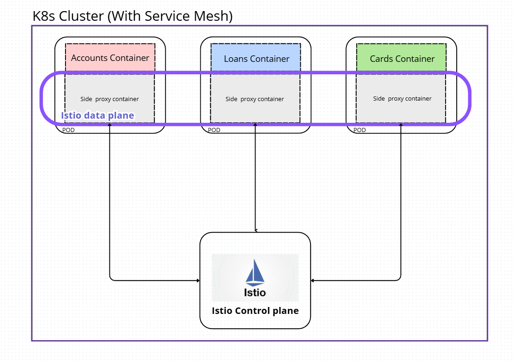
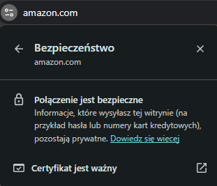
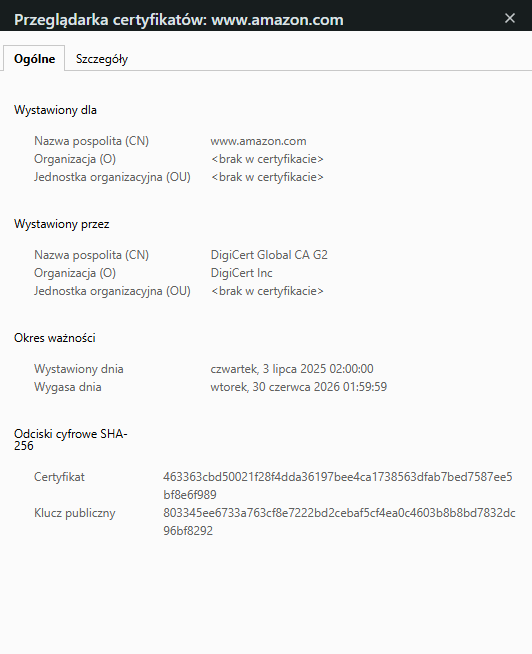
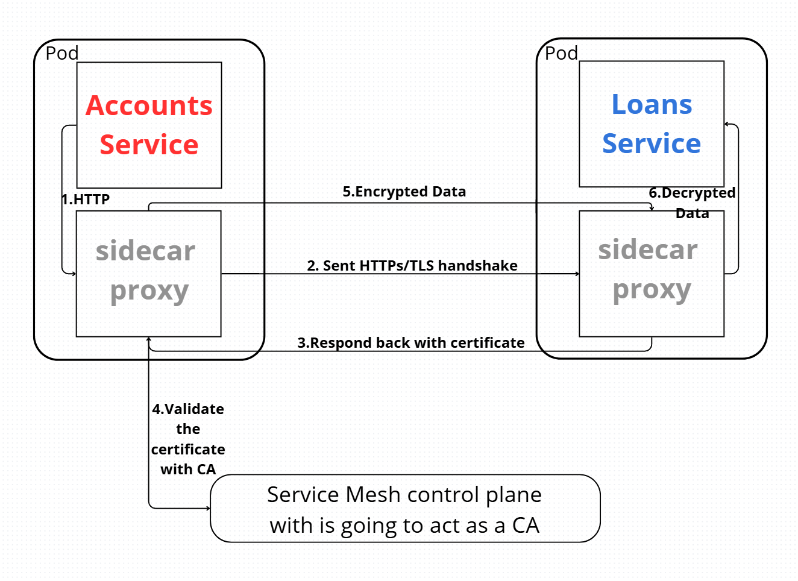

---

# Section 19: Introduction to kubernetes Ingress, ServiceMesh (Istio) & mTLS

---

## Advanced DevOps Concepts

In this section, we'll discuss advanced DevOps topics.
Many of these topics are commonly used in real-world projects.

As a developer, I don’t need to know them in extreme detail, but having a solid understanding certainly doesn’t hurt.

So, let’s focus on **Kubernetes Ingress**.

---

### Kubernetes Service Documentation

We can start by visiting the official Kubernetes service documentation:

🔗 [https://kubernetes.io/docs/concepts/services-networking/service/](https://kubernetes.io/docs/concepts/services-networking/service/)

We’ve already used this before, so we know how to define and use Kubernetes Services.

If we scroll down, we’ll see the different **service types**:

* `ClusterIP`
* `NodePort`
* `LoadBalancer`

But there's another one we haven’t discussed yet: **`ExternalName`**

---

### `ExternalName` Services

Services of type `ExternalName` map a Kubernetes Service to a DNS name instead of using selectors like `my-service` or `cassandra`. You define it using the `spec.externalName` field.

Here’s an example that maps the `my-service` in the `prod` namespace to `my.database.example.com`:

```yaml
apiVersion: v1
kind: Service
metadata:
  name: my-service
  namespace: prod
spec:
  type: ExternalName
  externalName: my.database.example.com
```

Normally, when you create a Service in Kubernetes (like `ClusterIP`, `NodePort`, or `LoadBalancer`), it connects to **Pods** running inside the cluster — like an app or database.

But `ExternalName` doesn't connect to any Pods or Deployments.
Instead, it works like a **DNS alias** that redirects the service name to an **external DNS address**.

---

### Real Use Case

All of your applications might need to connect to a database that isn’t running in Kubernetes. For example, the database could be on:

* **AWS RDS**
* **Azure SQL**
* **Google Cloud SQL**
* Or simply a server outside the cluster

Let’s say the external database has this DNS address:
`my.database.example.com`

#### 😵 Typical (but inconvenient) approach

Each app needs to include this DNS in its environment variables or config:

```yaml
env:
  - name: DB_HOST
    value: "my.database.example.com"
```

This works, but it has downsides:

* You repeat the same DNS address in every app
* If the DNS ever changes → you need to update all apps
* You can’t monitor or control this connection from within Kubernetes
* Apps don’t see the DB as a native Kubernetes Service

---

### ✅ Solution: `ExternalName` Service

Instead of repeating `my.database.example.com` in 5 different apps, you define it once — as a Kubernetes Service:

```yaml
apiVersion: v1
kind: Service
metadata:
  name: my-database
spec:
  type: ExternalName
  externalName: my.database.example.com
```

#### 🔁 But wait — we still need the actual address, right?

**YES, exactly! 💡**
You still need the real DNS address — but only **in one place**, not across all your apps.

---

## Now, Let’s Explore Ingress

🔗 [https://kubernetes.io/docs/concepts/services-networking/ingress/](https://kubernetes.io/docs/concepts/services-networking/ingress/)

Using **Ingress**, we can **expose all our microservices** to the outside world via a single entry point.

But here’s a key question:
**How is Ingress different from a LoadBalancer?**
Ingress is listed as a separate resource — it’s not just another Service type.

---

### Key Difference: LoadBalancer vs Ingress

If you use a `LoadBalancer` service, you **expose a single microservice** to the external world.

So, if you create 5 LoadBalancer services for 5 microservices:
→ You’ll have 5 separate **public IP addresses**,
→ Each with its own load balancer provided by your cloud provider.

But sometimes, we want **just one entry point** into the cluster.
This one entry point will **forward traffic to the correct service/container** based on path or host.

We’ve already built such a gateway using **Spring Cloud Gateway**, which acts as a single entry point — and uses a LoadBalancer under the hood.

However, this requires **a lot of development effort and configuration**, and the developer is responsible for all **cross-cutting concerns** (routing, security, etc).

That’s why some organizations **prefer using Kubernetes Ingress**, rather than building a custom gateway.

---

### What is Ingress?

Ingress exposes **HTTP and HTTPS paths** from outside the cluster to internal services.
Traffic routing is controlled by **Ingress rules** defined in the `Ingress` resource.

Ingress can be configured to:

* Provide **externally reachable URLs**
* Handle **load balancing**
* Support **SSL/TLS**
* Offer **name-based virtual hosting**

---

### So why build a Spring Cloud Gateway if Ingress does the same thing?

Because **different teams have different strengths**.

* One organization might have amazing Java developers who can build a powerful edge server using Spring Cloud Gateway.
* Another team might have excellent DevOps engineers who know everything about Kubernetes and can set up Ingress with advanced features (like Keycloak integration).

So, we pick the **best approach based on our team**.

Another reason:
**Ingress doesn’t solve every problem**.
Sometimes, a developer needs to implement **business logic** at the edge — which Ingress **can’t do**.
In that case, **Spring Cloud Gateway** (written in Java) is a better fit.

---

## Now, Let’s Dive Deeper into Ingress

How does a DevOps team implement custom routing logic with Ingress?

1. You define a Kubernetes resource of type:

```yaml
kind: Ingress
```

2. But just defining the resource is not enough.
   You also need an **Ingress Controller**, such as:

* **NGINX**
* **Traefik**
* **HAProxy**

The controller’s job is to **watch Ingress resources** and configure the underlying system accordingly.

🔗 List of Ingress Controllers:
[https://kubernetes.io/docs/concepts/services-networking/ingress-controllers/](https://kubernetes.io/docs/concepts/services-networking/ingress-controllers/)

NGINX is popular because it’s open source.

---

### Here’s how Kubernetes Ingress works (diagram):



Just like Spring Cloud Gateway, **Ingress also defines routes**,
and forwards them to Kubernetes **Services**.

---

## Why use Ingress?

1. Acts as a **single entry point** to the cluster (like Spring Cloud Gateway)
2. **TLS/SSL Termination** (HTTPS)
   → Encrypts traffic between client and server
   → Not usually done between microservices (to reduce performance overhead)
3. **Path-based Routing**
   🔹 Example:

  * `example.com/api` → routes to API server
  * `example.com/shop` → routes to shop app
  * `example.com/blog` → routes to blog
4. **Host-based Routing**
   🔹 Example:

  * `api.example.com` → routes to API
  * `shop.example.com` → routes to shop
  * `blog.example.com` → routes to blog
5. **Load balancing**
6. **Annotations** (e.g., for roles, auth, rate limiting, etc.)

---

### Ingress Controller vs LoadBalancer

Ingress Controllers are often compared to LoadBalancer Services.

But:

* **LoadBalancer** is simple and good for basic use cases.
* **Ingress Controller** supports **advanced scenarios**.

---

### Traffic Types Handled by Ingress

* **Ingress traffic** → Incoming traffic from outside the cluster
* **Egress traffic** → Outgoing traffic leaving the cluster
* **North-South traffic** → Both ingress and egress (in/out of the cluster)

---

## In the previous lesson

We learned that **Ingress** can handle both **ingress** and **egress traffic**.
But traffic **inside the application** is referred to as:

> **East-West traffic**

A **Service Mesh** is particularly good at handling **East-West traffic**.

---

## What is a Service Mesh?

A **Service Mesh** is a **dedicated infrastructure layer** for managing communication between microservices in a **containerized application**.

It includes a set of **networking capabilities** that help establish **secure**, **reliable**, and **observable** communication between services in a **distributed system**.

---

Earlier, we discussed how to **secure our microservices**:

1. They are **not exposed** to the outside world
   → Access is possible **only** from within the internal network or other apps
   → (This is the **first layer of protection**)

2. The **second layer of protection** can be provided by the **Service Mesh**

---

### What features does a service mesh provide?

A service mesh can offer many useful features:

* **Service Discovery**
  → Services can find each other without hardcoded addresses

* **Load Balancing**
  → Ensures traffic is distributed evenly across service instances

* **Circuit Breaking**
  → Prevents services from being overwhelmed by high traffic

* **Fault Tolerance**
  → Ensures services stay functional even if dependencies fail

* **Metrics and Tracing**
  → Gives visibility into traffic within the system

* **Security**
  → Can secure internal service-to-service communication using **Mutual TLS (mTLS)**

---

As you can see, we’ve already implemented **many of these features** in our own application, such as:

* **Metrics and tracing** using **Grafana**
* **Fault tolerance** using **Resilience4j**
* **Service discovery** using **Eureka**

A **service mesh** provides similar features — but in a **centralized and standardized way**.

So, if service mesh handles all these concerns for us…

---

## Why did we learn all of these concepts earlier?

The answer is similar to what we said before:

Not every organization has experienced **DevOps engineers**,
just like not every organization has experienced **Java developers**.

Setting up a **Service Mesh** requires **technical expertise**, especially from DevOps,
and often also **a significant budget**.

So if a company **has the money and resources**, it can definitely go for a service mesh.

But if not, then all these concerns like:

* **Service discovery**
* **Load balancing**
* **Security**
* **Fault tolerance**

…can still be **implemented by developers** directly in code.

---

So, in some teams, someone might say:

> “Don’t worry about non-business logic — we’ll use a mesh.”

And that’s totally fine.

But in many cases, **you will** have to implement that **non-business logic** as well.

---

## The Classic Microservice Approach

In the traditional microservice approach, each microservice needs to implement:

* Business logic
* Security
* Metrics
* Tracing
* Resilience
* etc.

This leads to a major drawback:

> Each microservice ends up with a lot of code and config related to non-business concerns.

So in the future, if you want to **change security, tracing, resiliency, or metrics**,
you may need to **update every microservice**.

Managing this becomes complex.

And as mentioned earlier, developers have to handle these repetitive changes
**across all services**, which takes their focus away from the **core business logic**.

---

### So who are we?

We’re human beings.
We’re **intelligent people**.

Our job is to **understand client needs** and implement them through **business logic**.

But when we’re forced to handle non-functional requirements,
our focus gets split — and we spend energy on something **outside** our main role.

---

## Below is a diagram showing the architecture **with and without service mesh**:



With a service mesh, every Pod gets **an extra container**, which acts as a **sidecar proxy container**.

This **proxy container** is generated and injected by the **service mesh**, and runs alongside the main app container.

It’s known as a **sidecar proxy container**.

---

## What is a Sidecar Container?

The term **sidecar** comes from motorcycles:
A small passenger pod riding alongside the main vehicle.


Likewise, in Kubernetes:

* The **microservice** and the **sidecar proxy** run together in the same Pod
* The **sidecar is independent** of the main app
* So no matter what language the app is written in, the **sidecar container always works**


---

## Understanding Key Components of a Service Mesh

### 🧭 Data Plane

The **data plane** is responsible for **routing traffic between services**.
It’s usually implemented using lightweight **proxies**, such as **Envoy** or **Linkerd Proxy**, commonly referred to as **sidecars**.

Each microservice is paired with a sidecar proxy, which handles **inbound and outbound traffic** by intercepting requests and responses.
This allows the proxy to manage traffic **to and from the service** without requiring changes to the application code.

---

### 🎛️ Control Plane

The **control plane** is responsible for **monitoring and management**.
It includes components like:

* Control Plane APIs
* Service Discovery
* Configuration Management

The control plane also handles the **injection and management** of sidecar containers into the data plane.

---

### 🧰 Popular Service Mesh Solutions

Here are some widely-used service mesh platforms:

* **Istio**
* **Linkerd**
* **Consul**
* **Kong Mesh**
* **AWS App Mesh**
* **Azure Service Mesh**

---

As shown in the diagram below:
Whenever we deploy our **main containers**, the **service mesh control plane** automatically injects **sidecar proxies** into each part of the application.



All of these proxies are managed by the control plane and together form what’s known as the **Istio data plane** (or equivalent in other meshes).

---

### 💡 Why is it called the "Data Plane"?

Because it’s responsible for **handling all the traffic** flowing between services.
For example, if a request comes in for the **`accounts` service**, the traffic will **never go directly** to the `accounts` container.

Instead, it always goes **through the proxy**, which enforces rules, policies, security, and routing logic.

---

If you’re interested in more details, check out:
🔗 [https://istio.io/](https://istio.io/)

---

### 🔐 How Does a Service Mesh Handle Security?

---

## 🔐 What is mTLS?

**mTLS** stands for **Mutual TLS**.
It’s a variant of **TLS** — so first, let’s understand what **TLS** is.

---

### What is TLS?

**TLS** stands for **Transport Layer Security**.
It **replaces SSL (Secure Sockets Layer)**, which is now deprecated.
TLS is the encryption protocol used in **HTTPS** communication.

Let’s say a **browser** (client) wants to communicate with a **backend server**.
To make that communication secure — especially if you're sending something sensitive like **credit card information** — both the client and server use the **HTTPS protocol**, which is powered by **TLS**.

Without TLS, someone could intercept and **spy on the communication** (e.g., via a man-in-the-middle attack).
So TLS protects the **data in transit** and ensures that the server presents a **valid certificate** to prove its identity.

---

### Why regular TLS isn’t enough in microservices

TLS works well in browser–server scenarios.
But in a **microservices environment** — like Kubernetes — we don’t have browsers.
All communication happens **service-to-service** via APIs.

In these scenarios, it’s not enough for just **one side (the server)** to prove its identity.

➡️ Instead, **both microservices** need to **authenticate each other**.

This is where **mTLS** (Mutual TLS) comes in.

---

### What is mTLS?

With **Mutual TLS**, **both the client and server** present certificates to each other.
Both sides must **verify and trust** each other’s identity before communication is allowed.

mTLS is most commonly used in what's called a **Zero Trust Environment**.

---

### What is a Zero Trust Environment?

Let’s say you've deployed all your microservices inside a Kubernetes cluster, and it's not exposed to the public.
Even in that case, **you should not assume** that internal communication is safe by default.

Why?

Because:

* You might be using a **third-party library** inside a container that has a **security vulnerability**.
* A malicious or compromised service could **eavesdrop** on traffic inside the cluster.
* A microservice might try to **communicate with another service it shouldn’t have access to**.

To protect against these risks, you should use the **Zero Trust security model**, which says:

> **“Trust no user, no device, no network, no service — by default.”**

Instead, **every microservice must prove its identity** before it's allowed to talk to another.

This is where **mTLS comes into the picture.**

---

### Summary: TLS vs. mTLS

| Feature               | TLS                    | mTLS                         |
| --------------------- | ---------------------- | ---------------------------- |
| Who authenticates?    | Only the **server**    | **Both** client and server   |
| Typical use case      | Web browser ↔️ backend | Microservice ↔️ microservice |
| Certificates required | On server              | On **both sides**            |
| Used in               | HTTPS                  | Zero-trust networks          |

---

### Before we focus on mTLS...

Let’s make sure we fully understand **TLS** first:

* TLS is an **encryption protocol** commonly used on the internet.
* It **authenticates the server** in a client-server connection.
* It **encrypts the communication**, so that **external parties cannot spy** on the data.
* TLS is the **direct successor to SSL**, and **SSL is now deprecated**.
  (Even though people sometimes still say "SSL", they’re usually referring to TLS.)

---

## 🔐 How Does TLS Work?

Let’s say your **browser** wants to connect to a server — for example, where **amazon.com** is deployed.

When you try to access **amazon.com** in your browser, the **browser** will first ask the **backend server** to **prove its identity**.

It essentially asks:

> “Are you the real Amazon backend server?”

To **prove its identity** (i.e., to authenticate itself), the **backend server sends its certificate** to the browser.

But the **browser won’t just blindly trust** the certificate.

Instead, it **validates the certificate using Certificate Authorities (CAs)**.

---

### What are Certificate Authorities?

**Certificate Authorities** (CAs) are trusted organizations in the industry that issue certificates.

So, if I go to a Certificate Authority and request a TLS certificate for **amazon.com**,
I first have to **prove that I own the domain**.

Once I do that, the CA will issue a **TLS certificate**.

That same certificate is sent to browsers — and browsers **verify it** with those same CAs.

---

### Browser Verification

When you open a secure site like **Amazon**, the browser **checks the certificate**.

If it’s valid, you’ll see the **padlock icon** 🔒 in the address bar, indicating that the website is **secure**.



You can even **view the certificate details** by clicking the padlock icon:



---

### What Happens Behind the Scenes?

Here's a simplified step-by-step of the TLS process:

1. **TCP handshake** is established first.
2. The **backend server sends its public key** (in the certificate) to the browser.
3. The **browser generates a session key**, encrypts it using the server’s **public key**, and sends it back.
4. Only the backend server (with its **private key**) can decrypt that session key.
5. Now **both the browser and server** share a **symmetric session key**.
6. All further communication is encrypted using that **shared symmetric key**.

> 🔐 So the session key itself is exchanged using **asymmetric encryption**,
> but the actual communication uses **symmetric encryption** for performance and speed.

---

Here is the English translation of your text, written clearly and professionally:

---

Now let’s see how **mTLS differs from TLS**.

All the steps we discussed in TLS are still followed in **two-party communication** — and that's what we call **mutual TLS (mTLS)**.
mTLS should **only be used for internal traffic** — within an organization that has many microservices, like services deployed inside a Kubernetes cluster.

---

In **TLS**, a **third-party certificate authority (CA)** issues a certificate, which typically has a validity of one year.
The CA also charges a fee after verifying the domain details.

However, in **mTLS**, we **cannot ask a third-party CA to issue certificates every time**,
because microservices are created and destroyed dynamically — we can't keep requesting certificates for each one.
That would be **costly and hard to manage**, since we’d need to maintain a large number of certificates.

Instead, the **organization itself acts as the certificate authority (CA)** and handles internal certificate issuance.

---

### 🔍 Communication **without mTLS**


As we can see in the diagram, **without mTLS**, the communication between `accounts` and `loans` microservices happens over **plain HTTP**.

Additionally, one microservice should **always verify the authenticity** of the other.
It **shouldn’t just assume** that the service it's talking to is really the `loans` microservice.
It must be **sure** that it’s talking to the right service — not to a malicious or misconfigured one.

---

So with **mTLS**, we can **even configure which microservice is allowed to talk to which one**,
preventing abuse or unauthorized access.

---

### 🔐 Communication **with mTLS**



---

### ✅ Benefits of mTLS (Mutual Transport Layer Security):

* **Mutual Authentication**: Both client and server authenticate each other, increasing trust and security.
* **Protection Against Impersonation**: Prevents man-in-the-middle attacks and impersonation, since both parties must present valid certificates.
* **Granular Access Control**: You can define which microservices are allowed to talk to each other, based on certificates.
* **Resistance to Credential Theft**: Uses cryptographic keys instead of passwords, reducing risk of credential leaks or brute-force attacks.
* **Simplified Key Management**: Certificates can be issued internally, and tools like service meshes automate rotation and renewal.
* **Scalability**: Though certificate management is complex, **service meshes** can handle it automatically across large clusters.
* **Compliance**: Helps meet regulations like **GDPR, HIPAA, PCI DSS** by securing sensitive internal communications.
* **Zero Trust Security**: mTLS follows **Zero Trust principles**, where **every request must be verified**, even within the network.

---
