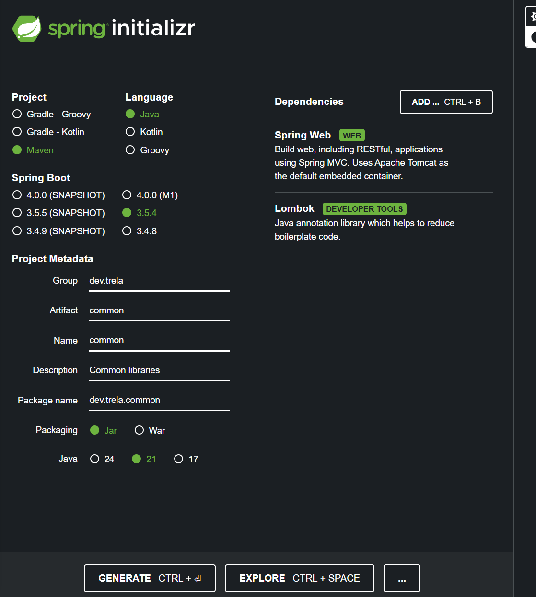
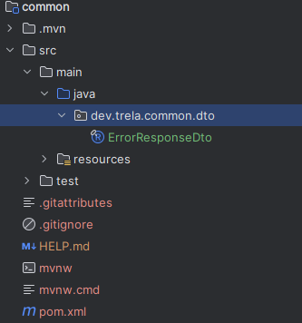

---

# Section 20: Introduction to kubernetes Ingress, ServiceMesh (Istio) & mTLS

---

## In this section, we will learn a best practice that **every microservices developer** should follow.

We'll copy the code from **Section 14**, and we **won’t dive into Kubernetes** here. Instead, we’ll use the code from Section 14 as-is.

If we take a look at our `pom.xml` files in each microservice, we’ll notice something:

We have different configuration properties in each `pom.xml`, such as:

```xml
<properties>
  <java.version>21</java.version>
  <spring-cloud.version>2025.0.0</spring-cloud.version>
  <otelVersion>2.18.0</otelVersion>
</properties>
```

These are things like Java version, Spring Cloud version, OpenTelemetry version, etc.—and this is **repeated across all microservices**.

Then we have all the dependencies, and at the end, even the Google Jib Maven plugin.

### The Problem

The problem with this approach is that we're **hardcoding versions** like Spring, Java, and others **directly inside each microservice**.

Now imagine your organization has **more than 30 microservices**.

If you want to upgrade from one version to another, you would need to **manually update all the `pom.xml` files** in every microservice.

Do you think this is a good practice?
**Of course not!**

You would have to go into every single microservice just to change a single number.

---

### The Solution: Using a BOM

We'll solve this by using a **BOM**—a special `pom.xml` file that helps us **manage dependency versions centrally**.

---

### What is a BOM in Maven?

A **BOM (Bill of Materials)** is a dependency management mechanism that provides a **central place** to define the versions of dependencies (including transitive ones). It prevents version conflicts when different parts of your system use the same libraries but with **different versions**.

With a BOM, you can manage versions in **one place**, and downstream projects simply import the BOM to automatically align dependency versions.

In the context of **Maven and Spring Boot**, a BOM is a special kind of **POM (Project Object Model)** that manages versions of a **set of related dependencies**.

---

### Why Use a BOM in Microservices?

In a microservices architecture, managing shared dependencies can quickly become **complex**. Each service might declare versions independently, leading to version conflicts and high maintenance effort.

The BOM solves this by:

* ✅ Ensuring **version consistency** across all microservices
* ✅ **Simplifying dependency management**
* ✅ Making it easy to **upgrade libraries** across all services from one place

---

### What Defines a BOM in Maven?

A BOM is simply a Maven project (`pom.xml`) with:

```xml
<packaging>pom</packaging>
```

It typically doesn't have a `<dependencies>` section (or only minimal dependencies), but **does include a `<dependencyManagement>` block** that defines the versions of dependencies.

---

### Adapting a BOM to Our Project

To do this, we first create a **separate Maven project**—an empty Spring Boot project with a `pom.xml`.

We start with a basic empty Spring Boot project:

*(referenced image: img.png)*

It contains a typical `pom.xml` structure:

*(referenced image: img\_1.png)*

Before we make any changes, we **delete the entire `src` folder**, since this project won’t contain any source code.

*(referenced image: img\_2.png)*

---

### Clean Up the `pom.xml`

Next, we **remove the `<parent>` tag**:

```xml
<parent>
  <groupId>org.springframework.boot</groupId>
  <artifactId>spring-boot-starter-parent</artifactId>
  <version>3.5.4</version>
  <relativePath/> <!-- lookup parent from repository -->
</parent>
```

We also **remove any empty tags**.

Then, we add metadata like:

```xml
<licenses>
  <license>
    <name>Apache License, Version 2.0</name>
    <url>https://www.apache.org/licenses/LICENSE-2.0</url>
  </license>
</licenses>

<developers>
  <developer>
    <name>Marcin Trela</name>
    <email>marcin.trela.dev@gmail.com</email>
    <organization>Trela-dev</organization>
    <organizationUrl>https://github.com/Trela-dev</organizationUrl>
  </developer>
</developers>

<scm>
  <url>https://github.com/Trela-dev/microservices-with-springboot-docker-k8s</url>
</scm>
```

We also add:

```xml
<packaging>pom</packaging>
```

And remove:

```xml
<properties>
  <java.version>21</java.version>
</properties>
```

Now we **paste in the shared properties** that are used in all of our microservices:

```xml
<common-lib.version>1.0.0</common-lib.version>
<spring-boot.version>3.4.1</spring-boot.version>
<java.version>21</java.version>
<maven.compiler.source>21</maven.compiler.source>
<maven.compiler.target>21</maven.compiler.target>
<spring-cloud.version>2024.0.0</spring-cloud.version>
<spring-doc.version>2.8.1</spring-doc.version>
<h2.version>2.3.232</h2.version>
<lombok.version>1.18.36</lombok.version>
<otel.version>2.11.0</otel.version>
<micrometer.version>1.14.2</micrometer.version>
<jib.version>3.4.2</jib.version>
<image.tag>s20</image.tag>
```

---

### Controlling Third-Party Dependencies

When using **third-party dependencies** outside of Spring Boot (e.g., `H2`, `Lombok`, `OpenTelemetry`, `Micrometer`, etc.), you should **explicitly define the version** you want to use.

Even if you **don’t** specify the version, your microservices will **still work**, because Spring Boot starter dependencies will resolve the versions automatically.

However, you should **never rely on that**. You should always **control the versions** yourself to avoid surprises and ensure consistency.

---

### Add `<dependencyManagement>` Block

For now, let’s remove all regular dependencies and keep the `<dependencies>` section empty.

Then we add a new block:

```xml
<dependencyManagement>
  <dependencies>

    <dependency>
      <groupId>org.springframework.boot</groupId>
      <artifactId>spring-boot-dependencies</artifactId>
      <version>${spring-boot.version}</version>
      <type>pom</type>
      <scope>import</scope>
    </dependency>

    <dependency>
      <groupId>org.projectlombok</groupId>
      <artifactId>lombok</artifactId>
      <version>${lombok.version}</version>
      <type>pom</type>
      <scope>import</scope>
    </dependency>

    <dependency>
      <groupId>com.h2database</groupId>
      <artifactId>h2</artifactId>
      <version>${h2.version}</version>
      <type>pom</type>
      <scope>import</scope>
    </dependency>

    <dependency>
      <groupId>org.springdoc</groupId>
      <artifactId>springdoc-openapi-starter-webmvc-ui</artifactId>
      <version>${spring-doc.version}</version>
      <type>pom</type>
      <scope>import</scope>
    </dependency>

    <dependency>
      <groupId>org.springframework.boot</groupId>
      <artifactId>spring-boot-starter-test</artifactId>
      <version>${spring-boot.version}</version>
      <scope>test</scope>
    </dependency>

    <dependency>
      <groupId>org.springframework.cloud</groupId>
      <artifactId>spring-cloud-dependencies</artifactId>
      <version>${spring-cloud.version}</version>
      <type>pom</type>
      <scope>import</scope>
    </dependency>

  </dependencies>
</dependencyManagement>
```

---

### Explanation

In the first dependency:

```xml
<dependency>
  <groupId>org.springframework.boot</groupId>
  <artifactId>spring-boot-dependencies</artifactId>
  <version>${spring-boot.version}</version>
  <type>pom</type>
  <scope>import</scope>
</dependency>
```

We are importing the Spring Boot BOM, which includes the recommended versions of all Spring Boot-related dependencies.

> This **doesn’t install any dependencies**, it just tells Maven:
>
> “Use the versions defined in this BOM whenever one of these dependencies is declared.”

---

### Example BOM File

You can find an example Spring Boot BOM here:
[https://repo1.maven.org/maven2/org/springframework/boot/spring-boot-dependencies/3.2.0/spring-boot-dependencies-3.2.0.pom](https://repo1.maven.org/maven2/org/springframework/boot/spring-boot-dependencies/3.2.0/spring-boot-dependencies-3.2.0.pom)

Inside, you’ll see:

* A list of `<properties>` defining dependency versions
* A `<dependencyManagement>` section listing all managed dependencies

This tells Maven:
**“If using Spring Boot version 3.2.0, use the dependency versions listed below.”**

---

## Adapting the `trela-bom` into Our Microservices

Now, to adapt our `trela-bom` into the project, we’ll go to the `pom.xml` file of one of our microservices — for example, `accounts`.

Up until now, our `pom.xml` has the following `parent`:

```xml
<parent>
  <groupId>org.springframework.boot</groupId>
  <artifactId>spring-boot-starter-parent</artifactId>
  <version>3.5.3</version>
  <relativePath/> <!-- lookup parent from repository -->
</parent>
```

But we want to **replace** this parent with our custom `trela-bom`:

```xml
<parent>
  <groupId>dev.trela</groupId>
  <artifactId>trela-bom</artifactId>
  <version>0.0.1-SNAPSHOT</version>
  <relativePath>../trela-bom/pom.xml</relativePath> <!-- lookup parent from repository -->
</parent>
```

---

### Removing Redundant Properties

We can also remove the `<properties>` section from `accounts` because all version properties are now managed by the `trela-bom`:

```xml
<properties>
  <java.version>21</java.version>
  <spring-cloud.version>2025.0.0</spring-cloud.version>
  <otelVersion>2.18.0</otelVersion>
</properties>
```

---

### The Benefit of the BOM

The beauty of this setup is that **if we ever want to update a version** (e.g., Spring Boot), we can just **change it once in `trela-bom`**, and **we don’t need to touch any microservice `pom.xml` files** — unless we want to add a new dependency.

---

### Keeping Only What’s Needed

When you look at the `accounts` microservice, you’ll notice that it only needs a **small subset of Spring Boot dependencies**.

There are hundreds of dependencies managed by the Spring Boot BOM, but `accounts` might only need 4 or 5.
The BOM won’t pull in everything by default — the microservice must still **declare explicitly which dependencies it needs**.

---

### Spring Initializr and BOM Behavior

When we generate a project using [Spring Initializr](https://start.spring.io), Spring Boot includes its own BOM (`spring-boot-dependencies`) by default.

👉 This BOM includes default, tested versions of popular libraries such as Jackson, Hibernate, Spring Web, Spring Security, etc.
👉 As a result, **you don’t need to manually specify versions** for most Spring Boot starters — the BOM handles it.

---

### Third-Party Dependencies — Pin Your Versions

However, for **third-party libraries** that are **outside of Spring Boot's ecosystem** — like OpenTelemetry or Micrometer — it’s **recommended to specify the exact version** you want to use.

Why?
Because if you don’t, **Spring Boot may pick the latest compatible version**, and that might change over time.

By specifying the version yourself (in your BOM), you **gain control and stability**.

---

### Example: Declaring a Third-Party Dependency in `accounts`

Let’s explicitly declare a third-party dependency in `accounts/pom.xml` like so:

```xml
<dependency>
  <groupId>io.micrometer</groupId>
  <artifactId>micrometer-registry-prometheus</artifactId>
  <version>${micrometer.version}</version>
</dependency>
```

This version is managed in `trela-bom`, so we don’t hardcode it here.

---

### Removing Redundant Dependency Management

Previously, we might have imported the Spring Cloud BOM like this:

```xml
<dependencyManagement>
  <dependencies>
    <dependency>
      <groupId>org.springframework.cloud</groupId>
      <artifactId>spring-cloud-dependencies</artifactId>
      <version>${spring-cloud.version}</version>
      <type>pom</type>
      <scope>import</scope>
    </dependency>
  </dependencies>
</dependencyManagement>
```

But now, since this is already included in `trela-bom`, **we can safely remove it**.

---

### Cleaning Up and Finalizing the `pom.xml`

We replace all values from the local `<properties>` block with centralized ones from `trela-bom`.
Now our `pom.xml` has **no versions** — all are delegated to the BOM.

---

## Repeat for Other Services (e.g., `cards`)

We do the same in the `cards` microservice:

* Remove the old `<parent>` and replace it with the `trela-bom`

* Remove the `<properties>` block:

  ```xml
  <properties>
    <java.version>21</java.version>
    <spring-cloud.version>2025.0.0</spring-cloud.version>
    <otelVersion>2.18.0</otelVersion>
  </properties>
  ```

* Add necessary dependency versions via properties managed in `trela-bom`.

---

### Example: Adding Flyway

Let’s say you’re using **Flyway** (which your instructor isn't).
Since it’s a third-party dependency, you should pin its version in the `trela-bom`.

You can use the following command to find out the current version:

```bash
mvn dependency:tree
```

If it shows version `11.7.2`, you add that to the `trela-bom` like this:

```xml
<flyway.version>11.7.2</flyway.version>
```

Then in your microservice:

```xml
<dependency>
  <groupId>org.flywaydb</groupId>
  <artifactId>flyway-core</artifactId>
  <version>${flyway.version}</version>
</dependency>
```

---

### Include `jib.version` and `image.tag` in BOM

You can also centralize the version of the **Jib plugin** and the image tag by adding to `trela-bom`:

```xml
<jib.version>3.4.2</jib.version>
<image.tag>s20</image.tag>
```

And do the same in the remaining microservices.

---

## Testing the BOM in Action

Let’s test the effect of the BOM.

We start the `config-server`, and we see that it runs with:

```text
:: Spring Boot :: (v3.4.1)
```

Now, we **change the Spring Boot version** in `trela-bom` to `3.4.0`.

Then, we **delete the `target` folder** from the `config-server` (so nothing is cached or precompiled).

*(image referenced: img\_3.png)*

After restarting, we see in the logs:

```text
:: Spring Boot :: (v3.4.0)
```

✅ That confirms our BOM is working perfectly!

---

## Managing Exceptions and Shared Dependencies with `trela-bom`

With the `trela-bom` project, we’ve built a **Bill of Materials (BOM)** for our microservices-based system.

However, there are cases where **a specific microservice needs to use a different version of a dependency** than the others.

For example, in our BOM we have the following version definitions:

```xml
<properties>
  <common-lib.version>1.0.0</common-lib.version>
  <spring-boot.version>3.4.1</spring-boot.version>
  <java.version>21</java.version>
  <maven.compiler.source>21</maven.compiler.source>
  <maven.compiler.target>21</maven.compiler.target>
  <spring-cloud.version>2024.0.0</spring-cloud.version>
  <spring-doc.version>2.8.1</spring-doc.version>
  <h2.version>2.3.232</h2.version>
  <lombok.version>1.18.36</lombok.version>
  <otel.version>2.18.0</otel.version>
  <micrometer.version>1.14.2</micrometer.version>
  <flyway.version>11.7.2</flyway.version>
  <jib.version>3.4.2</jib.version>
  <image.tag>s20</image.tag>
</properties>
```

Now let’s say we have the `loans` microservice, and we want it to use **a different version of `springdoc` and `lombok`** compared to the rest of the system.

To do this, we can **simply override the versions locally** in the `loans` project. Maven will use the version declared in the child project instead of the one inherited from the parent BOM.

---

## Another Benefit of the BOM: Shared Dependencies

Aside from centralizing version management, another great advantage of using a BOM is the ability to define **shared dependencies** in one place.

For example, let’s say **all microservices use `spring-boot-starter-test`**.

Instead of repeating this dependency in every microservice, we can move it to `trela-bom`.

---

### How to Do It

First, remove the `spring-boot-starter-test` dependency from each microservice:

```xml
<dependency>
  <groupId>org.springframework.boot</groupId>
  <artifactId>spring-boot-starter-test</artifactId>
  <scope>test</scope>
</dependency>
```

Once removed from all services, you can add it to the `dependencyManagement` section of `trela-bom`.

Now, every microservice will automatically inherit the version and scope from the BOM when they declare the dependency without a version.

---

## Verifying the Setup with Docker Images

As a next step, let’s test whether the `trela-bom` configuration affects the Docker image build process.

Navigate to the `config-server` folder and build the Docker image using Jib:

```bash
mvn compile jib:dockerBuild
```

✅ **Everything works!**
This confirms that our BOM setup didn’t break anything and that the microservices are building correctly with shared dependency and version management.

---

Sometimes developers write duplicated code across many microservices.
For example, we might have something like:
`ErrorResponseDto`

When we build shared dependencies, there are different approaches.

---

### 1. The first approach is to create a shared Maven project

which contains all the common dependencies.

---

🧱 **In `shared` create your classes**
After creating the project, navigate to the directory:

```
shared/
├── pom.xml
└── src/
    └── main/
        └── java/
            └── com/
                └── example/
                    └── shared/
                        └── dto/
                            └── UserDto.java
```

Example `UserDto.java`:

```java
package com.example.shared.dto;

public class UserDto {
    private String username;
    private String email;

    public UserDto(String username, String email) {
        this.username = username;
        this.email = email;
    }

    public String getUsername() { return username; }
    public void setUsername(String username) { this.username = username; }

    public String getEmail() { return email; }
    public void setEmail(String email) { this.email = email; }
}
```

---

🧾 **Check the `pom.xml`**
Make sure your `pom.xml` looks like this:

```xml
<project xmlns="http://maven.apache.org/POM/4.0.0"
         xmlns:xsi="http://www.w3.org/2001/XMLSchema-instance"
         xsi:schemaLocation="http://maven.apache.org/POM/4.0.0
                             http://maven.apache.org/xsd/maven-4.0.0.xsd">
  <modelVersion>4.0.0</modelVersion>

  <groupId>com.example.shared</groupId>
  <artifactId>shared</artifactId>
  <version>1.0.0</version>
  <packaging>jar</packaging>

  <name>shared</name>
</project>
```

---

🏗️ **Build the library**
In the terminal (in the `shared` directory), run:

```bash
mvn clean install
```

This will create a `.jar` file and install it into your local Maven repository (`~/.m2/repository`).

---

If we use this approach, the library becomes a big fat jar.
If a service needs only one dependency,
for example, utilities, security, logging are all inside,
and say the service only needs utilities, it still has to carry security and logging —
which is too much!

---

### 2. Another approach

is to split one shared project into smaller ones,
which reduces carrying unnecessary dependencies,
but the downside is you might have 20 or 30 different Maven projects.

---

### 3. The third approach: multi-module projects

This is a Maven project consisting of many submodules, each with its own `pom.xml`, but sharing the same parent `pom.xml`.
It can be used to share code between services without duplication.
Inside the parent POM, we can create a multi-module Maven project.

---

### 🔗 How do parent and child work in multi-module Maven?

🔸 **Parent `pom.xml` (the main one on top):**
Contains:

* Common settings (e.g. Java version, encoding)
* Plugins (e.g. `maven-compiler-plugin`)
* Optionally: common dependencies (but they are not added automatically!)
* List of modules (`<modules>`)

❗ But dependencies declared in the parent are *not* automatically inherited as imports in the code — they are only available if declared in `dependencyManagement`.

---

🔸 **Child `pom.xml` (e.g. `service-a/pom.xml`)**
Has `<parent>`, meaning: "I inherit configuration from the parent".

But: it must declare dependencies it needs by itself.

---

### It’s simply one main project (parent) containing several smaller projects (modules).

Imagine it like this:

```
/my-app (this is the root/parent project)
│
├── pom.xml              ← main POM (parent)
│
├── shared               ← submodule with DTOs, utilities, etc.
│   └── pom.xml
│
├── service-a            ← service A
│   └── pom.xml
│
└── service-b            ← service B
    └── pom.xml
```

---

### 🧠 What does it give you?

* Each module (e.g. `shared`, `service-a`, `service-b`) is a separate Maven project.
* But all share the same parent POM — so they have the same Java version, dependencies, configuration, etc.
* Thanks to that you can:

  * Build everything at once with `mvn clean install`
  * Share code between modules without publishing JARs to `.m2`
  * Avoid duplication (e.g. no need to install `shared` with DTOs separately)

---

Actually, the choice between these approaches varies among developers,
and we should decide logically according to our project’s specifics.

---

**We will use the third approach.**

---

**How to do it?**

First, we create a submodule for `trela-bom`

We add it into the `trela-bom` project.

Now, in the `pom.xml` of the BOM project,

we create a `common` module:

```xml
<modules>
    <module>common</module>
</modules>
```

—that is, the module we created earlier.

---

Now, in the `common/pom.xml`,

we remove the existing `<parent>` section and add the BOM parent:

```xml
<parent>
    <groupId>dev.trela</groupId>
    <artifactId>trela-bom</artifactId>
    <version>0.0.1-SNAPSHOT</version>
    <relativePath>../pom.xml</relativePath> <!-- lookup parent from repository -->
</parent>
```

---

Besides that, in the BOM project we add a property with the version for `common-lib.version`.

We remove existing properties from `common/pom.xml`.

We add `springdoc` dependency:

```xml
<dependency>
    <groupId>org.springdoc</groupId>
    <artifactId>springdoc-openapi-starter-webmvc-ui</artifactId>
    <version>${spring-doc.version}</version>
</dependency>
```

We can also remove the entire `<build>` section from `common/pom.xml` since it inherits everything from the BOM.

---

Now we take the `ErrorResponseDto` class from a microservice and move it into the `common` module.

In `common`, we remove the class with the `main` method,
create a new package `dto`,
and paste our `ErrorResponseDto` there.



---

Next, we remove `ErrorResponseDto` from each of our microservices.

---

If we now try to run a microservice, we will get a compilation error because it needs that class.

What should the microservices do now?
They need to add a dependency on `common` in each microservice:

```xml
<dependency>
    <groupId>dev.trela</groupId>
    <artifactId>common</artifactId>
    <version>${common.lib.version}</version>
</dependency>
```

---

And now everything works — dependencies are resolved from our BOM, which the microservices’ POMs inherit from!

Example import in code:

```java
import dev.trela.common.dto.ErrorResponseDto;
```

---

This section introduces Maven BOMs (Bill of Materials) as a best practice for managing dependencies in microservices architectures, addressing the challenges of hardcoding versions across multiple services.

Here's a breakdown of the key concepts and steps:

The Problem: Hardcoded Versions
Duplication: Configuration properties and dependency versions (like Java, Spring Cloud, OpenTelemetry) are repeated across pom.xml files in every microservice.

Maintenance Nightmare: Upgrading a version requires manual updates in every single microservice, which is impractical for large organizations.

The Solution: Maven BOM (Bill of Materials)
A BOM is a special pom.xml file that provides a central place to define dependency versions.

It ensures version consistency, simplifies dependency management, and makes it easy to upgrade libraries across all services from one place.

A BOM is defined by <packaging>pom</packaging> and primarily uses a <dependencyManagement> block to declare versions, rather than direct <dependencies>.

Adapting a BOM to Your Project (trela-bom)
Create a New Maven Project for the BOM:

Start with an empty Spring Boot project.

Delete the src folder as it won't contain source code.

Remove the <parent> tag from the initial pom.xml.

Add metadata like licenses, developers, and SCM information.

Set <packaging>pom</packaging>.

Remove the <properties> section and instead define shared properties within the BOM for consistency.

Define Shared Properties: Centralize versions for Java, Spring Boot, Spring Cloud, OpenTelemetry, Micrometer, Jib, and other common libraries.

Add <dependencyManagement> Block:

Import core BOMs like spring-boot-dependencies and spring-cloud-dependencies using <type>pom</type> and <scope>import</scope>. This tells Maven to "use these versions if a dependency is declared."

Explicitly define versions for third-party dependencies not managed by Spring Boot's own BOM (e.g., H2, Lombok, SpringDoc, Micrometer) to ensure control and stability.

Integrating trela-bom into Microservices
Replace Parent POM: In each microservice's pom.xml (e.g., accounts), replace the spring-boot-starter-parent with your custom trela-bom:

XML

<parent>
  <groupId>dev.trela</groupId>
  <artifactId>trela-bom</artifactId>
  <version>0.0.1-SNAPSHOT</version>
  <relativePath>../trela-bom/pom.xml</relativePath>
</parent>
Remove Redundant Properties: Delete the <properties> section from microservices as versions are now centrally managed by the BOM.

Declare Dependencies Without Versions: Microservices still need to declare the dependencies they use, but without specifying versions. Maven will infer the versions from the imported BOM.

Overriding Versions: If a specific microservice needs a different version of a dependency than defined in the BOM, you can locally override it in that microservice's pom.xml. Maven will prioritize the locally declared version.

Shared Dependencies: Common dependencies used by all microservices (e.g., spring-boot-starter-test) can be moved into the dependencyManagement section of the BOM. Microservices simply declare the dependency without a version, and the BOM provides it.

Verify with Docker Builds: Confirm that the BOM setup doesn't break the Docker image build process using mvn compile jib:dockerBuild.

Managing Shared Code/Dependencies Beyond Versions
The section then explores different approaches to sharing code and non-version dependencies across microservices:

Big Shared Maven Project:

Create a single shared Maven project (packaging jar) containing all common classes (e.g., DTOs).

Microservices declare this shared project as a dependency.

Downside: This creates a "big fat JAR" where services carry unnecessary dependencies if they only need a small part.

Split Shared Projects:

Break the shared project into smaller, granular projects (e.g., shared-utilities, shared-security).

Downside: Leads to many small Maven projects, increasing complexity.

Multi-Module Projects (Chosen Approach):

A single parent Maven project containing multiple submodules, each with its own pom.xml but sharing the parent's configuration.

Benefits:

Builds everything at once (mvn clean install).

Shares code between modules without publishing JARs to the local Maven repository.

Avoids duplication.

Implementing Multi-Module Shared Code
Create a common Submodule: Add a new module named common inside the trela-bom project.

Update trela-bom/pom.xml: Add <module>common</module> to the <modules> section.

Configure common/pom.xml:

Set its parent to trela-bom.

Remove its own <properties> and <build> sections, as they are inherited.

Move Shared Code: Relocate common classes (e.g., ErrorResponseDto) from microservices into the common module.

Add common Dependency to Microservices: Each microservice needing the shared code will add a dependency to common, leveraging the version defined in trela-bom:

XML

<dependency>
  <groupId>dev.trela</groupId>
  <artifactId>common</artifactId>
  <version>${common.lib.version}</version>
</dependency>
This approach centralizes both dependency versions and shared code, making maintenance and upgrades significantly easier in a microservices environment.
