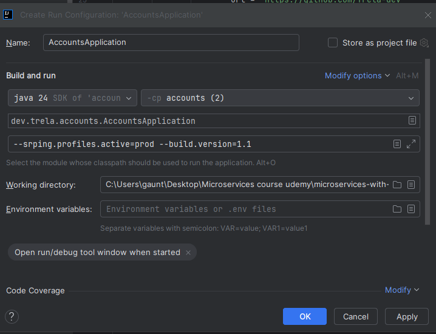
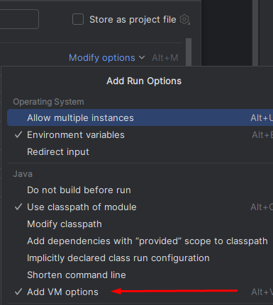
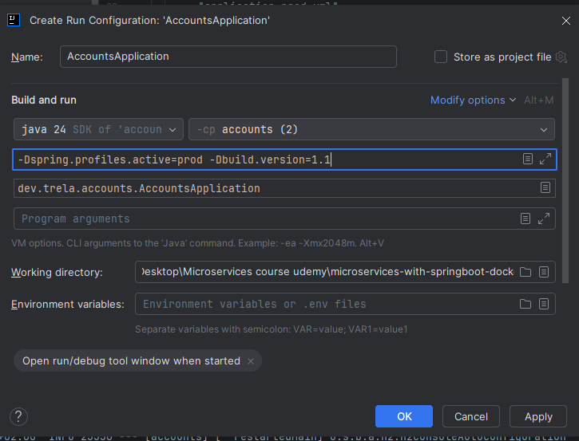
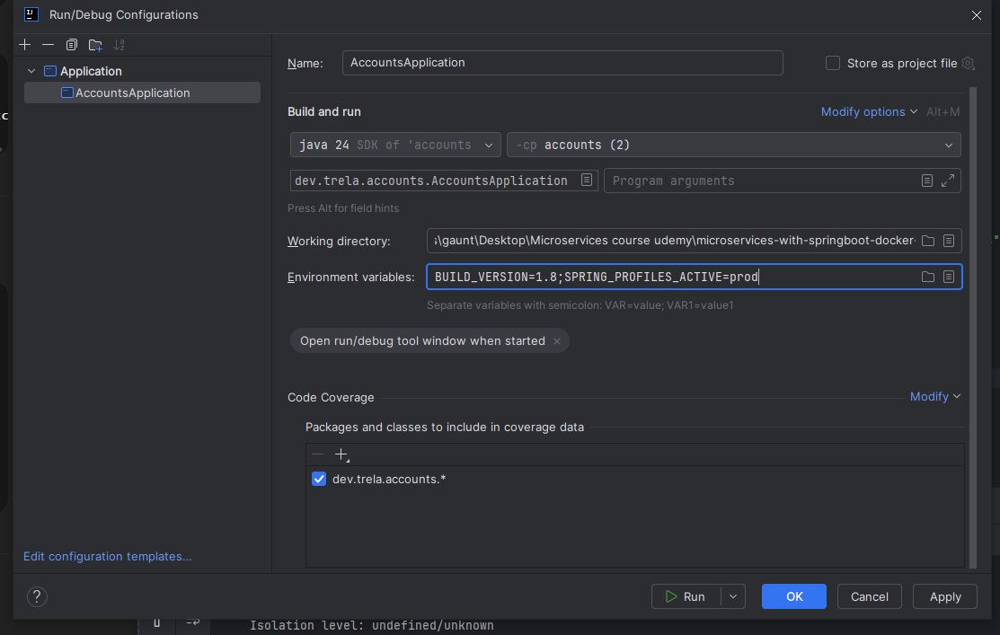
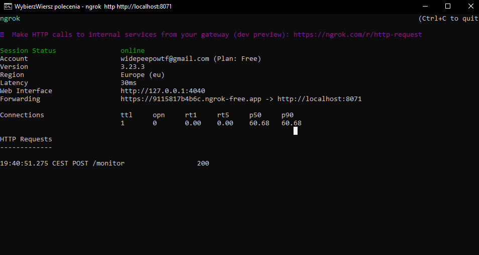

okej zaczynamy sekcję 6

musimy pokonac challange externalizacji konfiguracji

mówi o @Value annotation
możemy dzieki niej bezposrednio wstrzyknac w pola to co chcemy z properties

 mamy tez 
 Environemnt Properties

@Component 
public class MyBean{

    @Autowired
    private Environment environment;
    
    public void printSomeProperty(){
        System.out.println(environment.getProperty("my.property"));}

}

czyli mozna sobie pobrac environment 

@ConfigurationProperties("prefix")
public class MyAppProperties{
p}

Na początek poznajemu różne sposoby na wstrzykiwanie z properties
najpierw @Value 
ale nie wiem czemu jak jestduo properties ma to nei dzialac 

okej za pomocą     @Autowired
private Environment environment;
mozemyp obierac rzwniez nasze zmienne srodowiskowe np java HOMe
tez mowi ze jak jest duzo do odczytania to ten sposob nie jest najlepszy jak jest duzo environment do odczytania
no i widzimy klucz odczytywanej wartosci 

@ConfigurationProperties

żeby użyć 3 approach potrzeba pojo klasy np takie ustawienia w yaml

accounts:
message: "Welcome to TrelaBank accounts related local APIs"
contactDetails:
name: "Marcin Trela Developer"
email: "marcin.trela.dev@gmail.com"
onCallSupport:
- (123) 456-7890
- (123) 523-7890

potem maja takie odzwierciedlenie

@ConfigurationProperties(prefix = "accounts")
public record AccountsContactInfoDto(
String message,
Map<String, String> contactDetails,
List<String> onCallSupport
) {
}
i taką annotacje musimy w main klasie dac
@EnableConfigurationProperties(value = {AccountsContactInfoDto.class})
public class AccountsApplication {
public static void main(String[] args) {
SpringApplication.run(AccountsApplication.class, args);
}
}

potem wstrzykujemy     private final AccountsContactInfoDto accountsContactInfoDto;

i uzywamy     @GetMapping("/contact-info")
public ResponseEntity<AccountsContactInfoDto> getContactInfo() {
return ResponseEntity
.status(HttpStatus.OK)
.body(accountsContactInfoDto);
}

🟢 Kiedy co stosować — podsumowanie praktyczne:
Podejście	Kiedy używać	Zalecane do
@Value	1–2 wartości, proste typy	app.version, feature.enabled
Environment	Gdy klucze są dynamiczne lub zależne od logiki	np. getProperty("config." + name)
@ConfigurationProperties	Gdy masz spójne grupy ustawień, listy, walidację	mail.server, database, api.*

Zarządzanie wartościami dla różnych środowisk (dev/test/prod) to coś, co robi się na poziomie plików konfiguracyjnych i profilów Springa, a nie przez samą adnotację.

🔧 Przykład problemu
Masz np. w pliku:

application-dev.properties:

properties
Kopiuj
Edytuj
db.url=jdbc:mysql://localhost/dev-dbs
application-prod.properties:

properties
Kopiuj
Edytuj
db.url=jdbc:mysql://prod-server/prod-db
I teraz pytanie: skąd @Value("${db.url}") ma wiedzieć, którą wersję ma wczytać?

➡️ Sam @Value tego nie „ogarnie”, dopóki nie ustawisz aktywnego profilu, np.:

properties
Kopiuj
Edytuj
spring.profiles.active=dev

 wiec co cjezeli bedziemy potrzebowac roznych environment
i wchdoza profile mozna grupowac profile 

I to wlasnie zostanie zaimplementowane

takze tworzymy pliki yml specjalnie pod dany profil np qa 

spring:
config:
activate:
on-profile: "qa"

build:
version: "2.0"

accounts:
message: "Welcome to TrelaBank accounts related QA APIs"
contactDetails:
name: "Example QA Contact"
email: "example.qa.contact@gmail.com"
onCallSupport:
- (123) 456-7890
- (123) 523-7890

a potem te pliki importujemy
config:
import:
- "application_qa.yml"
- "application_prod.yml"

i mozna aktyqwowac profil ktory jest teraz   active:
- "qa"
  config:
  import:
 - "application_qa.yml"
 - "application_prod.yml"
   profiles:
   active: prod

Okej wszystko fajnie idziała mozna sobie zmieniac profile
ale generalnie wszystko jest w mikroserwisie
a my nie chce y budować za każdym razem innego docker image jak bo to jest przeciwko 12 factor 
wiec mozemy zmienic uzywając 
CLI 
a wlasciwie command line argumetns
one maja pierwszenstwo nad wszystkie metody zmieniania properties
np 
java -jar accounts-service-0.0.1-SNAPSHOT.jar --build.version="1.1" 
no i to zmieni properties w pliku application.yml

oprocz tego mozna uzywajac JVM system properties
java -Dbuild.version="1.2" -jar accounts-service-0.0.1-SNAPSHOT.jar

mozna uzywac tez environment variables i to nie tylko w javei mozna 
np
env:BUILD_VERSION="1.3";java -jar accounts-service-0.0.1-SNAPSHOT.jar

🧠 Jak Spring ustala kolejność źródeł konfiguracji?
Spring Boot ma priorytety dla źródeł konfiguracji – od najważniejszego:

Parametry linii poleceń (CLI) – --build.version=1.1

System properties (JVM) – -Dbuild.version=1.1

Zmienne środowiskowe (env) – BUILD_VERSION=1.1

Pliki application-*.yml/application.properties

Wartości domyślne w kodzie
W Dockerfile masz jeden build:

Dockerfile
Kopiuj
Edytuj
FROM openjdk:17
COPY target/accounts-service.jar app.jar
ENTRYPOINT ["java", "-jar", "app.jar"]
Ale uruchamiasz kontener z różną konfiguracją:

docker run -e BUILD_VERSION=2.0 myapp

docker run myapp --build.version=2.0
Albo z system property:
docker run myapp -Dbuild.version=2.0

🔁 Pętla CI/CD wygląda tak:
Zbuduj kod → accounts-service:latest

Wrzuć do rejestru (DockerHub, GitHub Packages)

W zależności od środowiska:

QA → --spring.profiles.active=qa

PROD → --spring.profiles.active=prod

DEV → --spring.profiles.active=dev

1. za pomocą command line argumetns

okej mozna zasymulowac takie odpalenie w IDE normalnie to sie robi przez cli na buildize
ale my zrobimy w ide

modify run configuration prawym na apke i to kliknac w IDE
i wpisujemy --spring.profiles.active=prod --build.version=1.1

i teraz w przyadk tego endpointu
http://localhost:8080/api/contact-info

 dostajemy prod informacje
{
"message": "Welcome to TrelaBank accounts related prod APIs",
"contactDetails": {
"name": "Example prod Contact",
"email": "example.prod.contact@gmail.com"
},
"onCallSupport": [
"(123) 456-7890",
"(123) 523-7890"
]
}nawet mimo profilu zmienionego
profiles:
active: qa
 czyli CLI ma wieksze pierwszenstwo 

Natomiast w przypadku tego
http://localhost:8080/api/build-info
1.1
chociaz w nie ma nigdzie tej lciby zostala odpalaona w CLI 
2. za pomocąJVM system properties
   okej mozna zasymulowac takie odpalenie w IDE normalnie to sie robi przez cli na buildize
   ale my zrobimy w ide
Najpierw klikamy modify i add vm options

i wpisujemy komendę
-Dspring.profiles.active=prod -Dbuild.version=1.1

i tak samo dostajemy 1.1 w tym endpoinceie 
http://localhost:8080/api/build-info
1.1 

3. Environmetn variables

BUILD_VERSION=1.8;SPRING_PROFILES_ACTIVE=prod
i tu 1.8 w tym endpoinceie
http://localhost:8080/api/build-info

Okej i taki eksperyment

masz rozne wersje ale wychodzi 1.3 na koniec bo nma highest precednece
http://localhost:8080/api/build-info
1.3

Czyli kolejnosc jest taka
najpierw command line argumetns potem JVM system properteis
potem environment variables, a potem yml 

table there that shows all 3 approaches

| Method                                    | How it's set                       | When it's available                | Who typically uses it                            | Good for                                     |
| ----------------------------------------- | ---------------------------------- | ---------------------------------- | ------------------------------------------------ | -------------------------------------------- |
| **JVM System Property** (`-Dkey=value`)   | Passed to the JVM                  | Available **before** Spring starts | Developers or scripts                            | JVM-level config (encoding, logging, memory) |
| **Command Line Argument** (`--key=value`) | Passed directly to Spring Boot app | Available when Spring starts       | Devs or Ops launching app manually or via script | Spring Boot-specific overrides               |
| **Environment Variable** (`KEY=value`)    | Set in OS / container              | Available before anything          | OS, Docker, CI/CD, Cloud                         | Cloud-native and secrets-safe configs        |

No i tak to sie robi ale generalnie on mowi ze to dziala do pewnego stopnia 
dla cloud native to nie dziadala 

👉 In many production environments you don’t have direct control over how the app is launched.
For example:

On a cloud server, the system might launch the app automatically using a system service (systemd) or container.

In Docker, the CMD or ENTRYPOINT is preconfigured in the image.

In Kubernetes, the app runs inside a pod — you can’t manually add flags like --key=value unless the deployment manifest includes them.

So:

Option	Do you need access to java -jar?	Works in Docker/Kubernetes?
--key=value	✅ Yes	❌ Not always
-Dkey=value	✅ Yes	❌ Not always
KEY=value (env var)	❌ No	✅ Yes
