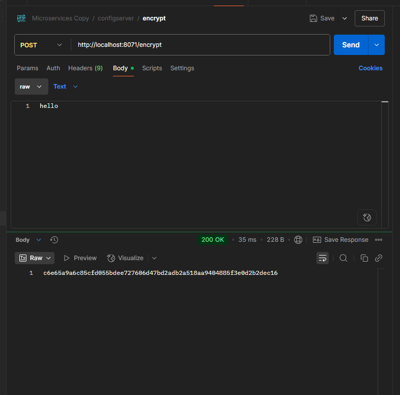

---

# Section 6: Externalizing Configuration in Spring Boot

## Overview

Externalizing configuration allows us to separate configuration values (e.g., URLs, API keys, feature flags) from code. This is critical for building flexible and environment-specific applications.

### Different Ways to Inject Properties from Configuration Files:

---

## 1. Using `@Value` Annotation

* Allows injecting single property values directly into fields.
* Example:

```java
@Value("${my.property}")
private String myProperty;
```

* Works well for a few simple values like `app.version` or `feature.enabled`.
* Limitation: When there are many properties or complex structures, this becomes cumbersome.
* Also, when multiple property files are present (e.g., multiple profiles), `@Value` alone won't decide which one to pick unless the active profile is correctly set.

---

## 2. Using `Environment` Object

* Inject `Environment` to programmatically access properties.

```java
@Component
public class MyBean {
    @Autowired
    private Environment environment;

    public void printSomeProperty() {
        System.out.println(environment.getProperty("my.property"));
    }
}
```

* Can also access environment variables (e.g., `JAVA_HOME`).
* Useful when keys are dynamic or based on logic, like `getProperty("config." + name)`.
* Not ideal if you have many properties to read.

---

## 3. Using `@ConfigurationProperties`

* Binds groups of properties into POJOs or records.
* Supports complex types like maps and lists.
* Allows validation.
* Example YAML config:

```yaml
accounts:
  message: "Welcome to TrelaBank accounts related local APIs"
  contactDetails:
    name: "Marcin Trela Developer"
    email: "marcin.trela.dev@gmail.com"
  onCallSupport:
    - (123) 456-7890
    - (123) 523-7890
```

* Corresponding POJO:

```java
@ConfigurationProperties(prefix = "accounts")
public record AccountsContactInfoDto(
    String message,
    Map<String, String> contactDetails,
    List<String> onCallSupport
) {}
```

* Enable configuration properties in the main class:

```java
@EnableConfigurationProperties(AccountsContactInfoDto.class)
public class AccountsApplication {
    public static void main(String[] args) {
        SpringApplication.run(AccountsApplication.class, args);
    }
}
```

* Inject the properties bean and use it:

```java
private final AccountsContactInfoDto accountsContactInfoDto;

@GetMapping("/contact-info")
public ResponseEntity<AccountsContactInfoDto> getContactInfo() {
    return ResponseEntity.status(HttpStatus.OK).body(accountsContactInfoDto);
}
```

---

## When to Use Which Approach? — Practical Summary

| Approach                   | When to Use                                     | Best for                              |
| -------------------------- | ----------------------------------------------- | ------------------------------------- |
| `@Value`                   | 1-2 simple values                               | `app.version`, `feature.enabled`      |
| `Environment`              | Dynamic keys or logic-based retrieval           | e.g., `getProperty("config." + name)` |
| `@ConfigurationProperties` | Groups of related properties, lists, validation | mail server, database, `api.*`        |

---

## Managing Different Environments (dev/test/prod)

* Spring profiles allow activating different sets of properties.
* Example:

`application-dev.properties`:

```
db.url=jdbc:mysql://localhost/dev-db
```

`application-prod.properties`:

```
db.url=jdbc:mysql://prod-server/prod-db
```

* To specify which profile to use, set the active profile in `application.properties` or via command line:

```properties
spring.profiles.active=dev
```

---

## Using Profiles in YAML with Imports

* Profiles can be grouped and imported:

```yaml
spring:
  config:
    activate:
      on-profile: "qa"
  build:
    version: "2.0"
  accounts:
    message: "Welcome to TrelaBank accounts related QA APIs"
    contactDetails:
      name: "Example QA Contact"
      email: "example.qa.contact@gmail.com"
    onCallSupport:
      - (123) 456-7890
      - (123) 523-7890
```

* Import multiple profile files:

```yaml
config:
  import:
    - "application_qa.yml"
    - "application_prod.yml"
```

* Activate profiles:

```yaml
profiles:
  active: 
    - "qa"
```

---

## Changing Configuration Without Rebuilding Docker Image

* Following 12-factor app principles, do not rebuild Docker images for each environment.
* Instead, override configuration at runtime with:

### 1. Command Line Arguments (CLI)

* Highest priority.
* Example:

```bash
java -jar accounts-service.jar --build.version="1.1" --spring.profiles.active=prod
```

* Can be simulated inside IDE by modifying run configuration.

---

* Endpoint returns:

```json
{
  "message": "Welcome to TrelaBank accounts related prod APIs",
  "contactDetails": {
    "name": "Example prod Contact",
    "email": "example.prod.contact@gmail.com"
  },
  "onCallSupport": [
    "(123) 456-7890",
    "(123) 523-7890"
  ]
}
```
* Endpoint http://localhost:8080/api/build-info returns version `1.1`

---

### 2. JVM System Properties

* Passed as `-D` flags.

```bash
java -Dspring.profiles.active=prod -Dbuild.version=1.1 -jar accounts-service.jar
```

* Can be simulated by setting VM options in IDE.

---


---

* Endpoint http://localhost:8080/api/build-info returns version `1.1`


### 3. Environment Variables

---

* Endpoint  http://localhost:8080/api/build-info returns version from env variable (e.g., `1.8`)

---

## Precedence of Configuration Sources in Spring Boot

Spring Boot resolves property values by the following priority (highest first):

1. Command line arguments (e.g., `--build.version=1.1`)
2. JVM system properties (`-Dbuild.version=1.1`)
3. Environment variables (`BUILD_VERSION=1.1`)
4. `application.yml` or `application.properties` files
5. Default values in code

---

## Summary Table of Configuration Methods

| Method                          | How It's Set                   | When It's Available  | Who Uses It                    | Good For                              |
| ------------------------------- | ------------------------------ | -------------------- | ------------------------------ | ------------------------------------- |
| **JVM System Property**         | Passed to JVM with `-D`        | Before Spring starts | Developers, scripts            | JVM-level config (encoding, logging)  |
| **Command Line Argument (CLI)** | Passed directly to Spring Boot | At Spring startup    | Devs, Ops running app manually | Spring Boot-specific overrides        |
| **Environment Variable**        | Set in OS/container            | Before anything      | OS, Docker, CI/CD, Cloud       | Cloud-native and secrets-safe configs |

---

## Real-World Challenges for Cloud Native

* You often **do not** have direct control over app launch commands.
* In Docker and Kubernetes:

    * CMD or ENTRYPOINT is fixed in the image.
    * You cannot add CLI args easily unless deployment manifests specify them.
* Thus:

    * `--key=value` and `-Dkey=value` require control over Java launch.
    * Environment variables (`KEY=value`) work seamlessly in Docker/Kubernetes.

---

Sure! Here's your full note rewritten in clear **English**, formatted like a presentation or documentation, and with **placeholders for screenshots (img\_1.png, img\_4.png, etc.)** already numbered:

---

## 🔐 Externalized Configuration in Spring Boot – Challenges and Solutions

### ❌ Limitations of Using Only Spring Boot (Env Vars, CLI Args)

Managing application configuration only via CLI args, JVM options, or environment variables is **not scalable nor secure** for real-world, multi-environment, microservice architectures.

| Problem                       | Why it's a problem                                                                |
| ----------------------------- | --------------------------------------------------------------------------------- |
| ❓ No version control          | You can’t track who changed what, when                                            |
| 🧍 No audit trail             | Environment variables aren’t centrally logged                                     |
| 🔓 No access control          | Too many people can access secrets like passwords or tokens                       |
| 💥 Risk of boot-time errors   | A single missing or mistyped value can break the app on startup                   |
| 🧩 No encryption              | Env vars are usually visible in system processes – a potential security risk      |
| 🔁 Hard to update dynamically | Updating config typically requires restarting the application                     |
| ⚙️ Chaos at scale             | Coordinating values across 10s or 100s of instances becomes error-prone and messy |

---

## ✅ Better Alternatives

* **Spring Cloud Config Server** – Centralized configuration server (e.g., Git-backed YAML files).
* **Vault** – Secure storage for secrets, with access control and encryption.
* **Auditing via Git** – Track changes, rollbacks, and who did what.
* **Hot reload support** – Use `/actuator/refresh` and `@RefreshScope` to dynamically reload without restart.

---

## 🌐 Spring Cloud Config Server – Git-based Setup

The configuration can be stored:

* Locally inside the config server project,
* In external files on the system,
* **Best practice**: in a **dedicated GitHub repo**.

---

## 🔒 Encrypting Sensitive Data in Git Config Files

To securely store sensitive values (like emails or passwords) in Git:

### 1. Set up the encryption key in your `config-server` `application.yml`:

```yaml
encrypt:
  key: "V-6hQYD?w0QgedUy"
```

### 2. Encrypt values using `/encrypt` endpoint:

**URL**: `http://localhost:8071/encrypt`
**Method**: `POST`
**Body**: Plain text (e.g., your email or password)

---

### 3. Use the encrypted value in your config file, prefixed with `{cipher}`:

```yaml
accounts:
  contactDetails:
    email: "{cipher}7b5637712265bf86d5c9ac2a9241cd902fd51ba..."
```

Then, when you hit your endpoint:
**`http://localhost:8080/api/contact-info`**,
you’ll receive the **decrypted** value in the response.

### 4. You can also decrypt manually using `/decrypt`:

**URL**: `http://localhost:8071/decrypt`
**Method**: `POST`

---

> 🔐 **Security Note**: Your encryption key (`encrypt.key`) should never be hardcoded in the YAML file in production.
> Store it securely, e.g., in **Vault** or other secret management solutions.

---

## 🔄 Updating Configuration Without Restarting Services

Once your microservices are up and running, you might want to update some config values (e.g., in GitHub repo) **without restarting the services**.

Spring Boot provides an **Actuator endpoint** to help with that:

### 👉 `POST /actuator/refresh`

**URL**: `http://localhost:8080/actuator/refresh`

When invoked, the service fetches **updated values** from the config server and applies them live (for `@RefreshScope` beans).

Example success response:

```json
[
  "config.client.version",
  "accounts.message"
]
```

---

Sure! Here’s your full **English version** of the note, cleaned up and structured, with image references clearly marked so you know where to insert each numbered image:

---

## 🤯 But What If You Have 50 Instances?

Here’s the catch:
If you have **50 instances** of a service (e.g., running in Docker, Kubernetes, or on different servers), you’d need to send a manual `POST /actuator/refresh` request to **each one** individually.

---

## ☁️ Spring Cloud Bus to the Rescue

Spring Cloud Bus works using a **pub/sub (publish-subscribe)** model.
It means: one message is published, and **every subscriber** listening to that topic receives it.

So no matter **how many instances** of a microservice you have — all of them will **receive the refresh message**, as long as they’re listening.

---

## 🐇 Setting Up RabbitMQ

To use Spring Cloud Bus, you need a **message broker** — we’ll use **RabbitMQ**.

Let’s pull and run the RabbitMQ container with the management UI using Docker:

```bash
docker pull rabbitmq:management-alpine
```

Then run it:

```bash
docker run -d --name rabbitmq -p 5672:5672 -p 15672:15672 rabbitmq:management-alpine
```

You can access the RabbitMQ management interface at:
**[http://localhost:15672](http://localhost:15672)**

Log in using:

* **Username**: `guest`
* **Password**: `guest`

---

---

## ⚙️ Adding Spring Cloud Bus to Your Services

To enable communication via RabbitMQ, add this dependency to **all your services** (clients + config server):

```xml
<dependency>
  <groupId>org.springframework.cloud</groupId>
  <artifactId>spring-cloud-starter-bus-amqp</artifactId>
</dependency>
```

Then configure RabbitMQ in your `application.yml`:

```yaml
spring:
  rabbitmq:
    host: localhost
    port: 5672
    username: guest
    password: guest
```

---

## 🔁 Triggering a Refresh via Bus

Now, when you change something in your remote Git configuration repo,
you don’t need to restart each service manually.

Instead, simply call:

```
POST http://localhost:8080/actuator/busrefresh
```

This **automatically sends a refresh event to all subscribed instances**.

Just make sure every microservice is connected to the same bus (i.e., the same RabbitMQ broker).

---

📌 **This solves the problem** of having to manually send a refresh to every instance.

---

## ⚙️ Can We Automate Even That?

Yes, with **GitHub Webhooks**, we can push configuration changes **automatically** to every microservice via Spring Cloud Bus.

---

## 🧩 Setting Up GitHub Webhooks with Spring Cloud Config Monitor

1. Add this dependency to the **Config Server**:

```xml
<dependency>
  <groupId>org.springframework.cloud</groupId>
  <artifactId>spring-cloud-config-monitor</artifactId>
</dependency>
```

2. This gives you a new endpoint:

   ```
   POST /monitor
   ```

GitHub can now send a POST request to `/monitor` whenever a config file changes.
This triggers `busrefresh`, which distributes the update across all instances.

---


---

## 🧠 Problem: GitHub Can’t Call Localhost

GitHub **can’t call** something like `http://localhost:8080/monitor` directly — it needs a **public URL**.

You can use:

* [Hookdeck](https://hookdeck.com/) – used in many tutorials, but might not work as easily now.
* ✅ **[Ngrok](https://ngrok.com)** – a reliable alternative.

With **Ngrok**, you map your local service to a public URL.

Example:

```bash
ngrok http 8080
```

Ngrok will generate a public URL like:

```
https://b482021a3511.ngrok-free.app -> http://localhost:8080
```

So in GitHub webhook settings, use:

```
https://b482021a3511.ngrok-free.app/monitor
```

---

---

---

## ✅ Result

Now, whenever you push a change to the config repo on GitHub:

* GitHub triggers a webhook → `/monitor`
* `/monitor` triggers Spring Cloud Bus
* Spring Cloud Bus notifies **all subscribing microservices**
* Every instance gets updated **automatically**

---
