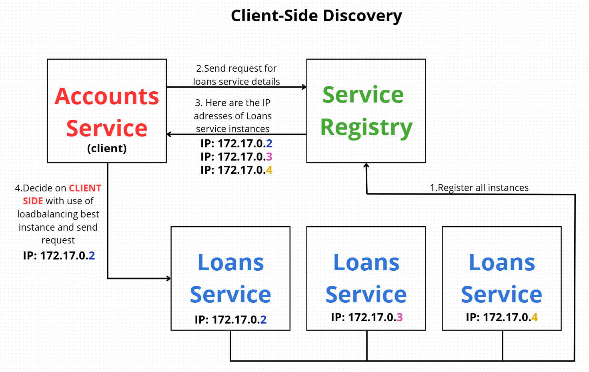
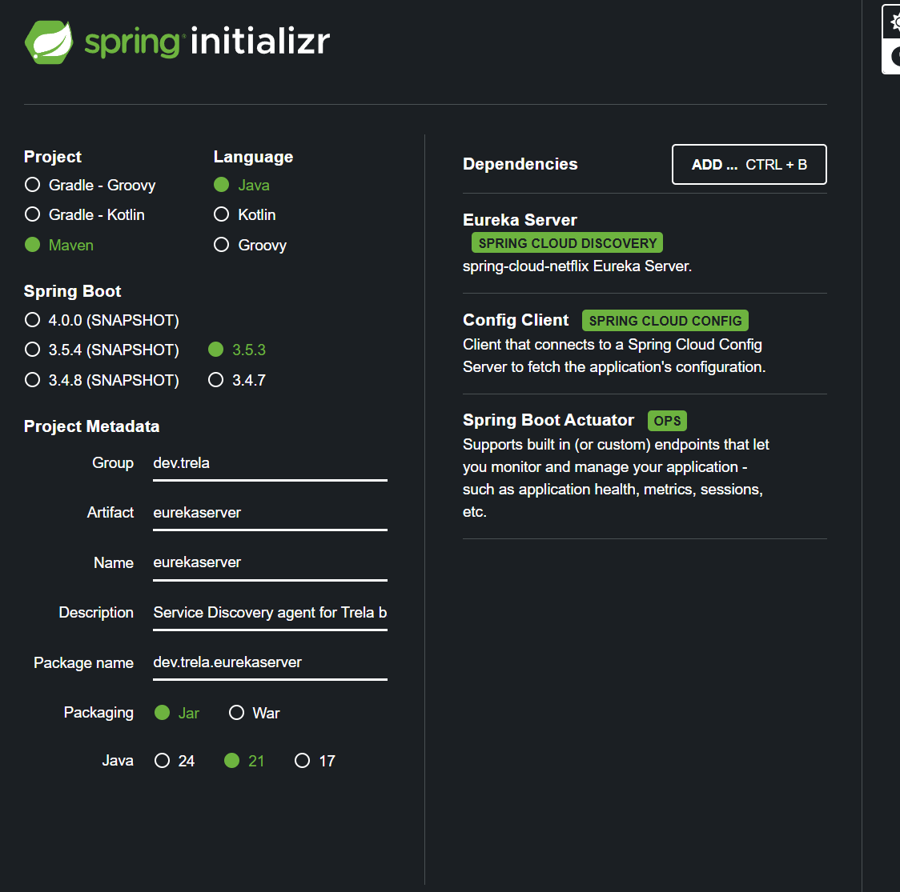
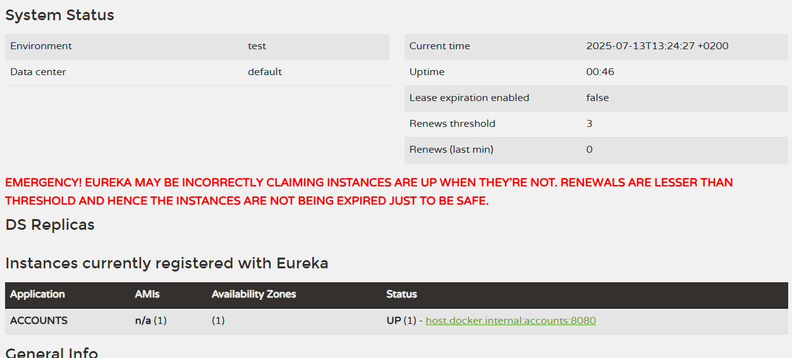
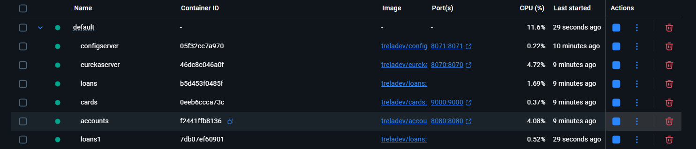
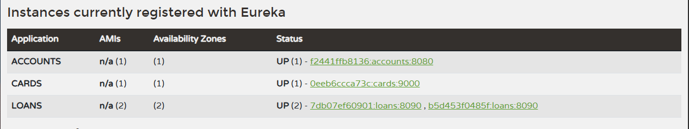

---

# Section 8:  Service Discovery & Service Registration in microservices

---


## 🧩 Problem: Scaling and Dynamic Service Management

In a microservices architecture, challenges arise when:

* We want to run **multiple instances** of a microservice.
* Ports are **assigned dynamically**, making static configuration impossible.
* We want **load to be distributed evenly** across all instances:

    * No instance should sit idle.
    * No instance should be overloaded.

### ❌ Why ports are not enough:

* You **can’t predict ports** in dynamic environments.
* There is usually **only one hostname**, and you **can’t list an unknown number of ports**.

### ✅ Solutions:

1. **Service Discovery**
2. **Service Registration**
3. **Load Balancing**

---

## 🧠 Traditional vs Cloud-Native Applications

### 🏗️ Traditional:

* DNS is often used to abstract IP changes.
* Services are deployed on **separate static servers**, so **hardcoded IPs** worked.
* Scaling was hard: Adding/removing services required **manual IP updates**.
* Traditional load balancers are **complex** and often **not container-friendly**.

### ☁️ Cloud-Native:

* Services are **dynamic**: instances and ports change frequently.
* **Service registration** and **discovery** are automated.
* Service communication is **name-based**, and **load balancers distribute requests** among multiple instances.

---

## 🔄 Terminology

* **Upstream service** → the one sending the request.
* **Downstream service** → the one receiving the request.

---

## 💡 Client-Side Service Discovery (Spring Cloud Eureka)

In this pattern:

* A separate **Service Registry** exists (e.g., Eureka Server).
* Services **register themselves** on startup.
* The **client service** queries the registry and selects an instance to call.
* **Load balancing** is done on the **client side**.



---

## ⚙️ Tools We Use

* **Eureka Server** – Spring Cloud Netflix Eureka for service registry.
* **Spring Cloud LoadBalancer** – For client-side load balancing.
* **Netflix Feign** – Declarative HTTP client.

---

## 📦 Setting up Eureka Server



1. Generate a Spring Boot project for Eureka Server.
2. Add annotation:

```java
@SpringBootApplication
@EnableEurekaServer
public class EurekaserverApplication {
    public static void main(String[] args) {
        SpringApplication.run(EurekaserverApplication.class, args);
    }
}
```

3. Configure `application.yml`:

```yaml
server:
  port: 8070

eureka:
  instance:
    hostname: localhost
  client:
    fetchRegistry: false
    registerWithEureka: false
    serviceUrl:
      defaultZone: http://${eureka.instance.hostname}:${server.port}/eureka/
```

* `fetchRegistry: false` – the Eureka server doesn't fetch other services.
* `registerWithEureka: false` – it's **not** a client.

4. Start the Eureka server and navigate to:
   [http://localhost:8070/](http://localhost:8070/) – Eureka dashboard.

---

## ✅ Registering Services with Eureka

1. Add Eureka Client dependency to each microservice.
2. Configure `application.yml`:

```yaml
management:
  endpoints:
    web:
      exposure:
        include: "*"
  endpoint:
    shutdown:
      access: unrestricted
  info:
    env:
      enabled: true

endpoints:
  shutdown:
    enabled: true

eureka:
  instance:
    preferIpAddress: true
  client:
    fetchRegistry: true
    registerWithEureka: true
    serviceUrl:
      defaultZone: http://localhost:8070/eureka

info:
  app:
    name: accounts
    description: Trela Bank Accounts Application
    version: 1.0.0
```

3. Start the service.

 

* On the Eureka dashboard, the registered service appears.
* Clicking the service name shows the metadata (e.g., description, version).

---

## 🔍 Useful Eureka Endpoints

* View all services: `http://localhost:8070/eureka/apps`
* View in JSON: Add header `Accept: application/json`
* Get a specific service: `http://localhost:8070/eureka/apps/cards`

---

## 📴 Gracefully Shutting Down a Service

In development (not production), you can trigger a shutdown via:

**POST:**
`http://localhost:8080/actuator/shutdown`

**Response:**

```json
{
  "message": "Shutting down, bye..."
}
```

➡️ Eureka logs will show the unregistration:

```
Unregistering ...
```

---

## ❤️ Eureka Heartbeats

Unlike tools like **Consul** (which poll services), Eureka expects clients to send **heartbeats** every \~30 seconds.

If Eureka is shut down:

```
ERROR ... was unable to send heartbeat!
```

When Eureka is restarted:

```
INFO ... Re-registering apps/CARDS
```

This shows that:

* Eureka **receives** health info from services.
* **Consul**, in contrast, **actively sends probes**.

---

## 🔁 Load Balancing with OpenFeign

Let’s set up inter-service communication (e.g., Accounts → Cards).

### 1. Add **OpenFeign** dependency to `pom.xml`.

### 2. Enable Feign in the main class:

```java
@EnableFeignClients
@SpringBootApplication
public class AccountsApplication {
    public static void main(String[] args) {
        SpringApplication.run(AccountsApplication.class, args);
    }
}
```

---

## 🔄 Declarative REST with Feign

Instead of using `RestTemplate` or `WebClient` (where you need full URLs and ports), Feign lets you declare REST clients **like interfaces**.

### 🧠 Analogy:

Similar to how Spring Data JPA generates query implementations for interfaces like:

```java
@Repository
public interface CustomerRepository extends JpaRepository<Customer, Long> {
    Optional<Customer> findByMobileNumber(String mobileNumber);
}
```

---

## 🔌 Implementing a Feign Client

In the **Accounts** service:

```java
@FeignClient("cards") // service name from Eureka
public interface CardsFeignClient {
    @GetMapping("/api/fetch")
    ResponseEntity<CardsDto> fetchCardDetails(@RequestParam String mobileNumber);
}
```

➡️ Behind the scenes:

* Feign “pretends” this is a local method call.
* It performs an HTTP request to the matching endpoint in the **Cards** service.

---

## 🤓 Fun Fact: Why is it called Feign?

> Feign was developed by Netflix to **simulate** HTTP clients using simple, declarative interfaces.
> It **“feigns”** being a local method call, but under the hood it performs an actual **network request**.


---

Now we need to add a method in the **Cards Controller**:

```java
@Override
@GetMapping("/fetch")
public ResponseEntity<CardsDto> fetchCardDetails(@RequestParam String mobileNumber) {
    CardsDto cardsDto = cardService.fetchCardDetails(mobileNumber);
    return ResponseEntity.status(HttpStatus.OK).body(cardsDto);
}
```

The method name is `fetchCardDetails`, and it needs to match the method used in the **Feign Client**, like so:

```java
@FeignClient("cards")
public interface CardsFeignClient {
    @GetMapping("/api/fetch")
    public ResponseEntity<CardsDto> fetchCardDetails(@RequestParam String mobileNumber);
}
```

### What happens under the hood:

1. Our Feign client (`CardsFeignClient`) will contact the **Eureka Server** and request a list of all instances registered under the name `"cards"`.
2. These instances will be **cached for 30 seconds**, so the client doesn't have to query Eureka every time.
3. Feign then uses the list of available instances and makes the HTTP request to one of them.
4. The actual implementation of the request, service discovery, load balancing, and failover is all generated behind the scenes by the **OpenFeign** client.

---

### Usage in the `CustomerServiceImpl`

```java
@Override
public CustomerDetailsDto fetchCustomerDetails(String mobileNumber) {
    // Validate if the customer exists
    Customer customer = getCustomerByMobileNumber(mobileNumber);

    // Validate if an account exists for the customer
    Accounts account = getAccountByCustomerId(customer.getCustomerId());

    // Fetch loan details using Feign client
    ResponseEntity<LoanDto> loanDtoResponseEntity = loansFeignClient.fetchLoanDetails(mobileNumber);
    LoanDto loanDto = loanDtoResponseEntity.getBody();

    // Fetch card details using Feign client
    ResponseEntity<CardsDto> cardDtoResponseEntity = cardsFeignClient.fetchCardDetails(mobileNumber);
    CardsDto cardDto = cardDtoResponseEntity.getBody();

    // Aggregate all the data into a single DTO
    return CustomerMapper.mapToCustomerDetailsDto(
            customer,
            AccountsMapper.mapToAccountsDto(account),
            loanDto,
            cardDto
    );
}
```

---

### Testing the Endpoint

After creating a new **account**, **card**, and **loan** for the same mobile number, you can use the following endpoint:

```
http://localhost:8080/api/fetchCustomerDetails?mobileNumber=4354437687
```

And you’ll get the fully aggregated customer data thanks to OpenFeign:

```json
{
  "name": "Madan Reddy",
  "email": "tutor@eazybytes",
  "mobileNumber": "4354437687",
  "accountsDto": {
    "accountNumber": 1187353245,
    "accountType": "Savings",
    "branchAddress": "123 Main Street, New York"
  },
  "loansDto": {
    "mobileNumber": "4354437687",
    "loanNumber": "100688691362",
    "loanType": "Home Loan",
    "totalLoan": 100000,
    "amountPaid": 0,
    "outstandingAmount": 100000
  },
  "cardsDto": {
    "mobileNumber": "4354437687",
    "cardNumber": "100637733040",
    "cardType": "Credit Card",
    "totalLimit": 100000,
    "amountUsed": 0,
    "availableAmount": 100000
  }
}
```

---

### How Load Balancing Works

When the **Accounts Service** (or any other microservice using OpenFeign) sends a request, Feign will:

1. Query Eureka for all registered instances under the given service name.
2. Use the built-in **load balancer** (like Ribbon or Spring Cloud LoadBalancer) to choose the best instance.
3. Automatically handle service resolution, retries, and even fallbacks (if configured).

This allows for scalable and resilient microservice communication with minimal configuration.

Let me know if you’d like me to visualize the architecture or diagram how the data flows between services.

---

### Why do we get this warning in Eureka?

**`EMERGENCY! EUREKA MAY BE INCORRECTLY CLAIMING INSTANCES ARE UP WHEN THEY'RE NOT. RENEWALS ARE LESSER THAN THRESHOLD AND HENCE THE INSTANCES ARE NOT BEING EXPIRED JUST TO BE SAFE.`**

Apparently, this is related to something called **self-preservation**.

If, for some reason, Eureka doesn’t receive heartbeats from services, after a certain amount of time it will remove them from the registry.
But sometimes, **glitches** happen (e.g., network delays or provider issues), causing services to temporarily miss sending heartbeats — even though they're still alive.

To prevent wrongly deregistering healthy services, Eureka enters **self-preservation mode**.
This means that **Eureka won’t remove services** from the registry **even if they temporarily stop sending heartbeats**.
This protects against brief network issues, ISP problems, etc.

#### In short:

The Eureka server won’t panic if it doesn’t receive heartbeats from the majority of instances.
Instead, it will enter **Self-preservation mode**, which acts as a safeguard during network glitches.

When a microservice stops, Eureka will give it **three chances** — meaning **90 seconds** (3 × 30 sec heartbeat intervals) to send a heartbeat.
Only if this fails, will it be removed.

---

### Useful Eureka Settings:

```properties
eureka.instance.lease-renewal-interval-in-seconds = 30
# How often a client sends heartbeat signals (every 30 seconds)

eureka.instance.lease-expiration-duration-in-seconds = 90
# How long the server waits without receiving a heartbeat before evicting an instance

eureka.server.eviction-interval-timer-in-ms = 60000
# How often Eureka runs the eviction task (every 60 seconds)

eureka.server.renewal-percent-threshold = 0.85
# Threshold for expected heartbeats per minute. Below this, self-preservation is triggered

eureka.server.renewal-threshold-update-interval-ms = 900000
# How often Eureka recalculates the expected heartbeat threshold (every 15 minutes)

eureka.server.enable-self-preservation = true
# Enables self-preservation mode (recommended to keep it true)
```

---

### How the percentage threshold works (e.g., 85%):

* If Eureka receives **≥ 85% of expected heartbeats**, it behaves normally and removes expired instances.
* But if it receives **< 85%**, **self-preservation mode activates**, and **Eureka does NOT remove any instances**.

✅ Waiting 90 seconds for an instance (i.e. "lease expiration") is a separate process from self-preservation.
🔥 BUT — **self-preservation can pause that process!**

---

### Example Scenario:

* You have 100 instances.
* Self-preservation threshold is set to 85%.
* Eureka receives only 80 heartbeats (i.e., 80%).

Then Eureka says:

> "Too few heartbeats — I’m not sure if it's a service failure or a network issue. I won’t remove anything!"

➡️ At that point, **self-preservation mode is activated**, and **Eureka will NOT evict any instances**, even if the 90-second expiration is reached.

---

So that **warning message**:

> `EMERGENCY! EUREKA MAY BE INCORRECTLY CLAIMING INSTANCES ARE UP WHEN THEY'RE NOT. RENEWALS ARE LESSER THAN THRESHOLD AND HENCE THE INSTANCES ARE NOT BEING EXPIRED JUST TO BE SAFE.`

...means:

⚠️ **Be careful!** The instances you're seeing in the UI **might not actually be up** anymore.
But since the number of heartbeats is below the expected threshold, **Eureka will not remove them** — as a **safety measure** to avoid mistakenly deleting live services.

---
Sure! Here's a clear English note summarizing your setup and load balancing test, including your explanations and referencing the images you provided:

---

# Load Balancing Test with Multiple Loan Service Instances

### Docker Setup

We run multiple instances of the **loans** service using Docker Compose by simply duplicating the service definition with a different container name and port mapping.

Example snippet in `docker-compose.yml`:

```yaml
loans:
  image: "treladev/loans:s8"
  container_name: loans
  ports:
    - "8090:8090"
  environment:
    SPRING_APPLICATION_NAME: loans
  extends:
    file: common-config.yml
    service: microservice-configserver-config

loans1:
  image: "treladev/loans:s8"
  container_name: loans1
  ports:
    - "8091:8090"
  environment:
    SPRING_APPLICATION_NAME: loans
  extends:
    file: common-config.yml
    service: microservice-configserver-config
```

In Docker Desktop, you can see both `loans` and `loans1` containers running simultaneously:



### Eureka Server View

In the Eureka dashboard at `http://localhost:8070/eureka/apps`, both instances of the loans service are registered and visible:



### Load Balancing Behavior

When sending a request to the API Gateway or any service that uses Eureka for service discovery, such as:

```
http://localhost:8080/api/fetchCustomerDetails?mobileNumber=4354437687
```

The requests are balanced between the two loan service instances. Because each loan instance has its own H2 database with different data, the responses alternate between success and error:

**Successful response example:**

```json
{
  "name": "Madan Reddy",
  "email": "tutor@eazybytes",
  "mobileNumber": "4354437687",
  "accountsDto": {
    "accountNumber": 1147323515,
    "accountType": "Savings",
    "branchAddress": "123 Main Street, New York"
  },
  "loansDto": {
    "mobileNumber": "4354437687",
    "loanNumber": "100675826135",
    "loanType": "Home Loan",
    "totalLoan": 100000,
    "amountPaid": 0,
    "outstandingAmount": 100000
  },
  "cardsDto": {
    "mobileNumber": "4354437687",
    "cardNumber": "100377676451",
    "cardType": "Credit Card",
    "totalLimit": 100000,
    "amountUsed": 0,
    "availableAmount": 100000
  }
}
```

**Error response example (from the other instance):**

```json
{
  "apiPath": "uri=/api/fetchCustomerDetails",
  "errorCode": "INTERNAL_SERVER_ERROR",
  "errorMessage": "[404] during [GET] to [http://loans/api/fetch?mobileNumber=4354437687] [LoansFeignClient#fetchLoanDetails(String)]: [{\"apiPath\":\"uri=/api/fetch\",\"errorCode\":\"NOT_FOUND\",\"errorMessage\":\"Loan not found with the given input data mobileNumber: 4354437687\",\"errorTime\":\"2025-07-14T12:50:13.461596862\"}]",
  "errorTime": "2025-07-14T12:50:13.465486343"
}
```

---

### Conclusion

* The **load balancing works correctly** by routing alternate requests to different service instances.
* Each loans service instance connects to its own **separate H2 database**, so data availability differs per instance.
* This setup effectively simulates multiple microservice instances behind Eureka, with Docker Compose managing containerization.

---
