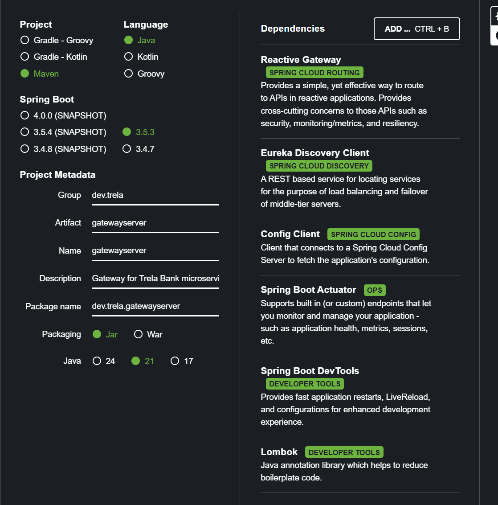
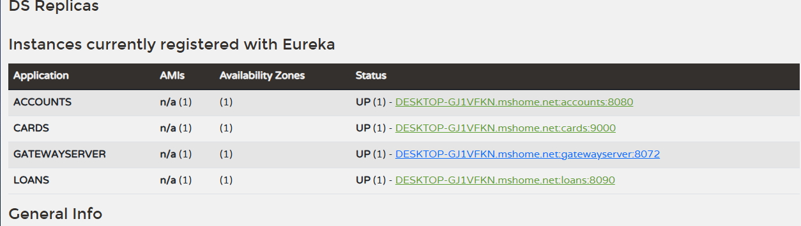
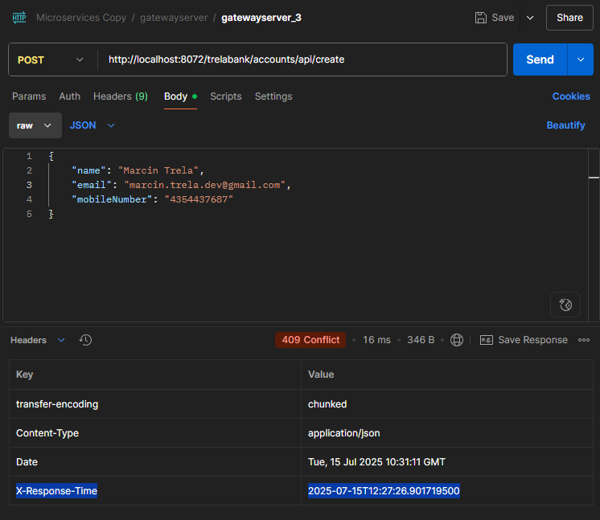
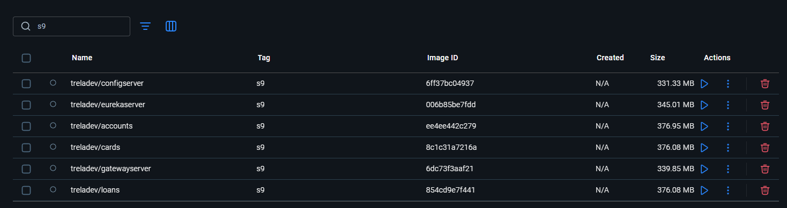
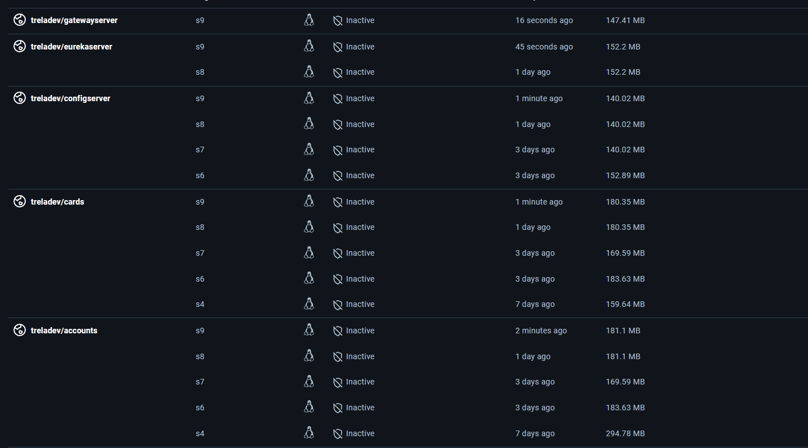

---

# Section 9:  Gateway, Routing & Cross cutting concerns in microservices

---
# 📌 Why Should We Use a Single Entry Point in a Microservices Architecture?

## ✅ Benefits of a Single Entry Point (API Gateway)

1. **Avoiding Direct Access to Microservices**
   Without a gateway, clients would need to know and target each individual microservice directly — which is not only inconvenient but also fragile and hard to manage.

2. **Cross-Cutting Concerns**
   How would we handle things like:

    * Logging
    * Auditing
    * Tracing
    * Security
      These concerns would have to be implemented **in every single service** without a gateway.

3. **Centralized Routing**
   Routing becomes chaotic without a single place to manage the paths to all services.

---

## 💡 Solution: API Gateway (also called Edge Server)

This sits at the **edge** of your system and handles:

* Incoming requests
* Outgoing responses
* Cross-cutting concerns (logging, security, metrics, etc.)

Spring Cloud Gateway is a great tool for this.

> **Official Description:**
> *This project provides a library for building an API Gateway on top of Spring WebFlux. Spring Cloud Gateway aims to provide a simple, yet effective way to route to APIs and provide cross cutting concerns to them such as: security, monitoring/metrics, and resiliency.*

---

## 🛠️ Creating the Gateway

We can create the Gateway service using **Spring Initializr**:


---

## ⚙️ Enabling Automatic Routing via Eureka Discovery

We can enable auto-routing based on Eureka service names:

```yaml
cloud:
  gateway:
    discovery:
      locator:
        enabled: true
        lowerCaseServiceId: true
```

This allows us to route without manually writing path mappings — services are automatically discovered and routed.

---

## ✅ Testing with Eureka

Once the services are running, you can view them in Eureka:



You can also inspect available Gateway routes via:

```
http://localhost:8072/actuator
```

and specifically:

```
http://localhost:8072/actuator/gateway/routes
```

---

## 🔄 Example Requests

You can now access services via the gateway like this:

```http
POST http://localhost:8072/ACCOUNTS/api/create
Content-Type: application/json

{
  "name": "Marcin Trela",
  "email": "maarcin.trela.dev@gmail.com",
  "mobileNumber": "4354437687"
}
```

Fetch request:

```
GET http://localhost:8072/ACCOUNTS/api/fetch?mobileNumber=4354437687
```

Same structure applies to other services:

```
http://localhost:8072/LOANS/api/create
http://localhost:8072/CARDS/api/create
```

> ❗ *Note: Initially, you must use UPPERCASE service names (e.g., ACCOUNTS).*

---

## 🔠 Enabling Lowercase Service IDs

To use lowercase service names (like `/accounts`), update config:

```yaml
cloud:
  gateway:
    discovery:
      locator:
        enabled: true
        lowerCaseServiceId: true
```

Now you can use:

```
http://localhost:8072/accounts/api/fetch?mobileNumber=4354437687
```

---

## 🔁 Custom Routes (Advanced)

If you want to define **your own custom paths**, you can add a bean like this:

```java
@Bean
public RouteLocator trelaBankRouteConfig(RouteLocatorBuilder routeLocatorBuilder) {
    return routeLocatorBuilder.routes()

        .route("accounts-route", p -> p
            .path("/trelabank/accounts/**")
            .filters(f -> f.rewritePath("/trelabank/accounts/(?<segment>.*)", "/${segment}"))
            .uri("lb://ACCOUNTS"))

        .route("loans-route", p -> p
            .path("/trelabank/loans/**")
            .filters(f -> f.rewritePath("/trelabank/loans/(?<segment>.*)", "/${segment}"))
            .uri("lb://LOANS"))

        .route("cards-route", p -> p
            .path("/trelabank/cards/**")
            .filters(f -> f.rewritePath("/trelabank/cards/(?<segment>.*)", "/${segment}"))
            .uri("lb://CARDS"))

        .build();
}
```

### 🧠 Explanation:

* Name the route (e.g., `accounts-route`)
* Match the path (e.g., `/trelabank/accounts/**`)
* Strip off the prefix `/trelabank/accounts/` and rewrite to `/${segment}`
* Forward to the corresponding service via load balancer (`lb://ACCOUNTS`)

So now you can send:

```
POST http://localhost:8072/trelabank/accounts/api/create
```

But the original route (`http://localhost:8072/accounts/api/create`) may still work if you have auto-routing enabled.

---

## ❌ Disabling Auto-Routing to Avoid Multiple Paths

If you want to allow **only your custom routes**, disable default route generation:

```yaml
cloud:
  gateway:
    discovery:
      locator:
        enabled: false
        lowerCaseServiceId: true
```

This way, only **your defined routes** (e.g., `/trelabank/...`) will be active.

Verify again with:

```
http://localhost:8072/actuator/gateway/routes
```

You should now only see your custom paths.

---

## 📌 Final Notes

* You can define routes either via a Java `@Bean` (as above), or in `application.yml`
* For more advanced configurations, refer to the [Spring Cloud Gateway documentation](https://docs.spring.io/spring-cloud-gateway/docs/current/reference/html/)

---

Sure! Here’s a clear English note with explanations and images described that you can use — summarizing filters, routing, and your custom correlation ID filter in Spring Cloud Gateway:

---

# Spring Cloud Gateway Filters & Routing — Quick Guide

### 1. Adding Filters to Routes

In Spring Cloud Gateway, **filters** allow you to add extra logic or behavior to routes.
Filters can modify requests or responses, add headers, rewrite paths, etc.

You define filters inside routes in your configuration, e.g.:

```java
.route("loans-route", p -> p
    .path("/trelabank/loans/**")
    .filters(f -> f
        .rewritePath("/trelabank/loans/(?<segment>.*)", "/${segment}")
        .addResponseHeader("X-Response-Time", LocalDateTime.now().toString()))
    .uri("lb://LOANS"))
```

* Here, a **response header** `X-Response-Time` is added with the current time.
* The path is rewritten to remove `/trelabank/loans` prefix before forwarding.

---

### 2. Testing Filters — Example Output

When you call your endpoint through the gateway, you can see the added header in the response.

Example Postman screenshot:



---

### 3. Writing Your Own Global Filter

What if you want a filter applied to **all routes**? You write a **GlobalFilter**.

Example: a filter to add a **correlation ID** header to each request if it doesn’t exist, or log it if it does.

```java
public class RequestTraceFilter implements GlobalFilter {

    private final FilterUtility filterUtility;

    @Override
    public Mono<Void> filter(ServerWebExchange exchange, GatewayFilterChain chain) {
        HttpHeaders requestHeaders = exchange.getRequest().getHeaders();
        
        if(isCorrelationIdPresent(requestHeaders)){
            log.debug("Correlation ID found: {}",
                    filterUtility.getCorrelationId(requestHeaders));
        } else {
            String correlationId = generateCorrelationId();
            exchange = filterUtility.setCorrelationId(exchange, correlationId);
            log.debug("Correlation ID generated: {}", correlationId);
        }
        
        return chain.filter(exchange);
    }

    private boolean isCorrelationIdPresent(HttpHeaders headers){
        return filterUtility.getCorrelationId(headers) != null;
    }

    private String generateCorrelationId(){
        return UUID.randomUUID().toString();
    }
}
```

---

### 4. Why Check if Correlation ID Already Exists?

* Clients or other services may already send a **correlation ID** in request headers.
* We want to **reuse** that if present for traceability.
* If it’s missing, we **generate a new one** to uniquely identify the request for logging and tracing.

---

### 5. What is `ServerWebExchange`?

* It represents the **whole HTTP exchange** — both request and response.
* You can access both **request headers** and **response headers** via this single object.
* It acts like a **container** holding the request info from client and response info to send back.

---

### 6. Adding Correlation ID to Response Headers

You can add the correlation ID to the **response headers** so clients see it back.

Example of a global response filter:

```java
@Configuration
@Slf4j
@RequiredArgsConstructor
public class ResponseTraceFilter {

    private final FilterUtility filterUtility;

    @Bean
    public GlobalFilter postGlobalFilter() {
        return (exchange, chain) -> {
            return chain.filter(exchange).then(Mono.fromRunnable(() -> {
                HttpHeaders requestHeaders = exchange.getRequest().getHeaders();
                String correlationId = filterUtility.getCorrelationId(requestHeaders);
                log.debug("Adding correlation ID to response headers: {}", correlationId);
                exchange.getResponse().getHeaders().add(filterUtility.CORRELATION_ID, correlationId);
            }));
        };
    }
}
```
### Summary (What the Code Does)

This Spring Cloud Gateway filter is applied **after** the request has been processed (`postGlobalFilter`).

* It retrieves the **correlation ID** from the **incoming request headers** using a utility class.
* Then it adds this **same correlation ID** to the **outgoing response headers**.
* This ensures that the correlation ID is preserved and visible in the final response.
* It allows downstream services (or the client) to **trace the request using the same correlation ID** that was originally generated at the gateway level.

Thanks to this mechanism, the entire request-response flow — across multiple microservices — can be traced using a **single unique correlation ID**.

This is especially useful for:

* **Distributed logging and tracing**
* **Debugging failed requests**
* **Tracking performance across services**

---

Now we need to apply changes in our microservices because the same correlation ID must be captured by our microservice. It must use the same value to pass the request further along.

The idea is to log the same ID in every downstream service.

So in this example, we’ll do it for the **fetch** method in the **accounts** service.

First, we add a header and logger to our controller:

```java
@Override
@GetMapping("/fetchCustomerDetails")
public ResponseEntity<CustomerDetailsDto> fetchCustomerDetails(
    @RequestHeader("trelaBank-correlation-id") String correlationId,
    @RequestParam String mobileNumber) {
    
    log.debug("trelaBank-correlation-id found: {}", correlationId);
    return ResponseEntity.ok(customerService.fetchCustomerDetails(mobileNumber, correlationId));
}
```

Next, we pass it to the **loan** and **card** services as well, so we add it to the method in the service class:

```java
ResponseEntity<LoanDto> loanDtoResponseEntity = loansFeignClient.fetchLoanDetails(correlationId, mobileNumber);
LoanDto loanDto = loanDtoResponseEntity.getBody();

ResponseEntity<CardsDto> cardDtoResponseEntity = cardsFeignClient.fetchCardDetails(correlationId, mobileNumber);
CardsDto cardDto = cardDtoResponseEntity.getBody();
```

Of course, in the Feign client interface:

```java
@FeignClient("cards")
public interface CardsFeignClient {
    @GetMapping("/api/fetch")
    ResponseEntity<CardsDto> fetchCardDetails(
        @RequestHeader("trelaBank-correlation-id") String correlationId,
        @RequestParam String mobileNumber);
}
```

And now, in the **cards** and **loans** controllers, we add the header and logger as well:

```java
@Override
@GetMapping("/fetch")
public ResponseEntity<CardsDto> fetchCardDetails(
    @RequestHeader("trelaBank-correlation-id") String correlationId,
    @RequestParam String mobileNumber) {
    
    log.debug("trelaBank-correlation-id found: {}", correlationId);
    CardsDto cardsDto = cardService.fetchCardDetails(mobileNumber);
    return ResponseEntity.status(HttpStatus.OK).body(cardsDto);
}
```

And in each service, we also need to add:

```yaml
logging:
  level:
    dev:
      trela:
        loans: DEBUG
```

Now, after starting the application and sending a request via the API Gateway:

```
http://localhost:8072/trelabank/accounts/api/fetchCustomerDetails?mobileNumber=4354437687
```

In the response header, we get:

```
trelaBank-correlation-id: b0bccc69-c7f5-4460-b62a-c329cb5bde0b
```

In the **gateway service**, we see logs like:

```
2025-07-15T14:35:10.211+02:00 DEBUG --- RequestTraceFilter: trelaBank-correlation-id generated in RequestTraceFilter: b0bccc69-c7f5-4460-b62a-c329cb5bde0b
2025-07-15T14:35:10.246+02:00 DEBUG --- ResponseTraceFilter: Updated the correlation id in the outbound headers: b0bccc69-c7f5-4460-b62a-c329cb5bde0b
```

And in the **account**, **cards**, and **loans** services:

```
2025-07-15T14:35:10.218+02:00 DEBUG --- CustomerController: trelaBank-correlation-id found: b0bccc69-c7f5-4460-b62a-c329cb5bde0b
2025-07-15T14:35:10.239+02:00 DEBUG --- CardsController: trelaBank-correlation-id found: b0bccc69-c7f5-4460-b62a-c329cb5bde0b
2025-07-15T14:35:10.229+02:00 DEBUG --- LoansController: trelaBank-correlation-id found: b0bccc69-c7f5-4460-b62a-c329cb5bde0b
```

This means that correlation ID propagation is working correctly. As you can see from the timestamps (milliseconds), the request is first captured by the gateway server, then it passes through all the services, and finally it is captured again in the `ResponseTraceFilter`.

Now, if a request fails, we can take that correlation ID and analyze what happened:

```
b0bccc69-c7f5-4460-b62a-c329cb5bde0b
```
---

Alright, now let's build the Docker images.
Before we do that, we need to enable the liveness endpoints in the **loans**, **cards**, and **accounts** services, because only after checking their health status can we proceed to start the **gateway**.

So, we add the following configuration:

```yaml
health:
  readiness-state:
    enabled: true
  liveness-state:
    enabled: true

management:
  health:
    probes:
      enabled: true
```

Now we can build the images, making sure to have the correct version name in the `pom.xml` file (I’m using **Jib** to build the images):

```xml
<image>treladev/${project.artifactId}:s9</image>
```

After building the images (see Docker screenshot below):



We push them to Docker Hub:

```bash
docker image push docker.io/treladev/accounts:s9
```

(Screenshot from Docker Hub below)



Next, we add **health checks** to our services in the `docker-compose.yml` file:

```yaml
healthcheck:
  test: "curl --fail --silent localhost:9000/actuator/health | grep UP || exit 1"
  interval: 10s
  timeout: 5s
  retries: 10
  start_period: 10s
```

So, in summary:

1. First, the **config server** must start.
2. Then, **Eureka**.
3. Then the services.
4. Once everything is up and healthy, the **gateway** starts.

And everything works! ✅
